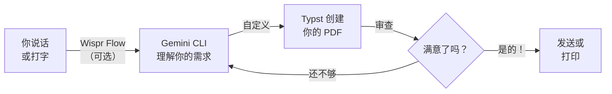

<Tip>
**难度：★★★☆☆ 中级** · 预计时间：约 1.5 小时
</Tip>

想象一下，只需描述你想要什么，就能创建一封精心排版的专业求职信 —— 格式完美，可以直接发送。说出来或打出来，不需要 Word 模板，不需要和页边距较劲，不需要任何设计技能。

<Info>
**教程由 [Chan Meng](https://chanmeng.org/) 主导** —— 高级 AI/ML 工程师、开源贡献者、前字节跳动开发者。Chan 搭建了 30+ 个真实应用，专注于 AI 驱动的解决方案，也是本次活动的圆桌嘉宾和本网站的开发者。
</Info>

## 你将构建什么

<CardGroup cols={3}>
  <Card title="描述" icon="microphone">
    告诉 AI 你需要什么文档 —— 用普通语言说出来或打出来
  </Card>
  <Card title="构建" icon="terminal">
    Gemini CLI 编写定义文档的 Typst 代码
  </Card>
  <Card title="导出" icon="file-pdf">
    编译成像素级精准的 PDF，可以发送或打印
  </Card>
</CardGroup>

## 工作原理

你描述你想要什么 —— 通过 Wispr Flow 说话或直接打字。Gemini CLI 理解你的请求并编写 Typst 代码。Typst 将其编译成精美的 PDF。审查、改进、重复，直到完美。

<Tip>
**你可以用 Wispr Flow 说出提示词，也可以打字或粘贴到 Gemini CLI 中。两种方式效果完全一样。** Wispr Flow 是可选项 —— 它只是让体验更加解放双手。本教程中的每条提示词，无论你说出来还是打出来都同样有效。
</Tip>

## 为什么选择 Typst？

| 特性 | Word | LaTeX | Markdown | Typst |
|------|------|-------|----------|-------|
| AI 友好度 | 差 —— 二进制格式 | 还好 —— 语法冗长 | 好 —— 简单 | **极好** —— 简洁清晰 |
| 排版质量 | 基础 | 优秀 | 基础 | **优秀** |
| 易学程度 | 是 | 否 | 是 | **是** |
| 编译速度 | 无 | 慢 | 快 | **即时** |
| Token 效率 | 无 | 差 | 好 | **极好** |

Typst 非常适合 AI 生成文档，因为它的语法简洁清晰 —— 与 LaTeX 相比，AI 产生的错误更少，使用的 token 也更少。编译时间即时，错误信息清晰可操作。

与 Word 不同，Typst 文件是纯文本 —— 所以 AI 可以直接读取、编写和修改它们。与 LaTeX 不同，Typst 易于学习，编译只需毫秒。

## 你将学到

本教程专注于**与 AI 沟通的技能**，而不是编程知识。你将学习如何：

- 清晰地描述专业文档 —— 通过说话或打字 —— 让 AI 构建它
- 使用 Typst 将文档编译成精美的 PDF
- 通过对话迭代设计 —— 调整字体、颜色、布局和内容
- 将模板适配到不同用途（求职信、发票、报告）
- 使用描述 → 构建 → 编译 → 审查的循环
- 使用 Wispr Flow 进行语音输入，实现解放双手的工作流

<Note>
**无需任何编程经验。** Gemini CLI 编写 Typst 代码 —— 你的工作是描述你想要什么。如果你能解释一份文档应该是什么样子，你就能创建专业的 PDF。
</Note>

## 工具

<CardGroup cols={3}>
  <Card title="Gemini CLI" icon="terminal">
    谷歌免费的终端 AI 助手，能理解你的自然语言请求并将其转化为行动。
  </Card>
  <Card title="Wispr Flow" icon="microphone">
    可选的语音输入工具 —— 说话代替打字。在任何应用中均可使用，包括终端。
  </Card>
  <Card title="Typst CLI" icon="file-pdf">
    免费开源的排版系统，将简单的文本文件转化为精美的 PDF。即时编译，错误信息清晰。
  </Card>
  <Card title="Node.js" icon="node-js">
    安装 Gemini CLI 所需的免费工具。一次性设置。
  </Card>
  <Card title="终端" icon="square-terminal">
    内置在电脑中的命令行应用。macOS 上叫 Terminal，Windows 上叫 PowerShell 或命令提示符。
  </Card>
</CardGroup>

## 费用

| 工具 | 费用 |
|------|------|
| Gemini CLI | 免费（每日 1,000 次请求） |
| Node.js | 免费 |
| Typst CLI | 免费开源 |
| Wispr Flow（可选） | 免费试用（[邀请链接可获一个月 Pro 版免费试用](https://wisprflow.ai/r?CHAN115)） |
| **合计** | **$0** |

## 前置要求

<CardGroup cols={3}>
  <Card title="一台能联网的电脑" icon="laptop">
    Windows 或 macOS 均可。无需特殊硬件。
  </Card>
  <Card title="约 1.5 小时" icon="clock">
    慢慢来 —— 不用着急。可以随时暂停，之后再继续。
  </Card>
  <Card title="好奇心" icon="lightbulb">
    无需任何先前经验。只需愿意尝试新事物。
  </Card>
</CardGroup>

<Note>
准备好了吗？前往[设置你的工具](/docs/2026-her-waka/tutorial/professional-pdf/setup)，安装你所需的一切。
</Note>
