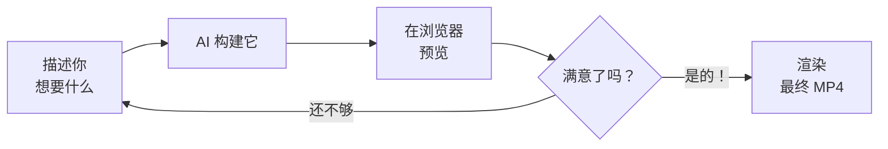

你的工具已就绪 —— 一个终端运行预览，另一个运行 AI 助手。现在让我们一步步创建一段真实的宣传视频。

我们将构建一段 **30 秒的个人品牌介绍** —— 但同样的工作流适用于任何类型的视频。你将生成配音音频、创建音效、构建视频构图，并渲染最终 MP4。

<Tip>
**语音或打字 —— 两种方式都行。** 如果你有 Wispr Flow 在运行，直接开口说出你的提示词即可。否则，复制粘贴或自己打字。你的 AI 助手无论哪种方式都能理解自然语言。
</Tip>

## Vibe Coding 循环

这是你在本教程中的工作方式：



描述。预览。优化。重复，直到你满意 —— 然后渲染。

<Steps>
  <Step title="生成你的配音音频">
    在构建视频之前，先创建配音。你将让 AI 助手调用 ElevenLabs API，并从你的脚本生成音频文件。

    <Tabs>
      <Tab title="个人品牌介绍">
        <Tabs>
          <Tab title="Gemini CLI（免费）">
            在你的 Gemini CLI 终端中，说出或输入此提示词：

            ```text title="说出或复制此提示词"
            I need you to generate a voiceover audio file using the ElevenLabs API.

            My ElevenLabs API key is: [paste your API key here]

            Please write a Node.js script that:
            1. Sends this text to the ElevenLabs text-to-speech API:
               "Hi, I'm [Your Name]. I'm a creative problem-solver transitioning
               into tech, and I'm passionate about building tools that help people.
               Let's connect."
            2. Uses the voice ID "21m00Tcm4TlvDq8ikWAM" (Rachel voice)
            3. Saves the audio output as public/voiceover.mp3

            Then run the script.
            ```
          </Tab>

          <Tab title="Claude Code（付费）">
            在你的 Claude Code 终端中，说出或输入此提示词：

            ```text title="说出或复制此提示词"
            I need you to generate a voiceover audio file using the ElevenLabs API.

            My ElevenLabs API key is: [paste your API key here]

            Please write a Node.js script that:
            1. Sends this text to the ElevenLabs text-to-speech API:
               "Hi, I'm [Your Name]. I'm a creative problem-solver transitioning
               into tech, and I'm passionate about building tools that help people.
               Let's connect."
            2. Uses the voice ID "21m00Tcm4TlvDq8ikWAM" (Rachel voice)
            3. Saves the audio output as public/voiceover.mp3

            Then run the script.
            ```
          </Tab>
        </Tabs>

        <Tip>
        **将 `[Your Name]` 替换为你的真实姓名。** 随意修改配音文字，让它听起来更像你 —— 这是你的个人品牌介绍。
        </Tip>
      </Tab>

      <Tab title="活动邀请">
        ```text title="说出或复制此提示词"
        I need you to generate a voiceover audio file using the ElevenLabs API.

        My ElevenLabs API key is: [paste your API key here]

        Please write a Node.js script that:
        1. Sends this text to the ElevenLabs text-to-speech API:
           "Join us for SheSharp's next workshop on the future of AI in the
           workplace. Saturday, April 12th, at GridAKL in Auckland.
           Free entry — all skill levels welcome. Register now."
        2. Uses the voice ID "21m00Tcm4TlvDq8ikWAM" (Rachel voice)
        3. Saves the audio output as public/voiceover.mp3

        Then run the script.
        ```
      </Tab>

      <Tab title="作品集展示">
        ```text title="说出或复制此提示词"
        I need you to generate a voiceover audio file using the ElevenLabs API.

        My ElevenLabs API key is: [paste your API key here]

        Please write a Node.js script that:
        1. Sends this text to the ElevenLabs text-to-speech API:
           "I built a personal portfolio website using AI — from scratch,
           in under an hour. It includes my projects, skills, and contact
           info. Here's how I did it."
        2. Uses the voice ID "21m00Tcm4TlvDq8ikWAM" (Rachel voice)
        3. Saves the audio output as public/voiceover.mp3

        Then run the script.
        ```
      </Tab>
    </Tabs>

    你的 AI 助手会编写一个小型 Node.js 脚本，运行它，并将配音音频保存为 `public/voiceover.mp3`。

    <Tip>
    **AI 要求授权？** 如果你的 AI 助手要求批准运行脚本或创建文件，输入 `y` 并按 **Enter**。这是正常的 —— 它在采取行动之前请求你的许可。
    </Tip>

    <AccordionGroup>
      <Accordion title="刚才发生了什么？">
      你的 AI 助手编写了一个小型 Node.js 脚本，该脚本：
      1. 将你的配音文字发送到 ElevenLabs 的文字转语音 API
      2. 从 ElevenLabs 服务器接收回音频数据
      3. 将其保存为项目 `public/` 文件夹中的 MP3 文件

      整个过程在几秒钟内完成。你用普通语言描述了你想要的内容，AI 处理了所有技术细节。
      </Accordion>

      <Accordion title="我想使用不同的声音">
      免费套餐包含以下内置声音。在你的提示词中替换声音 ID：

      | 声音 | ID | 风格 |
      |------|----|------|
      | Rachel | `21m00Tcm4TlvDq8ikWAM` | 平静、专业（默认） |
      | Bella | `EXAVITQu4vr4xnSDxMaL` | 温暖、友好 |
      | Antoni | `ErXwobaYiN019PkySvjV` | 对话式，男声 |
      | Elli | `MF3mGyEYCl7XYWbV9V6O` | 年轻、有活力 |
      | Josh | `TxGEqnHWrfWFTfGW9XjX` | 深沉、有权威感 |
      | Adam | `pNInz6obpgDQGcFmaJgB` | 清晰、中性，男声 |
      | Sam | `yoZ06aMxZJJ28mfd3POQ` | 温暖、叙述感 |
      | Domi | `AZnzlk1XvdvUeBnXmlld` | 自信、有力量感 |

      **想要更多选项？** 在 [elevenlabs.io/voice-library](https://elevenlabs.io/voice-library) 浏览所有声音并试听。以上内置声音适用于免费 API 套餐。
      </Accordion>

      <Accordion title="ElevenLabs API 返回错误">
      常见原因：
      - **API 密钥无效：** 仔细检查你是否复制了完整的密钥，没有多余的空格。
      - **已达到免费套餐限制：** 在 [elevenlabs.io](https://elevenlabs.io) 的个人资料下查看你的使用量。免费套餐每月 10,000 个字符。
      - **网络错误：** 确保你有网络连接，几秒后再试。

      如果错误信息令人困惑，把它粘贴到你的 AI 助手里问："这个错误是什么意思，怎么修复？"
      </Accordion>
    </AccordionGroup>
  </Step>

  <Step title="生成音效">
    现在让我们创建一个在视频切换时使用的音效。

    <Tabs>
      <Tab title="Gemini CLI（免费）">
        ```text title="说出或复制此提示词"
        Now generate a sound effect using the ElevenLabs sound effects API.
        Use my same ElevenLabs API key.

        Create a short, subtle whoosh transition sound — about 1.5 seconds long.
        Save it as public/swoosh.mp3
        ```
      </Tab>

      <Tab title="Claude Code（付费）">
        ```text title="说出或复制此提示词"
        Now generate a sound effect using the ElevenLabs sound effects API.
        Use my same ElevenLabs API key.

        Create a short, subtle whoosh transition sound — about 1.5 seconds long.
        Save it as public/swoosh.mp3
        ```
      </Tab>
    </Tabs>

    <Info>
    **ElevenLabs 可以从文字描述创建任何声音。** 试试"轻柔的铃声"、"键盘打字声"、"掌声"或"海浪声"。尝试不同的描述 —— 你的描述越具体，效果越好。
    </Info>

    <Accordion title="不同视频类型的音效创意">
    | 视频类型 | 音效提示词 |
    |---------|-----------|
    | 个人品牌 | "subtle whoosh transition, professional" |
    | 活动邀请 | "gentle bell chime notification" |
    | 作品集展示 | "soft keyboard typing sounds" |
    | 社交媒体技巧 | "upbeat pop notification sound" |
    | 自由职业宣传 | "confident drum hit accent" |
    | 感谢视频 | "warm, soft chime" |

    你可以生成多个音效，在视频的不同位置使用不同的音效。
    </Accordion>
  </Step>

  <Step title="创建你的视频构图">
    现在是重头戏 —— 描述你的视频，让 AI 构建它。这是一切汇聚的地方。

    <Tabs>
      <Tab title="Gemini CLI（免费）">
        ```text title="说出或复制此提示词"
        Create a Remotion video composition for a 30-second personal brand intro.

        The video should have:
        - A dark gradient background (dark purple to dark blue)
        - My name "[Your Name]" appearing with a smooth fade-in animation at 1 second
        - Below it, my tagline "Transitioning into Tech" sliding in from the left at 2 seconds
        - Three bullet points appearing one by one at 3, 4, and 5 seconds:
          • Creative problem-solver
          • Quick learner
          • Passionate about helping people
        - A "Let's connect" call-to-action fading in at 7 seconds
        - Use the voiceover audio from public/voiceover.mp3 starting at 0.5 seconds
        - Play the swoosh sound from public/swoosh.mp3 on each text transition
        - Use TailwindCSS for all styling
        - Make it 1080x1920 (vertical, for social media)
        - The video should be 15 seconds long at 30fps

        Create this as a new composition in the Remotion project and
        register it in src/Root.tsx.
        ```
      </Tab>

      <Tab title="Claude Code（付费）">
        ```text title="说出或复制此提示词"
        Create a Remotion video composition for a 30-second personal brand intro.

        The video should have:
        - A dark gradient background (dark purple to dark blue)
        - My name "[Your Name]" appearing with a smooth fade-in animation at 1 second
        - Below it, my tagline "Transitioning into Tech" sliding in from the left at 2 seconds
        - Three bullet points appearing one by one at 3, 4, and 5 seconds:
          • Creative problem-solver
          • Quick learner
          • Passionate about helping people
        - A "Let's connect" call-to-action fading in at 7 seconds
        - Use the voiceover audio from public/voiceover.mp3 starting at 0.5 seconds
        - Play the swoosh sound from public/swoosh.mp3 on each text transition
        - Use TailwindCSS for all styling
        - Make it 1080x1920 (vertical, for social media)
        - The video should be 15 seconds long at 30fps

        Create this as a new composition in the Remotion project and
        register it in src/Root.tsx.
        ```
      </Tab>
    </Tabs>

    <Tip>
    **查看预览！** AI 创建完文件后，切换到浏览器 `http://localhost:3000`。你应该能看到带有动画和音频的视频在播放。如果预览没有更新，尝试刷新浏览器。
    </Tip>

    <Tip>
    **将 `[Your Name]` 替换为你的真实姓名。** 随意修改标语、要点和颜色，使其符合你的个人品牌。
    </Tip>

    <Accordion title="AI 刚刚创建了什么？">
    你的 AI 助手在 `src/` 文件夹中创建了几个文件：
    - 一个 **React 组件**（`.tsx` 文件），定义视频的视觉布局 —— 文字、颜色、动画
    - 使用 Remotion 的 `<Audio>` 组件引入你的配音和音效
    - 使用 Remotion 的动画工具（`useCurrentFrame`、`interpolate`、`spring`）实现平滑过渡
    - 在 `src/Root.tsx` 中注册了新构图，让 Remotion 知道它的存在

    你永远不需要理解或编辑这些文件。AI 替你读取和编写它们。
    </Accordion>
  </Step>

  <Step title="审查和优化">
    在浏览器中观看预览。第一次可能不会完美 —— 这是预期中的事，也是整个过程的一部分。试试以下优化提示词：

    **调整大小和布局：**
    ```text title="说出或复制此提示词"
    The text is too small on mobile. Make the name 80px and the tagline 48px.
    Also add a subtle glow effect behind the name text. Keep everything else the same.
    ```

    **更改配色方案：**
    ```text title="说出或复制此提示词"
    Change the background gradient from purple-blue to dark teal to navy blue.
    Make the text white with a slight drop shadow for better readability.
    ```

    **修复音频时机：**
    ```text title="说出或复制此提示词"
    The voiceover timing is off — the speech starts before the name appears.
    Move the voiceover start to 1.5 seconds so it plays after the name fades in.
    ```

    **增加视觉效果：**
    ```text title="说出或复制此提示词"
    Add a subtle animated particle effect in the background — small dots slowly
    floating upward, very low opacity. Keep it elegant, not distracting.
    ```

    <Tip>
    **Vibe Coding 循环：描述 → 预览 → 优化。** 每次你发出提示词，AI 更新代码，预览刷新。持续优化，直到你满意为止。你可以无限次迭代。
    </Tip>

    <Info>
    **在反馈中要具体。** 不要说"让它看起来更好"，而是说"让名字文字更大，把背景改成深蓝色，并放慢淡入动画"。你越具体，AI 能帮助你的就越多。
    </Info>
  </Step>

  <Step title="渲染你的最终视频">
    对预览满意了？让我们渲染最终的 MP4 文件。

    <Tabs>
      <Tab title="Gemini CLI（免费）">
        ```text title="说出或复制此提示词"
        Render this video composition to an MP4 file. Use the Remotion render
        command and output it as out/my-promo-video.mp4
        ```
      </Tab>

      <Tab title="Claude Code（付费）">
        ```text title="说出或复制此提示词"
        Render this video composition to an MP4 file. Use the Remotion render
        command and output it as out/my-promo-video.mp4
        ```
      </Tab>
    </Tabs>

    <Info>
    **渲染需要 1 到 3 分钟**，具体取决于你的电脑和视频长度。你会在终端看到进度条。最终 MP4 文件将保存在项目内的 `out/` 文件夹中。
    </Info>
  </Step>

  <Step title="观看你的视频">
    打开渲染好的视频，看看最终效果：

    <Tabs>
      <Tab title="Windows">
        打开文件资源管理器，导航到项目的 `out/` 文件夹，然后双击 `my-promo-video.mp4`。或者运行：

        ```bash title="复制此命令"
        start out/my-promo-video.mp4
        ```
      </Tab>

      <Tab title="macOS">
        ```bash title="复制此命令"
        open out/my-promo-video.mp4
        ```
      </Tab>
    </Tabs>

    你应该能看到你完成的宣传视频 —— 带有动态文字、专业配音和音效。
  </Step>
</Steps>

## 刚才发生了什么？

回顾你所做的事情：

1. **生成了配音** —— AI 调用 ElevenLabs API，将你的脚本转化为专业音频
2. **创建了音效** —— AI 从文字描述生成了自定义的呼啸过渡音效
3. **构建了视频构图** —— AI 创建了动态文字、背景，并整合了你的音频文件
4. **优化了设计** —— 你描述了更改，AI 实时更新了视频
5. **渲染成 MP4** —— AI 运行了渲染命令，生成了可随处分享的视频文件

核心洞见：你用普通语言描述了一切。你没有打开视频编辑软件，没有编写代码，没有碰时间轴。AI 处理了所有技术工作 —— 你的工作是担任创意总监。

## 故障排除

<AccordionGroup>
  <Accordion title="预览空白或显示错误">
  AI 可能创建了一个有语法错误的文件。询问你的 AI 助手：
  ```text
  The preview is showing an error. Can you check the console output and fix any issues?
  ```
  你也可以尝试刷新浏览器。如果问题持续，检查终端 1（预览服务器）是否仍在运行。
  </Accordion>

  <Accordion title="预览中没有音频播放">
  Remotion 的预览可能不会自动播放音频。尝试点击 Remotion 预览控件中的播放按钮。同时验证音频文件是否存在：
  ```text
  Check if public/voiceover.mp3 and public/swoosh.mp3 exist and are valid audio files.
  ```
  </Accordion>

  <Accordion title="ElevenLabs API 返回错误">
  常见原因：
  - **API 密钥无效：** 仔细检查你的密钥 —— 没有多余的空格或缺失的字符。
  - **已达到免费套餐限制：** 你可能已用完本月配额。在 elevenlabs.io 查看使用量。
  - **频率限制：** 等几秒后再试。

  将错误信息粘贴到你的 AI 助手中，让它解释并修复问题。
  </Accordion>

  <Accordion title="渲染失败或视频损坏">
  询问你的 AI 助手：
  ```text
  The render command failed. Can you check what went wrong and try again?
  ```
  常见原因：音频文件缺失、构图未在 Root.tsx 中注册，或代码错误。AI 通常会找出并修复问题。
  </Accordion>

  <Accordion title="视频太长或太短">
  告诉你的 AI 助手你想要的确切时长：
  ```text
  Change the video duration to exactly 20 seconds at 30fps. Adjust the animation
  timing so everything fits within 20 seconds.
  ```
  </Accordion>

  <Accordion title="语音输入有错误">
  Wispr Flow 有时可能误听技术术语。你可以在按 Enter 键之前查看并更正文字。如果语音输入错误太多，改为复制粘贴提示词。
  </Accordion>
</AccordionGroup>

<Note>
恭喜 —— 你只用自然语言创建了一段真实的宣传视频！前往[继续探索](/docs/2026-her-waka/tutorial/promo-video/keep-going)，获取更多视频创意、高级技巧和即用提示词。
</Note>
