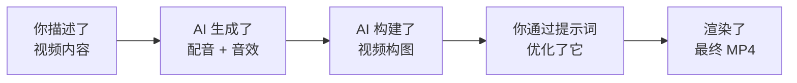

你已经构建了一段真实的宣传视频 —— 带有动态文字、AI 配音和音效 —— 完全通过用普通语言描述来完成。让我们看看你取得了什么成就，以及接下来可以做什么。

## 你构建了什么



- 使用 ElevenLabs 从文字脚本生成了专业配音音频
- 从文字描述创建了自定义音效
- 仅用自然语言提示词，用 Remotion 构建了动态视频构图
- 通过描述—预览—优化循环迭代设计
- 渲染了可在 LinkedIn、Instagram 或任何地方分享的最终 MP4 文件
- 学会了使用 API 密钥 —— 一项在整个科技行业通用的可迁移技能

<Tip>
**你刚学到的技能远不止视频创建。** 你使用了 API 密钥、调用了外部服务，并通过自然语言协调了多个工具。这与专业软件开发中使用的模式完全相同 —— 只是你没有写一行代码。
</Tip>

## 尝试更多视频类型

你构建了个人品牌介绍。现在试试这些其他场景 —— 以下每条提示词都可以直接使用。只需将其粘贴到你的 AI 助手中。

<AccordionGroup>
  <Accordion title="社区活动邀请">
  ```text title="说出或复制此提示词"
  First, generate a voiceover using the ElevenLabs API with my API key [paste key]:
  "Join us for SheSharp's next workshop on AI and the future of work.
  Saturday, April 12th at GridAKL, Auckland. Free entry, all skill levels
  welcome. Scan the QR code or visit shesharp.co to register."

  Use the Rachel voice and save as public/voiceover.mp3

  Then generate a gentle bell chime sound effect, about 1 second long,
  and save it as public/chime.mp3

  Then create a Remotion composition:
  - Bright gradient background (coral to warm orange)
  - "SheSharp Workshop" title fading in at 1 second
  - Event details appearing line by line: date, time, venue
  - Chime sound effect on each new line
  - Voiceover starting at 0.5 seconds
  - "Register Now" call-to-action at the end with a pulse animation
  - 1080x1920 vertical format, 20 seconds at 30fps
  ```
  </Accordion>

  <Accordion title="作品集项目展示">
  ```text title="说出或复制此提示词"
  First, generate a voiceover using the ElevenLabs API with my API key [paste key]:
  "I built a personal portfolio website using AI — from idea to live site in
  under an hour. It showcases my projects, skills, and contact information.
  No coding experience needed — I described what I wanted, and AI built it."

  Use the Bella voice (voice ID EXAVITQu4vr4xnSDxMaL) and save as
  public/voiceover.mp3

  Then generate soft keyboard typing sounds, 2 seconds, save as public/typing.mp3

  Then create a Remotion composition:
  - Dark background with a subtle code-editor aesthetic
  - Project title "My Portfolio Website" sliding in from the left
  - Three feature cards appearing one by one: "Built with AI", "Deployed in minutes", "Fully responsive"
  - Each card appears with the typing sound effect
  - Voiceover playing throughout
  - Website URL at the bottom fading in at the end
  - 1080x1920 vertical, 20 seconds at 30fps
  ```
  </Accordion>

  <Accordion title="社交媒体技巧短视频">
  ```text title="说出或复制此提示词"
  First, generate a voiceover using the ElevenLabs API with my API key [paste key]:
  "Here's a tip: you don't need to learn to code to work in tech. AI tools
  can build websites, create videos, and automate your workflow — all from
  natural language. The most important skill? Knowing how to describe what
  you want clearly. Start experimenting today."

  Use the Elli voice (voice ID MF3mGyEYCl7XYWbV9V6O) and save as
  public/voiceover.mp3

  Then generate an upbeat pop notification sound, 0.5 seconds, save as
  public/pop.mp3

  Then create a Remotion composition:
  - Bold, high-contrast background (black with neon accents)
  - Large "TECH TIP" title with a pop sound and bounce animation
  - Key phrases from the voiceover appearing as bold text overlays, timed to the speech
  - Pop sound on each new text appearance
  - Fast, punchy transitions
  - 1080x1920 vertical, 15 seconds at 30fps
  ```
  </Accordion>

  <Accordion title="自由职业服务宣传">
  ```text title="说出或复制此提示词"
  First, generate a voiceover using the ElevenLabs API with my API key [paste key]:
  "Need a professional website or digital presence? I design and build modern
  websites using the latest AI tools — fast, affordable, and tailored to your
  brand. Let's talk about what you need."

  Use the Josh voice (voice ID TxGEqnHWrfWFTfGW9XjX) and save as
  public/voiceover.mp3

  Then generate a confident, short drum hit accent sound, 1 second, save as
  public/accent.mp3

  Then create a Remotion composition:
  - Clean, professional gradient (dark slate to charcoal)
  - Service title "Web Design & AI Solutions" with elegant fade-in
  - Three service offerings appearing with the accent sound: "Custom Websites", "AI Automation", "Digital Strategy"
  - Contact email and website URL at the bottom
  - Voiceover throughout
  - 1080x1920 vertical, 20 seconds at 30fps
  ```
  </Accordion>

  <Accordion title="面试后感谢视频">
  ```text title="说出或复制此提示词"
  First, generate a voiceover using the ElevenLabs API with my API key [paste key]:
  "Hi [Interviewer Name], thank you so much for taking the time to meet with
  me today. I really enjoyed learning about your team and the work you're
  doing. I'm excited about the opportunity and look forward to hearing from
  you. Thanks again!"

  Use the Bella voice (voice ID EXAVITQu4vr4xnSDxMaL) and save as
  public/voiceover.mp3

  Then generate a warm, soft chime sound, 1 second, save as public/chime.mp3

  Then create a Remotion composition:
  - Warm, soft gradient background (light peach to soft lavender)
  - "Thank You, [Interviewer Name]!" text with a gentle fade-in
  - Your name and contact details appearing below
  - Soft chime at the start and end
  - Voiceover playing throughout
  - Professional but personal feel
  - 1920x1080 landscape (for email attachment), 15 seconds at 30fps
  ```
  </Accordion>
</AccordionGroup>

## 可以探索的创意

<CardGroup cols={2}>
  <Card title="构建视频作品集合辑" icon="photo-film">
    将多个短构图合并成一段更长的视频 —— 你的个人品牌介绍、项目展示和技能摘要。让 AI 用过渡效果将它们拼接在一起。
  </Card>
  <Card title="用其他语言创建视频" icon="globe">
    ElevenLabs 支持 32 种语言。试试生成中文、西班牙语或毛利语的配音。工作流相同 —— 只需更改配音文字并告诉 AI 使用哪种语言。
  </Card>
  <Card title="添加背景音乐" icon="music">
    使用 [Suno AI](https://suno.com) 从文字描述生成自定义背景音乐（例如："30 秒欢快的企业背景音乐"）。下载 MP3 并将其添加到你的 Remotion 构图中，与配音并用。
  </Card>
  <Card title="构建可复用模板" icon="clone">
    让你的 AI 助手将你的视频重构为带有变量的模板 —— 名字、标语、颜色、配音文件。这样你只需更改变量就能创建新视频，无需从头设计。
  </Card>
</CardGroup>

## 进阶提示词

```text title="说出或复制此提示词"
Make the video responsive — create two versions of the composition: one vertical
(1080x1920 for social media) and one horizontal (1920x1080 for presentations).
Both should use the same voiceover and animations but with different layouts.
```

```text title="说出或复制此提示词"
Add animated captions that appear in sync with the voiceover. Each phrase should
fade in as it is spoken and fade out when the next phrase begins. Use white text
with a dark semi-transparent background bar.
```

```text title="说出或复制此提示词"
Create a 3-second animated intro logo for my name with a professional motion
graphics feel — think smooth scaling, rotation, and a light streak effect.
Add a subtle bass hit sound effect when the logo fully appears.
```

```text title="说出或复制此提示词"
Set up an environment variable for my ElevenLabs API key so I don't have to
paste it into every prompt. Store it as ELEVENLABS_API_KEY and update the
voiceover generation script to read from it.
```

## 进阶：从 Gemini CLI 到 Claude Code

如果你在本教程中使用了 Gemini CLI，你已经学会了核心工作流。Claude Code 提供了更强大的体验 —— 尤其是对于复杂的视频构图：

| | Gemini CLI | Claude Code |
|---|---|---|
| **相同之处** | 在终端中描述你想要什么。AI 读取项目文件，编写代码，生成视频。 | 相同的工作流，相同的提示词。 |
| **不同之处** | 免费，适合入门 | 功能更强大，能更好地处理复杂构图，是 Remotion 官方推荐的工具 |
| **费用** | 免费（每日 1,000 次请求） | 需要 Max 或 Pro 订阅 |

如果你已经在使用 Claude Code —— 你正在使用专业开发者用于这个确切工作流的工具。

## 尝试另一个教程

<CardGroup cols={2}>
  <Card title="构建你的个人网站" icon="globe" href="/docs/2026-her-waka/tutorial/personal-website/overview">
    创建一个作品集网站来展示你的新宣传视频 —— 描述你想要什么，AI 构建并部署它。
  </Card>
  <Card title="创建专业 PDF" icon="file-pdf" href="/docs/2026-her-waka/tutorial/professional-pdf/overview">
    相同的 Vibe Coding 工作流，不同的输出 —— 从提示词创建精美的简历、求职信和报告。
  </Card>
  <Card title="Vibe Coding：每日报告机器人" icon="robot" href="/docs/2026-her-waka/tutorial/vibe-coding/overview">
    准备好迎接更高水平了吗？使用 Claude Code 构建一个完整应用 —— 相同的工具，更雄心勃勃的项目。
  </Card>
  <Card title="AI 早晨简报" icon="sun" href="/docs/2026-her-waka/tutorial/morning-briefing/overview">
    一个更轻量的教程 —— 将 AI 连接到你的 Google 日历和 Gmail，获取每日早晨简报。
  </Card>
</CardGroup>

## 反思

<AccordionGroup>
  <Accordion title="用 AI 创建视频，什么让你感到惊讶？">
  大多数人惊讶于这个工作流感觉是多么自然。不用学习时间轴编辑器和关键帧动画，你只需用普通语言描述你想要什么。AI 处理所有技术工作 —— 你的工作是担任创意总监。
  </Accordion>
  <Accordion title="宣传视频如何帮助你的职业发展？">
  一段简短的个人品牌视频能让你的 LinkedIn 个人资料脱颖而出。作品集展示能将你的项目转化为可分享的内容。面试后的感谢视频能让你令人难忘。在竞争激烈的就业市场中，这些小小的差异化因素会积累成优势。
  </Accordion>
  <Accordion title="接下来你会创建什么？">
  想想你想要推广什么 —— 你自己、一个活动、一个项目、一项服务。同样的工作流适用于所有这些。你甚至可以为朋友、社区团体或小型企业创建视频，以此练习并充实你的作品集。
  </Accordion>
  <Accordion title="与传统视频剪辑相比如何？">
  传统视频剪辑需要学习复杂的软件（Premiere Pro、Final Cut、DaVinci Resolve），理解时间轴、关键帧、音轨和导出设置。AI 方式让你专注于创意构思，同时由 AI 处理技术执行。两种方式各有优势 —— 但对于快速宣传内容，AI 工作流的速度要快得多。
  </Accordion>
</AccordionGroup>

## 资源

| 资源 | 介绍 | 链接 |
|------|------|------|
| Remotion | 程序化视频框架 | [remotion.dev](https://remotion.dev) |
| Remotion + AI 指南 | AI 驱动视频创建官方指南 | [remotion.dev/docs/ai](https://www.remotion.dev/docs/ai) |
| ElevenLabs | AI 语音和音效平台 | [elevenlabs.io](https://elevenlabs.io) |
| ElevenLabs 声音库 | 浏览 3,000+ 种声音 | [elevenlabs.io/voice-library](https://elevenlabs.io/voice-library) |
| Gemini CLI | 谷歌免费的终端 AI 助手 | [github.com/google-gemini/gemini-cli](https://github.com/google-gemini/gemini-cli) |
| Claude Code | Anthropic 的 AI 编程助手 | [docs.anthropic.com](https://docs.anthropic.com/en/docs/claude-code) |
| Suno AI | AI 音乐生成 | [suno.com](https://suno.com) |
| Wispr Flow | 任意应用的语音输入工具 | [wisprflow.ai](https://wisprflow.ai/r?CHAN115) |

<Note>
感谢你完成本教程！你从零开始，用语音和音效创建了一段专业宣传视频 —— 完全通过自然语言完成。描述你想要什么，让 AI 构建它的能力是一项强大的技能。把它带走吧。
</Note>
