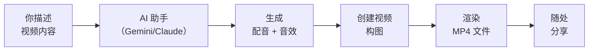

<Tip>
**难度：★★★★☆ 有挑战性** · 预计时间：约 1.5 到 2 小时
</Tip>

你需要一段 30 秒的 LinkedIn 自我介绍视频。你可以花好几个小时学习视频剪辑软件，看关键帧和时间轴的教程，结果做出来的东西依然显得业余。或者你只需描述你想要什么 —— "深色渐变背景、我的名字淡入、专业配音、每次切换时的呼啸音效" —— 然后让 AI 为你构建。

**这就是我们要构建的工作流。** 你用普通语言描述一个视频，AI 就能创建它 —— 完整包含动态文字、专业配音和音效。最终成果是一个真实的 MP4 文件，你可以上传到 LinkedIn、Instagram 或任何地方。

<Info>
**教程由 [Chan Meng](https://chanmeng.org/) 主导** —— 高级 AI/ML 工程师、开源贡献者、前字节跳动开发者。Chan 搭建了 30+ 个真实应用，专注于 AI 驱动的解决方案，也是本次活动的圆桌嘉宾和本网站的开发者。
</Info>

## 你将构建什么

<CardGroup cols={3}>
  <Card title="描述你的视频" icon="microphone">
    用自然语言告诉 AI 你想要什么 —— 文字、颜色、动画、配音脚本
  </Card>
  <Card title="AI 构建它" icon="wand-magic-sparkles">
    AI 创建视频构图，生成专业的配音音频和音效
  </Card>
  <Card title="导出为 MP4" icon="film">
    渲染最终视频，在 LinkedIn、Instagram、TikTok 或任何地方分享
  </Card>
</CardGroup>

## 工作原理

你描述你想要的视频效果。你的 AI 助手（Gemini CLI 或 Claude Code）调用 ElevenLabs API 生成配音和音效，然后创建包含动态文字和音频的 Remotion 视频构图。你预览、优化，再渲染最终 MP4。

## 你将学到

- 用自然语言描述视频，让 AI 为你构建
- 获取并使用 API 密钥 —— 这是整个科技行业通用的专业技能
- 将任何文字生成 AI 配音音频，支持 32 种语言
- 从文字描述创建音效（呼啸声、铃声、打字声）
- 掌握描述—预览—优化循环 —— 专业人士使用的同款工作流
- 渲染完成的 MP4 视频，可在任何地方分享

<Note>
**无需任何视频剪辑技能。** 你不会打开任何视频编辑软件。你的工作是描述你想要什么 —— AI 处理其余的一切。如果你能向朋友描述一个视频，你就能做到这一点。
</Note>

## 你可以制作什么类型的视频？

以下是一些真实示例 —— 为本教程选一个，或自己想一个。

<CardGroup cols={3}>
  <Card title="个人品牌介绍" icon="user">
    一段 30 秒的"嗨，我是[姓名]"视频，适合 LinkedIn 或作品集。你的名字、标语、核心优势，加上专业配音。
  </Card>
  <Card title="活动邀请" icon="calendar">
    宣传聚会、工作坊或社区活动。带动画的日期、地点和行动号召，配上铃声音效。
  </Card>
  <Card title="作品集展示" icon="briefcase">
    展示一个已完成的项目。动态列出你构建的内容、使用的工具和成果 —— 配有解说词。
  </Card>
  <Card title="社交媒体技巧" icon="lightbulb">
    一段简短有力的短视频，分享技术技巧或励志信息。大胆的动态文字配上配音 —— 非常适合 Instagram 或 TikTok。
  </Card>
  <Card title="自由职业服务宣传" icon="handshake">
    推广你的自由职业业务。服务名称、你做什么，以及专业配音的联系信息。
  </Card>
  <Card title="感谢视频" icon="heart">
    求职面试或参加网络活动后的个性化跟进。温暖的配音、你的名字和联系方式。
  </Card>
</CardGroup>

## 工具

<CardGroup cols={3}>
  <Card title="Gemini CLI 或 Claude Code" icon="terminal">
    在终端运行的 AI 助手。Gemini CLI 免费（每日 1,000 次请求）。Claude Code 是 Remotion 推荐的付费替代方案 —— 功能更强大，工作流相同。
  </Card>
  <Card title="Remotion" icon="video">
    从代码创建视频的框架。你永远不需要自己编写代码 —— AI 替你完成。个人使用免费。
  </Card>
  <Card title="ElevenLabs" icon="volume-high">
    AI 语音和音效平台。将任何文字转化为专业配音，或从描述生成音效。包含免费套餐。
  </Card>
  <Card title="Node.js" icon="node-js">
    运行 Gemini CLI、Remotion 和 ElevenLabs 脚本所需的工具。一次性设置步骤。
  </Card>
  <Card title="Wispr Flow（可选）" icon="microphone">
    说话代替打字。在任何应用中均可使用，包括终端。
  </Card>
</CardGroup>

## 费用

| 工具 | 费用 | 备注 |
|------|------|------|
| Gemini CLI | 免费 | 每日 1,000 次请求 |
| Claude Code | 付费 | 需要 Max 或 Pro 订阅。可选替代方案。 |
| Node.js | 免费 | |
| Remotion | 免费 | 个人使用免费 |
| ElevenLabs | 免费套餐 | 每月 10,000 字符（约 5–8 分钟语音） |
| Wispr Flow（可选） | 免费试用 | [邀请链接可获一个月 Pro 版免费试用](https://wisprflow.ai/r?CHAN115) |
| **合计** | **$0** | 使用 Gemini CLI + 免费套餐 |

## 前置要求

<CardGroup cols={3}>
  <Card title="一台能联网的电脑" icon="laptop">
    Windows 或 macOS 均可。无需特殊硬件 —— 渲染在你自己的电脑上完成。
  </Card>
  <Card title="1.5 到 2 小时" icon="clock">
    大部分时间是一次性设置。实际视频创建只需几分钟。慢慢来 —— 不用着急。
  </Card>
  <Card title="好奇心" icon="sparkles">
    无需编程或视频剪辑经验。如果你完成了本系列的任何之前的教程，你已经准备充分。
  </Card>
</CardGroup>

<Note>
准备好了吗？前往[设置你的工具](/docs/2026-her-waka/tutorial/promo-video/setup)，安装你所需的一切。
</Note>
