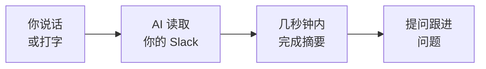

你构建了一个用 AI 跟进 Slack 频道的真正工作流。让我们看看你取得了什么成就，以及接下来可以做什么。

## 你构建了什么



- 将 AI 助手连接到了真实服务（Slack）—— 使用真实凭据
- 从真实的 Slack 频道获取了真实消息
- 以多种格式生成了结构化摘要
- 使用跟进问题找到了具体信息
- 体验了以语音为主的 AI 交互（路径 B）
- 完全免费，在 45 分钟内完成

## 你学到了什么

<Tip>
**最重要的技能不是编程 —— 而是知道如何连接工具并提出正确的问题。** 你学会了将 AI 助手链接到真实服务、获取实时数据，并将其转化为有用的内容 —— 无论是通过说话还是打字。这是一项可迁移的技能，在任何工作中都能用到。
</Tip>

- AI 工具如何连接到外部服务（连接器和 MCP）
- 如何编写能产生有用、结构化输出的提示词
- 如何为不同受众定制摘要格式
- 如何提问跟进问题，无需自己阅读即可探索数据
- 如何将 AI 作为生产力工具使用 —— 而不仅仅是聊天机器人
- 语音输入如何使 AI 工作流更快速、更自然（路径 B）

## 可以尝试的想法

<CardGroup cols={2}>
  <Card title="摘要多个频道" icon="layer-group">
    从多个频道获取摘要，比较整个工作区正在发生的事情。
  </Card>
  <Card title="每周简报" icon="calendar-week">
    创建每周摘要并与你的团队分享。将其格式化为可以粘贴到邮件中的通讯。
  </Card>
  <Card title="摘要私有频道" icon="lock">
    如果你使用了路径 B（Gemini CLI），可以在 Slack 应用设置中添加 `groups:history` 和 `groups:read` 作用域，以访问你所在的私有频道。前往 api.slack.com/apps 中的应用设置添加这些作用域。
  </Card>
  <Card title="导出为 PDF" icon="file-pdf">
    将本教程与[创建专业 PDF](/docs/2026-her-waka/tutorial/professional-pdf/overview) 教程结合 —— 摘要一个频道，然后用 Gemini CLI + Typst 创建一份格式精美的 PDF 报告。
  </Card>
</CardGroup>

<AccordionGroup>
  <Accordion title="提示词：比较多个频道">
    ```text title="说出或复制此提示词 —— 替换频道名称"
    Summarise these three Slack channels from the last week:
    - #general
    - #announcements
    - #project-updates

    For each channel, give me 3-5 bullet points.
    Then tell me: what are the common themes across all three channels?
    ```
  </Accordion>
  <Accordion title="提示词：每周简报邮件">
    ```text title="说出或复制此提示词 —— 替换 #channel-name"
    Create a weekly digest for #channel-name covering the last 7 days.

    Format it as a short newsletter with:
    - A one-sentence overview at the top
    - Key updates (bullet points)
    - Action items
    - Links shared

    Make it professional enough to paste into an email to my team.
    ```
  </Accordion>
  <Accordion title="提示词：找出未回答的问题">
    ```text title="说出或复制此提示词 —— 替换 #channel-name"
    Read the recent messages in #channel-name and find any questions
    that were asked but never answered.

    List each unanswered question with:
    - Who asked it
    - When they asked it
    - The full question

    This will help me make sure nothing falls through the cracks.
    ```
  </Accordion>
</AccordionGroup>

## 进阶：CLI 技能与通往 Claude Code 的路径

如果你使用了 CLI 路径，你现在已经有了终端 AI、MCP 连接和以语音为主的工作流的实操经验。这些技能可以直接迁移到 **Claude Code** —— Vibe Coding 教程中所用的专业 CLI 工具。

如果你使用了 Claude Desktop，你已经见识了 Anthropic 如何构建 AI 工具。Claude Code 是同一技术的终端版本 —— 更快、更强大，是专业开发者的首选工具。在进入 Vibe Coding 之前，考虑尝试本教程的 CLI 路径，以培养你的终端技能。

<Info>
**相同的技能，更强大的工具。** 在终端中与 AI 对话、批准工具调用、使用 MCP 服务器 —— 这一切你都通过 Gemini CLI 学到了。Claude Code 使用完全相同的工作流，但还能编写代码、编辑文件并管理整个项目。
</Info>

## 反思

<AccordionGroup>
  <Accordion title="将 AI 连接到 Slack，什么让你感到惊讶？">
  很多人惊讶于将 AI 连接到日常使用的服务是多么简单直接。技术门槛比大多数人预期的要低得多 —— 尤其是使用连接器（路径 A）完全无需设置，或使用语音命令（路径 B）让体验感觉就像与同事交谈。
  </Accordion>
  <Accordion title="这个工作流如何帮助你的工作或求职？">
  想想：休假后快速跟上进度、通过摘要相关频道为会议做准备、为经理创建每周报告，或跟进求职群体中的社区讨论。快速从对话中提取信息的能力在任何职位上都很有价值。有了语音输入，你甚至可以在多任务处理时获取这些摘要。
  </Accordion>
  <Accordion title="语音如何改变你与 AI 的交互方式？">
  与 AI 对话的感觉与打字不同。它更快、更自然，降低了寻求帮助的门槛。很多人发现，当他们可以直接说话时，他们会提出更多跟进问题 —— 这意味着他们从同一个工具中获得了更多价值。想想你的工作流中还有哪些地方，以语音为主的 AI 可以节省时间。
  </Accordion>
  <Accordion title="你还希望 AI 摘要哪些其他信息？">
  同样的方法适用于邮件、会议记录、文档、新闻文章等更多内容。一旦你知道如何编写有效的提示词，你就可以将这种技能应用到任何文字密集的任务中。
  </Accordion>
</AccordionGroup>

## 资源

| 资源 | 介绍 | 链接 |
|------|------|------|
| Gemini CLI | 谷歌的终端 AI 助手 | [github.com/google-gemini/gemini-cli](https://github.com/google-gemini/gemini-cli) |
| Claude Code | 专业 AI CLI 工具（你的下一步） | [docs.anthropic.com](https://docs.anthropic.com/en/docs/claude-code) |
| Claude Desktop | 下载 Anthropic 的 AI 助手 | [claude.ai/download](https://claude.ai/download) |
| Wispr Flow | 任意应用的语音输入工具 | [wisprflow.ai](https://wisprflow.ai/r?CHAN115) |
| Slack API 文档 | 官方 Slack API 文档 | [api.slack.com](https://api.slack.com) |
| Slack MCP 服务器 | 推荐路径使用的 MCP 服务器 | [npmjs.com/package/@modelcontextprotocol/server-slack](https://www.npmjs.com/package/@modelcontextprotocol/server-slack) |
| 管理你的 Slack 应用 | 创建和管理 Slack 应用 | [api.slack.com/apps](https://api.slack.com/apps) |

<Note>
感谢你完成本教程！你从零开始，用 AI 摘要了真实的 Slack 对话 —— 无论是通过说话还是打字。连接工具、获取数据并从中提取意义的能力，在任何职位上都很有价值 —— 把这项技能带走吧。
</Note>
