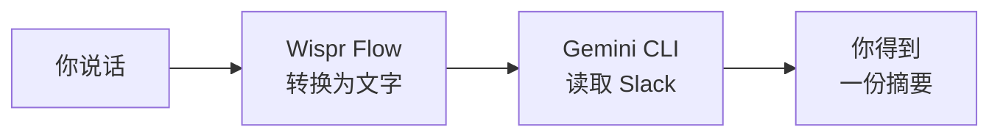
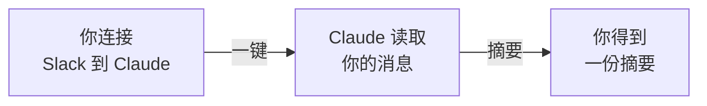

<Tip>
**难度：★★★★☆ 有挑战性** · 预计时间：约 45 分钟
</Tip>

你在漫长的周末后打开 Slack，五个频道里有 150 条未读消息 —— 你错过的项目更新、没有你参与就做出的决定，还有一个不知为何变成了 47 条回复的讨论串。你可以花 20 分钟全部刷完 —— 或者直接说：

> "读取 #general 频道最近的消息，给我一份包含主要话题、决定和待办事项的摘要"

几秒钟后，你就得到了清晰、结构化的快速回顾。不用滚动，不用跳读，不用担心遗漏什么重要的事情。

**这就是我们要构建的工作流。** 读取你的 Slack 消息并给你一份清晰、实用的摘要 —— 即时完成。

<Info>
**教程由 [Chan Meng](https://chanmeng.org/) 主导** —— 高级 AI/ML 工程师、开源贡献者、前字节跳动开发者。Chan 搭建了 30+ 个真实应用，专注于 AI 驱动的解决方案，也是本次活动的圆桌嘉宾和本网站的开发者。
</Info>

## 你将构建什么

<CardGroup cols={3}>
  <Card title="连接" icon="plug">
    将 AI 工具链接到你的 Slack 工作区，使其能够读取消息
  </Card>
  <Card title="获取" icon="download">
    从你选择的任意频道拉取消息
  </Card>
  <Card title="摘要" icon="sparkles">
    AI 读取消息并给你一份清晰、可操作的摘要
  </Card>
</CardGroup>

## 两条路径可供选择

本教程提供两种方式来达到相同的目标。选择最适合你的一种。

<CardGroup cols={2}>
  <Card title="推荐：CLI + 语音" icon="terminal">
    **约 30 分钟** · 推荐方式

    安装 Gemini CLI，创建一个 Slack 应用，并通过 Wispr Flow 使用语音命令从终端摘要频道。你将学习 AI 工具如何通过 MCP 连接到服务 —— 这与 Claude Code 等专业工具使用的工作流完全相同。
  </Card>
  <Card title="备选：Claude Desktop" icon="message-bot">
    **约 10 分钟** · 快速设置

    下载 Claude Desktop，一键连接你的 Slack 工作区，立即开始请求摘要。结果快速，但不会培养其他教程所用的 CLI 技能。Claude Desktop 由 Anthropic 制作 —— 也就是 Claude Code 背后的公司。
  </Card>
</CardGroup>

<Tip>
**我应该选哪条路径？** 我们推荐 **CLI + 语音** —— 它能培养你在每个教程中都会用到的终端技能，并为你使用 Claude Code 等专业工具做好准备。只有在时间紧张且想快速获得结果而不进行终端设置时，才选择 Claude Desktop。
</Tip>

## 工作原理

**推荐：Gemini CLI + 语音**

**备选：Claude Desktop**

两条路径都将 AI 助手连接到你的 Slack 工作区。AI 读取你所选频道的消息，分析对话，并在几秒钟内生成结构化摘要。

<Tip>
**你可以用 Wispr Flow 说出提示词，也可以打字或粘贴到 Gemini CLI 中。两种方式效果完全一样。** Wispr Flow 是可选项 —— 它只是让体验更加解放双手。本教程中的每条提示词，无论你说出来还是打出来都同样有效。
</Tip>

## 你将学到

- 将 AI 工具连接到真实服务（Slack）以访问实时数据
- 编写能生成实用、结构化摘要的清晰提示词
- 为不同需求（快速回顾、会议记录、要点提炼）定制摘要格式
- 对你没有阅读过的对话提问
- 将 AI 作为日常任务的生产力工具
- 使用语音输入与 AI 进行解放双手的交互（路径 B）

<Note>
**无需任何编程经验。** AI 处理一切 —— 你的工作是描述你想要什么样的摘要。如果你能向同事解释你需要什么，你就能做到这一点。
</Note>

## 工具

<CardGroup cols={3}>
  <Card title="Gemini CLI" icon="terminal">
    谷歌免费的终端 AI 助手，支持通过 MCP 连接外部服务。推荐路径使用。
  </Card>
  <Card title="Wispr Flow" icon="microphone">
    可选的语音输入工具 —— 说话代替打字。在任何应用中均可使用，包括终端。推荐路径使用。
  </Card>
  <Card title="Claude Desktop" icon="message-bot">
    Anthropic 的免费 AI 助手应用。直接连接并与 Slack 对话。仅备选路径使用。
  </Card>
  <Card title="Slack API" icon="slack">
    让你的工具从 Slack 频道读取消息。你将创建一个具有只读权限的简单 Slack 应用。
  </Card>
  <Card title="Node.js" icon="node-js">
    安装 Gemini CLI 和 Slack MCP 服务器所需的工具。仅推荐路径需要。
  </Card>
</CardGroup>

## 费用

| 工具 | 费用 |
|------|------|
| Claude Desktop | 免费 |
| Gemini CLI | 免费（每日 1,000 次请求） |
| Wispr Flow | 免费试用（[邀请链接可获一个月 Pro 版免费试用](https://wisprflow.ai/r?CHAN115)） |
| Node.js | 免费 |
| Slack API | 免费 |
| **合计** | **$0** |

## 前置要求

<CardGroup cols={3}>
  <Card title="一台能联网的电脑" icon="laptop">
    Windows 或 macOS 均可。无需特殊硬件。
  </Card>
  <Card title="约 45 分钟" icon="clock">
    慢慢来 —— 不用着急。可以随时暂停，之后再继续。
  </Card>
  <Card title="一个 Slack 工作区" icon="slack">
    你所在的任何工作区。可以是工作、社区或个人工作区。
  </Card>
</CardGroup>

<Note>
准备好了吗？前往[设置你的工具](/docs/2026-her-waka/tutorial/slack-summary/setup)，准备好一切。
</Note>
