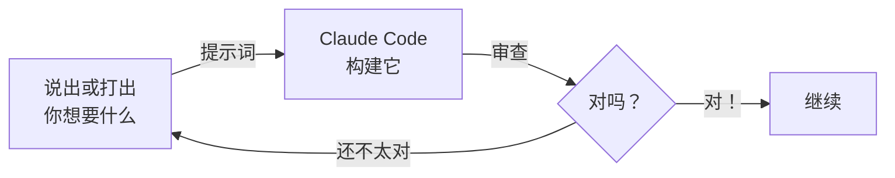
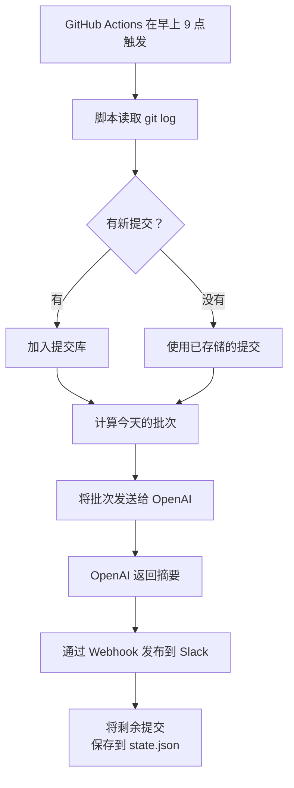

这是教程的核心。你将向 Claude Code 发送六个提示词，完成后你将拥有一个完全能用的每日报告机器人。无需编程 —— 只需清晰的沟通。

<Tabs>
  <Tab title="语音（Wispr Flow）">
    打开 Wispr Flow 后，直接开始说话。你的话语会自动以文字形式出现在 Claude Code 中。自然地描述你想要什么 —— Claude Code 理解你的意思并为你编写代码。说话在描述长而详细的提示词时特别有效，因为你可以像向同事解释一样说出需求。
  </Tab>
  <Tab title="打字或粘贴">
    从本页复制任何提示词并粘贴到 Claude Code 中。或者用自然语言打出你自己的请求。不需要特殊语法 —— 只需描述你想要什么。
  </Tab>
</Tabs>

## 如何与 Claude Code 对话

<Tip>
把 Claude Code 想象成一个能编写任何代码的出色同事，但需要你清晰地解释目标。你描述得越好，结果就越好。无论你是说话还是打字，方法都是一样的 —— 只需说出你需要什么。
</Tip>

对话循环始终是一样的：



让我们开始构建。

---

## 提示词 1：描述整个项目

在编写任何代码之前，给 Claude Code 呈现大局。这有助于它在每一步都做出更好的决策。

**打开终端，`cd` 进入你的 `daily-report-bot` 文件夹，输入 `claude` 启动 Claude Code。然后说出或发送此提示词：**

```text title="说出或复制此提示词"
I want to build a daily work report bot. Here's what it should do:

1. Run every weekday morning via GitHub Actions
2. Read my recent git commits from this repository
3. Use OpenAI's API to turn those commits into a friendly, human-readable daily standup update
4. Post the update to a Slack channel via a webhook

The bot should be written in Node.js. It should support a "dry run" mode
that prints the report to the console without posting to Slack.

I also want a "commit banking" feature: if I make 10 commits on Monday
but none on Tuesday, the bot should spread them across the week so every
day has something to report.

Can you start by creating a project structure with a package.json and
the main entry point? Don't write the full logic yet — just set up the
skeleton.
```

**会发生什么：** Claude Code 创建一个 `package.json`、一个主脚本文件（例如 `index.js` 或 `src/index.js`），可能还有一个配置文件。它搭建基本的项目结构，而不填充具体逻辑。

<Tip>
**沟通技巧：设定背景。** 注意提示词是如何从大局开始的（"每日工作报告机器人"），然后列出具体需求，最后要求第一个具体步骤。这给了 Claude Code 足够的背景，让它能就项目结构、命名和依赖做出明智的选择。
</Tip>

<Accordion title="查看生成的项目结构">
Claude Code 通常会创建类似这样的结构：

```
daily-report-bot/
  package.json
  src/
    index.js          # 主入口点
    commits.js        # 将收集 git 提交
    summarise.js      # 将调用 OpenAI
    slack.js          # 将发布到 Slack
    bank.js           # 将处理提交库
  .env.example        # 环境变量模板
```

具体结构可能有所不同 —— 没关系。Claude Code 正在根据你的描述做出合理的决策。
</Accordion>

---

## 提示词 2：构建提交收集器

现在让我们构建第一个真实的部分 —— 读取你的 git 提交记录的脚本。

```text title="说出或复制此提示词"
Now build the commit collector. It should:

1. Use git log to read commits from the last 24 hours (or a configurable time window)
2. Extract the commit message, author, and timestamp for each commit
3. Return them as a structured array
4. Handle the case where there are no commits gracefully
5. Use a separator that won't conflict with shell operators — not || or &&

Export the function so other parts of the project can use it.
```

**会发生什么：** Claude Code 编写一个函数，用正确的格式字符串运行 `git log`，解析输出，并返回一个干净的提交对象数组。

<Tip>
**沟通技巧：将工作拆解为步骤。** 我们没有让 Claude Code 一次性构建所有内容，而是一次处理一个部分。这让每个步骤更容易审查，如果出了问题，你能确切知道在哪里。
</Tip>

<Note>
**说出技术提示词效果很好。** Wispr Flow 能准确处理"git log"、"API"和"环境变量"等技术术语。如果它听错了什么，你可以在按 Enter 之前快速修正文字。
</Note>

<Accordion title="查看生成的代码">
```javascript
// src/commits.js
const { execSync } = require('child_process');

function getRecentCommits(hours = 24) {
  const since = new Date(Date.now() - hours * 60 * 60 * 1000).toISOString();

  try {
    const output = execSync(
      `git log --since="${since}" --pretty=format:"%H<SEP>%s<SEP>%an<SEP>%aI" --no-merges`,
      { encoding: 'utf-8' }
    );

    if (!output.trim()) {
      return [];
    }

    return output.trim().split('\n').map(line => {
      const [hash, message, author, date] = line.split('<SEP>');
      return { hash, message, author, date };
    });
  } catch (error) {
    console.error('Failed to read git log:', error.message);
    return [];
  }
}

module.exports = { getRecentCommits };
```
</Accordion>

---

## 提示词 3：添加智能分配（提交库）

这是机器人最聪明的部分。如果你周一完成了所有工作，你不希望周二到周五报告"什么都没做"。提交库将你的提交分配到整个一周。

```text title="说出或复制此提示词"
Now build the commit banking feature. Here's how it should work:

- Keep a "bank" of unposted commits in a local JSON file called state.json
- When new commits come in, add them to the bank
- Each day, calculate how many commits to include in today's report:
  divide the total banked commits by the remaining weekdays this week
  (including today), and round up
- Take that many commits from the bank for today's report
- Save the remaining commits back to state.json
- On Friday, use all remaining commits so the bank starts empty on Monday
- If there are no commits in the bank at all, return an empty array

Make sure state.json can be committed to git so GitHub Actions can
persist it between runs.
```

**会发生什么：** Claude Code 创建含有加载、保存和分配提交到工作日函数的库逻辑。

<Tip>
**沟通技巧：用通俗语言描述业务逻辑。** 你没有写任何算法 —— 你描述了你想要的*行为*。"除以剩余工作日，向上取整，周五清空。" Claude Code 将这个描述转化为可工作的代码。这正是语音大显身手的地方 —— 只需像解释给别人听一样说出逻辑。
</Tip>

<Accordion title="提交库在实际中的工作方式">
以下是真实一周内会发生的情况：

| 天 | 新提交 | 存储总计 | 今天的批次 | 剩余 |
|-----|------------|--------------|---------------|-----------|
| 周一 | 10 | 10 | 2（10 / 5 天） | 8 |
| 周二 | 0 | 8 | 2（8 / 4 天） | 6 |
| 周三 | 3 | 9 | 3（9 / 3 天） | 6 |
| 周四 | 0 | 6 | 3（6 / 2 天） | 3 |
| 周五 | 2 | 5 | 5（全部剩余） | 0 |

每天都有内容可以报告，即使你那天没有提交。
</Accordion>

<Accordion title="查看生成的代码">
```javascript
// src/bank.js
const fs = require('fs');
const path = require('path');

const STATE_FILE = path.join(__dirname, '..', 'state.json');

function loadState() {
  try {
    return JSON.parse(fs.readFileSync(STATE_FILE, 'utf-8'));
  } catch {
    return { bankedCommits: [] };
  }
}

function saveState(state) {
  fs.writeFileSync(STATE_FILE, JSON.stringify(state, null, 2));
}

function getRemainingWeekdays() {
  const today = new Date().getDay(); // 0=Sun, 1=Mon, ..., 5=Fri
  if (today === 0 || today === 6) return 0;
  return 6 - today; // days remaining including today: Mon=5, Tue=4, ..., Fri=1
}

function getTodaysBatch(newCommits) {
  const state = loadState();
  state.bankedCommits.push(...newCommits);

  const remaining = getRemainingWeekdays();
  if (remaining <= 0) return [];

  const isFriday = new Date().getDay() === 5;
  const batchSize = isFriday
    ? state.bankedCommits.length
    : Math.ceil(state.bankedCommits.length / remaining);

  const batch = state.bankedCommits.splice(0, batchSize);
  saveState(state);

  return batch;
}

module.exports = { getTodaysBatch, loadState, saveState };
```
</Accordion>

---

## 提示词 4：添加 AI 摘要生成器

现在我们连接到 OpenAI，将原始提交消息转化为友好的每日更新。

```text title="说出或复制此提示词"
Now build the summariser. It should:

1. Take an array of commit objects (message, author, date)
2. Send them to OpenAI's chat completions API (use gpt-4o-mini to keep costs low)
3. Ask OpenAI to write a friendly daily standup update from these commits
4. The system prompt should tell the AI to:
   - Write in first person
   - Group related work together
   - Keep it concise (3-5 bullet points)
   - Use a warm, professional tone
   - End with any blockers (or "No blockers" if none)
5. Return the formatted text

Use the OPENAI_API_KEY environment variable for authentication.
```

**会发生什么：** Claude Code 创建一个函数，将提交格式化为提示词，调用 OpenAI API，并返回摘要文字。

<Tabs>
  <Tab title="你请求了什么">
    你描述了*行为* —— 输入提交，输出友好摘要。你指定了模型、语气、格式以及身份验证的工作方式。
  </Tab>
  <Tab title="Claude Code 构建了什么">
    Claude Code 编写了 API 调用，设计了系统提示词，处理了错误，并返回了干净的文本。它做出了关于温度、token 限制和错误处理的决策，你不需要自己考虑这些。
  </Tab>
</Tabs>

<Tip>
**沟通技巧：指定集成方式和输出格式。** 连接外部服务时，告诉 Claude Code 使用哪个 API、什么模型，以及输出应该是什么样子。对结果描述得越具体，需要迭代的次数就越少。
</Tip>

<Accordion title="查看生成的代码">
```javascript
// src/summarise.js
const OpenAI = require('openai');

const client = new OpenAI({ apiKey: process.env.OPENAI_API_KEY });

const SYSTEM_PROMPT = `You are a helpful assistant that writes daily standup updates.
Given a list of git commits, write a concise daily update in first person.
Group related work together. Use 3-5 bullet points.
Keep the tone warm and professional.
End with "Blockers: None" unless the commits suggest otherwise.
Do not include commit hashes or timestamps.`;

async function summariseCommits(commits) {
  if (commits.length === 0) {
    return "No updates today — no recent commits to report.";
  }

  const commitList = commits
    .map(c => `- ${c.message} (${c.date})`)
    .join('\n');

  const response = await client.chat.completions.create({
    model: 'gpt-4o-mini',
    messages: [
      { role: 'system', content: SYSTEM_PROMPT },
      { role: 'user', content: `Here are my recent commits:\n\n${commitList}\n\nWrite my daily standup update.` }
    ],
    temperature: 0.7,
    max_tokens: 500,
  });

  return response.choices[0].message.content;
}

module.exports = { summariseCommits };
```
</Accordion>

---

## 提示词 5：添加 Slack 发布功能

将输出连接到 Slack。

```text title="说出或复制此提示词"
Now build the Slack posting module. It should:

1. Take the summary text from the summariser
2. Post it to Slack using an incoming webhook URL
3. Use the SLACK_WEBHOOK_URL environment variable
4. Format the message nicely for Slack (use mrkdwn format)
5. Add a header like "Daily Update — [today's date]"
6. Handle errors gracefully — log the error but don't crash

Use the native https module or fetch — no need for a Slack SDK.
```

**会发生什么：** Claude Code 创建一个小函数，向 Slack Webhook 发送带有格式化消息的 POST 请求。

<Tip>
**沟通技巧：增量构建。** 注意我们没有在提示词 1 中尝试构建 Slack 发布功能。到这一步，Claude Code 已经了解了整个项目。它知道摘要生成器返回文本，并自然地连接各个部分。
</Tip>

<Accordion title="查看生成的代码">
```javascript
// src/slack.js
async function postToSlack(summary) {
  const webhookUrl = process.env.SLACK_WEBHOOK_URL;

  if (!webhookUrl) {
    throw new Error('SLACK_WEBHOOK_URL environment variable is not set');
  }

  const today = new Date().toLocaleDateString('en-NZ', {
    weekday: 'long',
    year: 'numeric',
    month: 'long',
    day: 'numeric',
  });

  const payload = {
    blocks: [
      {
        type: 'header',
        text: { type: 'plain_text', text: `Daily Update — ${today}` },
      },
      {
        type: 'section',
        text: { type: 'mrkdwn', text: summary },
      },
    ],
  };

  const response = await fetch(webhookUrl, {
    method: 'POST',
    headers: { 'Content-Type': 'application/json' },
    body: JSON.stringify(payload),
  });

  if (!response.ok) {
    const body = await response.text();
    throw new Error(`Slack webhook failed (${response.status}): ${body}`);
  }

  console.log('Posted to Slack successfully.');
}

module.exports = { postToSlack };
```
</Accordion>

---

## 提示词 6：整合所有部分并本地测试

最后的构建步骤 —— 连接所有部分并添加安全测试的干运行模式。

```text title="说出或复制此提示词"
Now wire everything together in the main entry point. It should:

1. Collect recent commits using the commit collector
2. Pass them through the commit banking system
3. Send the batch to the OpenAI summariser
4. Post the summary to Slack

Add a --dry-run flag (or DRY_RUN=true environment variable) that:
- Skips the Slack posting step
- Prints the summary to the console instead
- Still updates state.json so we can test the banking logic

Also add a --channel flag or SLACK_CHANNEL environment variable that
defaults to "test". When set to "prod", use SLACK_WEBHOOK_PROD instead
of SLACK_WEBHOOK_TEST.

Add helpful console.log messages at each step so I can follow what's
happening when it runs.
```

**会发生什么：** Claude Code 创建主脚本，编排所有部分，支持命令行标志和环境变量。

<Warning>
**保管好你的 API 密钥。** 永远不要将 `.env` 文件、API 密钥或 Webhook URL 提交到 git。我们将在下一部分将它们存储为 GitHub Secrets。
</Warning>

<Tip>
**沟通技巧：请求集成和测试。** 这个提示词将所有内容整合在一起，并要求提供测试支持（干运行模式）。在连接到真实服务之前，始终要求一种安全的测试方式。
</Tip>

<Accordion title="查看生成的代码">
```javascript
// src/index.js
const { getRecentCommits } = require('./commits');
const { getTodaysBatch } = require('./bank');
const { summariseCommits } = require('./summarise');
const { postToSlack } = require('./slack');

async function main() {
  const isDryRun = process.argv.includes('--dry-run') || process.env.DRY_RUN === 'true';
  const channel = process.argv.includes('--channel')
    ? process.argv[process.argv.indexOf('--channel') + 1]
    : process.env.SLACK_CHANNEL || 'test';

  // Set the right webhook URL based on channel
  if (channel === 'prod') {
    process.env.SLACK_WEBHOOK_URL = process.env.SLACK_WEBHOOK_PROD;
  } else {
    process.env.SLACK_WEBHOOK_URL = process.env.SLACK_WEBHOOK_TEST;
  }

  console.log(`Running daily report (dry-run: ${isDryRun}, channel: ${channel})`);

  // Step 1: Collect commits
  console.log('Collecting recent commits...');
  const commits = getRecentCommits();
  console.log(`Found ${commits.length} new commit(s).`);

  // Step 2: Bank and batch
  console.log('Processing commit bank...');
  const batch = getTodaysBatch(commits);
  console.log(`Today's batch: ${batch.length} commit(s).`);

  if (batch.length === 0) {
    console.log('No commits to report today. Exiting.');
    return;
  }

  // Step 3: Summarise
  console.log('Generating summary with OpenAI...');
  const summary = await summariseCommits(batch);
  console.log('\n--- Daily Report ---');
  console.log(summary);
  console.log('-------------------\n');

  // Step 4: Post to Slack
  if (isDryRun) {
    console.log('Dry run — skipping Slack post.');
  } else {
    console.log('Posting to Slack...');
    await postToSlack(summary);
  }

  console.log('Done!');
}

main().catch(error => {
  console.error('Error:', error.message);
  process.exit(1);
});
```
</Accordion>

---

## 使用 Claude in Chrome 进行研究

有时你需要查找一些信息 —— Slack 的 Webhook 格式、GitHub Actions 语法，或者错误消息。这就是 Claude in Chrome 派上用场的地方。

<Tabs>
  <Tab title="用 Claude in Chrome 研究">
    1. 在 Chrome 中打开 Slack API 文档或任何文档页面
    2. 点击 Claude in Chrome 扩展图标
    3. 让它解释你正在阅读的内容，例如："What format does Slack expect for incoming webhook messages?"
    4. 利用答案来优化你发给 Claude Code 的下一个提示词
  </Tab>
  <Tab title="用 Claude Code 应用">
    将你的研究成果反馈给 Claude Code：

    ```text title="说出或复制此提示词"
    I looked up the Slack webhook format. It supports blocks with
    "mrkdwn" type for rich formatting. Can you update the Slack
    module to use blocks instead of a plain text payload?
    ```

    Claude Code 根据你的研究更新代码。
  </Tab>
</Tabs>

---

## 沟通技巧总结

<AccordionGroup>
  <Accordion title="对你想要的内容具体说明">
    不要说"构建一个 Slack 机器人"，而是说"构建一个函数，使用 blocks 格式向 Slack 传入 Webhook 发送 POST 请求。"越具体，需要迭代的次数就越少。
  </Accordion>
  <Accordion title="提供你的背景情况">
    从大局开始。告诉 Claude Code 项目是什么、为谁而做、你使用什么工具。背景信息帮助它在架构、命名和依赖方面做出更好的决策。
  </Accordion>
  <Accordion title="说话很适合描述功能">
    使用 Wispr Flow 时，不用担心说出技术术语 —— 它能准确处理"API"、"webhook"、"JSON"和"环境变量"等词汇。说话在描述业务逻辑和期望行为时尤其自然。
  </Accordion>
  <Accordion title="让 Claude Code 解释它做了什么">
    如果你不理解代码，可以问："Can you explain what this function does in plain language?" 理解代码有助于你发现问题并写出更好的后续提示词。
  </Accordion>
  <Accordion title="如果出了问题，描述错误">
    复制粘贴准确的错误消息。告诉 Claude Code 你期望发生什么以及实际发生了什么。不要自己尝试诊断问题 —— 让 AI 来帮助解决。
  </Accordion>
  <Accordion title="迭代 —— 逐步优化你的请求">
    你的第一个提示词很少能产生完美的结果。这很正常。审查 Claude Code 构建的内容，找出不太对的地方，然后发送后续提示词。每次迭代都会让你更接近目标。
  </Accordion>
</AccordionGroup>

---

## 完整数据流

以下是所有内容的连接方式：



<Note>
你的机器人构建好了！前往[部署和测试](/docs/2026-her-waka/tutorial/vibe-coding/deploy-and-test)，设置 GitHub Actions，看它真正运行起来。
</Note>
