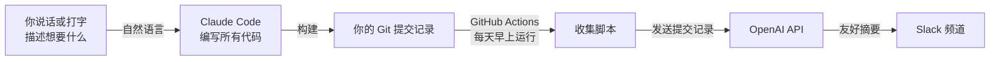
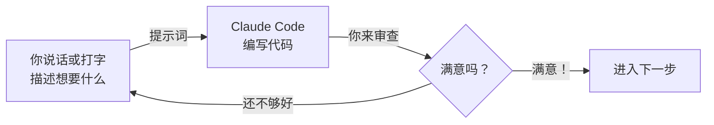

<Tip>
**难度：★★★★★ 高级** · 预计时间：约 2 小时
</Tip>

<Info>
**教程由 [Chan Meng](https://chanmeng.org/) 主导** —— 高级 AI/ML 工程师、开源贡献者、前字节跳动开发者。Chan 搭建了 30+ 个真实应用，专注于 AI 驱动的解决方案，也是本次活动的圆桌嘉宾和本网站的开发者。
</Info>

## 问题背景

你刚加入一个新团队。你的经理在 Slack 上发帖："从现在起，每个人每天发一条工作更新 —— 你完成了什么、正在做什么、有哪些阻碍。"

第一周，你认真执行。第二周，有一半的时间忘记了。第三周，你开始复制昨天的消息，改几个字了事。

是不是很熟悉？这不是因为你懒 —— 而是因为你是人。信息已经存在于你的 git 提交记录中，你只需要某样东西来读取这些提交并自动将它们转化成友好的每日更新，每天早上自动发送。

**这就是我们要构建的。** 而且我们自己一行代码都不用写。只需描述你想要什么 —— 通过说话或打字 —— Claude Code 就会全部实现。

## 什么是 Vibe Coding？

<Tip>
**Vibe Coding** 意味着用自然语言描述你想要什么，让 AI 为你编写代码。你把握方向，审查结果，不断迭代直到满意。把它想象成指挥一名建筑工人 —— 你不需要自己砌砖，但你需要解释房子应该是什么样子。通过 Wispr Flow 使用语音输入，你可以真正把想法说出来就变成现实。
</Tip>

<Info>
**建立在你的 CLI 技能之上。** 如果你完成了之前的 Gemini CLI 教程，你已经知道如何在终端中与 AI 合作 —— 说出提示词、批准工具调用、审查结果。Claude Code 使用相同的工作流，但可以编写、编辑和部署真实代码。区别在于能力，而不是流程。
</Info>

## 你将构建什么

<CardGroup cols={3}>
  <Card title="收集" icon="code-branch">
    自动收集你最近的 git 提交记录
  </Card>
  <Card title="摘要" icon="sparkles">
    使用 AI 将你的提交记录转化为友好的每日更新
  </Card>
  <Card title="发布" icon="comments">
    每天早上发送到你的 Slack 频道
  </Card>
</CardGroup>

## 工作原理

你描述你想要什么 —— 通过 Wispr Flow 说话或在终端打字。Claude Code 编写代码。部署后，机器人每天早上自动运行：收集你的 git 提交记录，将它们发送给 AI 模型改写为人类友好的更新，然后直接将结果发布到 Slack。

## 你将学到什么

本教程专注于**与 AI 的沟通技巧**，而非编程知识。你将学会：

- 编写清晰的提示词，一次就能得到想要的结果
- 将项目拆解为小的、可构建的步骤
- 用普通语言描述业务逻辑，让 AI 来实现
- 当第一次结果不太对时，进行迭代和优化
- 将多个 AI 工具结合使用（Claude Code 用于构建，Claude in Chrome 用于研究）
- 使用 Wispr Flow 语音输入来加速工作流

<Note>
你不需要懂编程。Claude Code 写代码 —— 你的工作是清晰地描述你想要什么。如果你能向同事解释一个想法，你就能 Vibe Code。通过 Wispr Flow 大声说出你的想法，让这一切更加自然。
</Note>

## Vibe Coding 工作流

本教程中的每一步都遵循相同的循环：

你描述。Claude Code 构建。你审查。重复直到满意，然后继续。

<Tip>
**语音还是键盘 —— 由你决定。** 通过 Wispr Flow，你可以自然地说出提示词，你的话语会作为文字出现在 Claude Code 中。本教程中的每个提示词无论说出来还是打出来都同样有效。语音在描述复杂功能时特别方便 —— 就像向同事解释一样，把你想要的说出来就好。
</Tip>

## 你将使用的工具

<CardGroup cols={2}>
  <Card title="Claude Code" icon="terminal">
    你的 AI 编程伙伴。你用自然语言描述想要什么，它来编写代码。在你的终端中运行。
  </Card>
  <Card title="Wispr Flow" icon="microphone">
    可选的语音输入工具 —— 说话代替打字。在任何应用中均可使用，包括终端。你的话语直接以文字形式传入 Claude Code。
  </Card>
  <Card title="Claude in Chrome" icon="chrome">
    一个浏览器扩展，帮助你研究文档、理解错误信息、寻找答案 —— 无需离开浏览器。
  </Card>
  <Card title="OpenAI API" icon="brain">
    读取你的 git 提交记录并将其改写为人类友好的每日更新的 AI 服务。我们将其用作机器人内部的摘要生成器。
  </Card>
  <Card title="GitHub Actions" icon="clock">
    GitHub 内置的自动化功能。它按计划每天早上运行你的机器人 —— 无需服务器。
  </Card>
  <Card title="Node.js" icon="node-js">
    安装 Claude Code 和运行机器人所需的免费工具。一次性设置。
  </Card>
</CardGroup>

## 费用

| 工具 | 费用 |
|------|------|
| Claude Code | 有免费套餐 |
| Wispr Flow | 免费试用（[邀请链接可获一个月 Pro 版免费试用](https://wisprflow.ai/r?CHAN115)） |
| Claude in Chrome | 免费 |
| OpenAI API | 约 $0.01/天（每月几分钱） |
| GitHub Actions | 公开仓库免费（私有仓库每月 2,000 分钟） |
| Slack | 免费 |
| **合计** | **约 $0/月** |

<Note>
准备好了吗？前往[设置你的工具](/docs/2026-her-waka/tutorial/vibe-coding/setup)，做好一切准备。
</Note>
