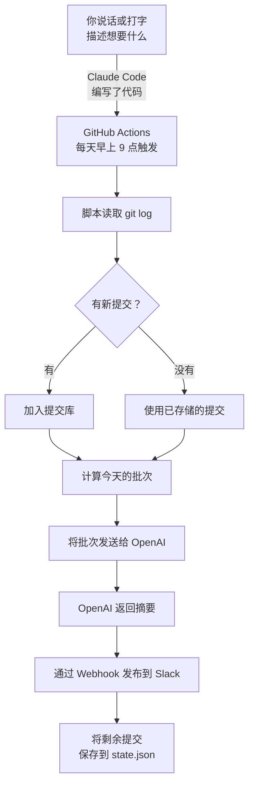

恭喜 —— 你构建了一个真正能用的 Slack 机器人，而且没有自己写过一行代码。你描述了你想要的 —— 通过说话或打字 —— Claude Code 将你的话语转化为一个完全自动化的每日报告机器人。让我们回顾一下你取得的成就，探索接下来可以做什么，并反思这段体验。

## 你构建了什么



一个每日报告机器人，它会：
- 自动收集你的 git 提交记录
- 使用提交库将提交分配到整个工作周
- 使用 AI 将它们总结成友好的每日更新
- 每天早上发布更新到你的 Slack 频道

---

## 你真正学到了什么

代码是有用的，但你练习的真正技能可以迁移到任何项目：

<Tip>
**最重要的技能不是编程 —— 而是沟通。** 你学会了将问题拆解为步骤，清晰地描述每个步骤，并不断迭代直到结果正确。无论你是通过 Wispr Flow 说出提示词还是打出来，核心技能是一样的：向 AI 解释你想要什么。这些技能让人在使用任何 AI 工具、在任何领域都能发挥效用。
</Tip>

## 你是怎么走到这里的

如果你完成了之前的教程，你一直在一步一步地积累 CLI 技能：

- **Gmail 摘要：** 第一次在终端中使用 Gemini CLI
- **Obsidian 每日笔记 / 整理：** 通过 Gemini CLI 语音控制应用
- **奥克兰通勤 / 个人网站：** Gemini CLI 与真实 API 和实时数据结合
- **专业 PDF / Slack 摘要：** Gemini CLI 与 MCP 服务器和扩展结合

Claude Code 的工作方式相同 —— 你在终端中说话或打字，AI 完成工作，你批准结果。唯一的区别是 Claude Code 更强大，能处理完整的工程项目。你从 Gemini CLI 学到的一切都为这一刻做好了准备。

---

以下是你练习的技能：

- **设定背景** —— 在深入细节之前给 Claude Code 大局观
- **将工作拆解为步骤** —— 一次解决一个部分，而不是一次性解决所有问题
- **描述业务逻辑** —— 用通俗语言解释你想要什么，而不是代码
- **指定集成方式** —— 明确说明使用哪些 API、格式和工具
- **增量构建** —— 每一步都建立在上一步之上
- **请求测试** —— 在上线前始终要求一种安全的验证方式
- **与 AI 一起调试** —— 清晰地描述错误，让 AI 帮助诊断
- **使用语音输入** —— 自然地说出功能和需求

---

## 提交库算法

对于那些对提交库背后算法感到好奇的人：

<Accordion title="深入了解：提交库如何分配提交">
算法简单但有效：

**规则：** 每天，将总存储提交数除以本周剩余工作日数（包括今天），向上取整。周五用完所有提交。

以下是周一有 15 个提交的完整一周示例：

| 天 | 已存储 | 剩余天数 | 批次大小 | 已发送 | 剩余 |
|-----|--------|---------------|------------|------|------|
| 周一 | 15 | 5 | ceil(15/5) = 3 | 3 | 12 |
| 周二 | 12 | 4 | ceil(12/4) = 3 | 3 | 9 |
| 周三 | 9 | 3 | ceil(9/3) = 3 | 3 | 6 |
| 周四 | 6 | 2 | ceil(6/2) = 3 | 3 | 3 |
| 周五 | 3 | 1 | 3（全部） | 3 | 0 |

另一个示例 —— 提交在整个一周内陆续到来：

| 天 | 新增 | 已存储 | 批次 | 已发送 | 剩余 |
|-----|-----|--------|-------|------|------|
| 周一 | 4 | 4 | ceil(4/5) = 1 | 1 | 3 |
| 周二 | 0 | 3 | ceil(3/4) = 1 | 1 | 2 |
| 周三 | 6 | 8 | ceil(8/3) = 3 | 3 | 5 |
| 周四 | 0 | 5 | ceil(5/2) = 3 | 3 | 2 |
| 周五 | 1 | 3 | 3（全部） | 3 | 0 |

提交库总会在周五清空，所以周一重新开始。
</Accordion>

---

## 接下来可以尝试的想法

使用相同的方法 —— 说出或打出你想要的，让 Claude Code 来构建：

<CardGroup cols={2}>
  <Card title="添加每周摘要" icon="calendar-week">
    让 Claude Code 创建一个单独的工作流，在周五运行并发布整周工作的摘要 —— 每周回顾版而非每日更新。
  </Card>
  <Card title="发布到 Microsoft Teams" icon="users">
    将 Slack Webhook 替换为 Teams 传入 Webhook。消息格式略有不同，但 Claude Code 可以处理转换。
  </Card>
  <Card title="包含 Jira 或 Trello 任务" icon="list-check">
    扩展机器人以拉取你最近的 Jira 工单或 Trello 卡片动态，与 git 提交一起展示，呈现一天更完整的工作图景。
  </Card>
  <Card title="添加励志名言" icon="quote-left">
    让 Claude Code 在每份报告末尾添加随机励志名言。一个让每日更新更有趣的小细节。
  </Card>
</CardGroup>

以下是开始这些扩展的提示词 —— 说出来或粘贴到 Claude Code 中：

```text title="说出或复制此提示词"
I want to add a weekly summary feature. Every Friday, after the daily
report, generate a second message that summarises everything posted
Monday through Friday. Post it to Slack with the header
"Weekly Summary — [date range]".
```

---

## 陷阱与经验教训

<AccordionGroup>
  <Accordion title="Shell 将 || 解释为 OR 运算符">
    如果你在 `git log --pretty=format` 中使用 `||` 作为分隔符，shell 会将其视为逻辑 OR。改用安全的分隔符，例如 `<SEP>`。这是一个连有经验的开发者都会踩的经典陷阱。
  </Accordion>
  <Accordion title="GitHub Actions cron 不够精确">
    在高负载期间，计划工作流可能会延迟最多 15 分钟。不要依赖精确的时间 —— 将你的机器人设计成无论何时运行都能正常工作。
  </Accordion>
  <Accordion title="state.json 必须提交">
    提交库的状态需要在运行之间持久保存。由于 GitHub Actions 每次都从新环境启动，`state.json` 必须提交到仓库。这就是为什么工作流中包含一个步骤，在每次运行后提交并推送它。
  </Accordion>
  <Accordion title="fetch-depth: 0 是必须的">
    默认情况下，`actions/checkout` 只获取最新提交（浅克隆）。你的机器人需要完整的 git 历史来查找最近的提交。始终设置 `fetch-depth: 0`。
  </Accordion>
  <Accordion title="永远不要提交 Webhook URL 或 API 密钥">
    将所有机密存储在 GitHub Secrets 中，而不是代码里。如果你不小心提交了机密，立即撤销它并生成一个新的。Git 历史会保留删除的内容 —— 从最新提交中删除机密并不能从历史记录中删除它。
  </Accordion>
</AccordionGroup>

---

## 反思

花几分钟思考你的体验：

<AccordionGroup>
  <Accordion title="与 Claude Code 合作，什么让你感到惊讶？">
    很多人惊讶于只需清晰描述想要什么就能完成这么多事情。是否有某个时刻，Claude Code 的输出超出了你的预期？是否有某个时刻你需要优化你的提示词？
  </Accordion>
  <Accordion title="说出提示词的感觉和打字有什么不同吗？">
    如果你使用了 Wispr Flow，你可能注意到说话让你以更自然的方式来解释事情 —— 就像向同事描述一样。语音输入改变了你与 Claude Code 的沟通方式吗？它让过程更快还是更直觉？
  </Accordion>
  <Accordion title="你如何在工作中使用这种方法？">
    Vibe Coding 不只是用来构建机器人的。想想你工作中重复性的任务 —— 报告、数据格式化、邮件模板。你能用 Claude Code 来自动化其中任何一个吗？语音输入能让原型创意变得更快吗？
  </Accordion>
  <Accordion title="你接下来会构建什么？">
    现在你了解了这个工作流 —— 描述、构建、审查、迭代 —— 你还能创建什么？一个回答常见问题的 Slack 机器人？一个整理文件的脚本？一个生成会议记录的工具？
  </Accordion>
</AccordionGroup>

---

## 资源

| 资源 | 介绍 | 链接 |
|----------|-------------|------|
| Claude Code 文档 | Claude Code 官方文档 | [docs.anthropic.com](https://docs.anthropic.com/en/docs/claude-code) |
| Wispr Flow | 免手动输入的语音转文字工具 | [wisprflow.ai](https://wisprflow.ai/r?CHAN115) |
| GitHub Actions 文档 | 了解更多关于工作流、触发器和机密的信息 | [docs.github.com/actions](https://docs.github.com/en/actions) |
| OpenAI API 参考 | 聊天完成的 API 文档 | [platform.openai.com/docs](https://platform.openai.com/docs) |
| Slack API —— Webhooks | 传入 Webhook 的工作原理 | [api.slack.com/messaging/webhooks](https://api.slack.com/messaging/webhooks) |
| Crontab Guru | 测试和理解 cron 调度表达式 | [crontab.guru](https://crontab.guru) |

<Note>
感谢你完成本教程！你从零开始构建了一个完全自动化的每日报告机器人 —— 更重要的是，你学会了如何与 AI 工具有效沟通，无论是通过语音还是键盘。把这些技能带到你的下一个项目吧。
</Note>
