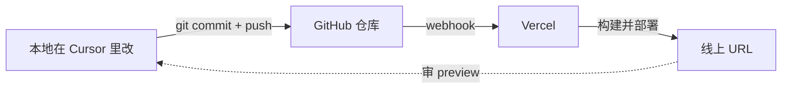

<AxisBadge axes={["JOB", "FUN"]} />

# 部署你的个人网站

## 学习目标

到本节课结束，学员应当能够：

- **审视自己第 1 周项目的技术栈**——通过问 AI 它替你选了什么框架、什么 UI 库，然后用自己的话说清楚每一个的作用。
- **通过自然语言请求 fork 一个生产级的 Vercel 模板**，整个过程不用自己手动 clone 仓库，也不用敲一句 `git clone`。
- **用大白话描述网站内容** —— bio、项目、链接、主题色 —— 然后看着 Cursor 把这段描述翻译成干净、已 commit 的源代码改动。
- **用一句提示词触发 Vercel 部署**，出错时能读 build log，并通过把错误描述给 AI 来恢复。
- **接通一个轻量版 AI 分身** 到作品集里——用 Gemini 2.5 Flash + `.env.local` 管理的 API key。最简 UI、不流式、不持久化（这些是第 3 周的事）。

## 核心主题

- "AI 给我选的栈是什么？" —— 大部分同学其实早已经在用 Next.js + Tailwind 了，只是自己没意识到。
- 现代 UI 组件库：什么时候用 Shadcn UI、什么时候用 Magic UI、什么时候用 Aceternity、什么时候用 Radix——以及什么时候完全不用组件库。
- 一个 Vercel 模板如何在一段对话里就变成"你的"网站。
- "用英文描述内容，让 AI 写 MDX/TSX"——这套模式贯穿第 2–6 周。
- 专业的 **本地 → GitHub → Vercel** CI/CD 工作流，以及为什么"拖拽到 Vercel"是一个大坑。
- 第一次接触 LLM 集成 —— Gemini 2.5 Flash + `.env.local` + 一个最简聊天框。流式、persona、持久化都是下周的事。

## 工具 / 技术栈

| 工具 | 本周角色 |
|---|---|
| **Cursor** | 一个聊天窗，所有事都在这里发生。 |
| **Vercel MCP** | AI 创建项目、部署、读日志、设置环境变量。 |
| **GitHub** | 每次 commit 推送；Vercel 自动重建。 |
| **Next.js 14** | Magic Portfolio 模板基于的框架。 |
| **Tailwind CSS** | 样式；当你描述视觉变化时，AI 改 class。 |
| **Magic Portfolio** | 我们 fork 的起点 —— [Vercel 模板](https://vercel.com/templates/next.js/magic-portfolio-for-next-js)。 |
| **UI 组件库巡礼** | Once UI · Magic UI · Shadcn · React Bits · Aceternity · Radix · 21st（见下方[专门章节](#ui-组件库巡礼)）。 |
| **Gemini 2.5 Flash** | 阶段 6 那个轻量版聊天框背后的 LLM。快、便宜。 |
| **Google AI Studio** | 取免费 API key 的地方（这是唯一一个"只能人做"的瞬间）。 |

<SiteEvolution thisWeek={2} />

## UI 组件库巡礼

框架（比如 Next.js）提供结构 —— 路由、SSR、性能默认值。**UI 组件库** 提供的是积木：按钮、对话框、动效标题、动效充沛的着陆页 section。两者搭配带来三件事：开发速度、视觉一致性、可扩展性。这张表先扫一眼，第 3–6 周你还会反复回来查它。

| 组件库 | 一句话定位 | 链接 |
|---|---|---|
| **Once UI** | 干净、基础的设计系统 | [once-ui.com](https://once-ui.com/products/once-ui-core) |
| **Magic UI** | 现代动效、抓眼球的交互 | [magicui.design](https://magicui.design/docs/components) |
| **Shadcn UI** | 当前最火，复制粘贴式组件，可彻底定制 | [ui.shadcn.com](https://ui.shadcn.com/docs/components) |
| **React Bits** | 轻量级 React 片段 | [reactbits.dev](https://www.reactbits.dev/get-started/index) |
| **Aceternity UI** | 潮、未来感、动效极强的 landing page | [ui.aceternity.com](https://ui.aceternity.com/components) |
| **Radix UI** | 无障碍优先（屏幕阅读器、键盘导航） | [radix-ui.com](https://www.radix-ui.com/themes/docs/components/alert-dialog) |
| **21st** | 现代组件的发现型注册表 | [21st.dev](https://21st.dev/home) |

<Tip title="Shadcn 不是'装'的——是'抄'的">
Shadcn UI 是个特例：你不是把它当一个庞大的 npm 依赖装进去，而是把每个组件的源码 **直接复制粘贴** 到你的项目里。这就是它现在最火的原因 —— **你拥有这段代码**，所以你能调任何一个像素，不用跟一个组件库的 API 较劲。
</Tip>

## 专业的 CI/CD 工作流

不可妥协的规则：**任何部署都走 GitHub**。本地改、commit、push —— Vercel 自动重建。每一次 push 都会拿到一个独立的 preview URL，你可以审完再推到生产。

<Note title="反模式 —— 千万别这么做">
本地改完文件、**手动上传到 Vercel**（在 dashboard 里拖拽，或者在一个不是 git repo 的文件夹里跑 `vercel deploy`）—— 这是个大坑。**没有 git 历史就意味着无法回退、无法审计、无法 review**，下一次出问题你甚至不知道是哪一次改动捅的篓子。整个学期，每一次部署都走 GitHub。就这样。
</Note>

## 课堂计划

| 时间 | 活动 |
|---|---|
| 0 – 15 分钟 | **回顾与 Check-in。** 第 1 周第一次拿到 Vercel URL 的同学举手。还卡住的——给两分钟和同学结对解一下。然后所有人在自己第 1 周的 repo 里跑下面的 **阶段 0 技术栈提示词**。 |
| 15 – 40 分钟 | **概念讲解。** 技术栈识别（框架 vs UI 组件库 —— 见上方表格）。"模板优先"模式。为什么 fork 一个好模板比从零开始更划算。CI/CD 流程图，以及为什么 GitHub 是唯一真实数据源。 |
| 40 – 75 分钟 | **现场演示。** 讲师对 Cursor 只发一句提示词："Fork Magic Portfolio，把它改成关于我，然后部署。"全班看着整套流程——fork、clone、改、commit、部署——在一段对话里发生。然后接通轻量版 AI 分身。 |
| 75 – 105 分钟 | **动手 Lab。** 每位学员上线自己的作品集 URL **并接通一个能用的聊天框**（背后是 Gemini 2.5 Flash）。每个人挑一种不同的强调色，整个教室会有差异性可供互评。 |
| 105 – 120 分钟 | **Q&A + 收尾。** Show-and-tell：三位学员把自己的线上 URL 贴出来，并跟"自己"聊两句，全班反应一下。 |

## 动手 Lab

**任务。** 下课时你应该有一个 `yourname-portfolio-*.vercel.app` URL，上面有你的照片、一段简介、两个真实项目（或学习项目）、你的邮箱，**外加** 一个能跑的小聊天框，由"轻量版 AI 你"作答 —— 全部都在一个响应式、支持深色模式的站点里。

### 阶段 0 —— 回顾 & 技术栈识别

上周你让 AI 自由挑起步方案。很多同学最后落到了 Next.js + Tailwind，自己却没明确要求过。今天我们把"已经存在的栈"叫出名字。

<PromptStep n={1} audience="Cursor">
打开我第 1 周的项目（`hello-technest`）。这个项目用了什么技术栈？请把它们分类成 **开发框架** vs **UI 组件库** vs **其他工具**（lint、formatter、构建工具）。每一项用一句话说明它具体的作用，以及为什么对一个个人网站来说是合理选择。如果有什么是冗余的，请实话实说。
</PromptStep>

<Note title="课堂讨论">
AI 回答完之后，我们绕一圈：AI 给 *你* 选的栈是什么？它的理由说服你了吗？每人两句话。注意听规律——大多数人会反复听到 "Next.js" 和 "Tailwind"。
</Note>

### 阶段 1 —— Fork & 搭骨架

<PromptStep n={2} audience="Cursor">
请把 Vercel 上叫 **Magic Portfolio** 的那个模板（Next.js 那个）fork 到我 GitHub 账号下一个新的公开仓库，叫 `my-portfolio`。把它 clone 进当前工作区，用 pnpm 装依赖，然后启动 dev server。dev server 起来以后，在我浏览器里打开 `http://localhost:3000`。先别改任何代码——我想先看看模板原样长什么样。
</PromptStep>

<VerifyStep n={3}>

- 浏览器打开 `http://localhost:3000`，显示 Magic Portfolio 的 demo 站。
- 你的 GitHub 账号下出现了 `my-portfolio` 仓库。
- 你的文件树里现在有一个 `my-portfolio` 文件夹，里面是 Next.js 的标准结构。

</VerifyStep>

### 阶段 2 —— 内容定制

<PromptStep n={4} audience="Cursor">
现在把这个站改成关于我的。下面是我的资料——请仔细读，把所有 demo 内容（名字、bio、"about" 页、社交链接、photo credit）替换成我的真实信息：

- 姓名：**\[你的全名\]**
- 一句话简介：**\[一句话——比如 "在 \[学校\] 学 CS，正在学怎么把 AI 产品做出来。"\]**
- 长简介：**\[3–4 句话——你是谁、对什么感兴趣、本学期在做什么\]**
- 邮箱：**\[你的邮箱\]**
- GitHub：**\[你的 GitHub URL\]**
- LinkedIn（可选）：**\[你的 LinkedIn URL\]**
- 强调色：**\[挑一个——比如 "深青色 #0e7490" 或 "柔珊瑚 #fb7185"\]**

更新主题配置去用我的强调色。任何模板里现成的占位图片你都可以用——真实照片我后面再换。改完以后用一条清楚的 commit message 提交。
</PromptStep>

<VerifyStep n={5}>

- 你的姓名、简介、邮箱出现在了首页和 About 页。
- 强调色（按钮、链接、hover 状态）和你要求的对得上。
- `git log` 能看到 Cursor 替你写的一条带合理 message 的 commit。

</VerifyStep>

### 阶段 3 —— 加项目卡片

<PromptStep n={6} audience="Cursor">
Projects 那一栏还在显示 demo 项目。把它们换成我的两个真实项目：

1. **\[项目 1 名字\]** —— **\[一句话描述\]**。链接：**\[URL 或 GitHub 仓库\]**。如果你有缩略图，用模板自带的占位图。
2. **\[项目 2 名字\]** —— **\[一句话描述\]**。链接：**\[URL 或 GitHub 仓库\]**。

如果我只有一个真实项目，第二个就用本课程的学习项目——比如 "Hello TECHNEST —— 我的第一次 AI 驱动部署"，配第 1 周拿到的线上 URL。Commit 然后 push。
</PromptStep>

<VerifyStep n={7}>

- 首页 Projects 这一栏显示你两个项目，链接点进去能打开。
- commit 已经 push 到 GitHub 了——在浏览器里打开你的仓库确认。

</VerifyStep>

### 阶段 4 —— 部署到生产环境

<PromptStep n={8} audience="Cursor">
现在把这个站作为生产站点部署到 Vercel。用 Vercel MCP。把项目和我 GitHub 上的 `my-portfolio` 仓库挂钩，让以后每一次 push 都自动部署。部署完成后在我浏览器里打开生产 URL，并把 URL 给我让我复制。
</PromptStep>

<ManualStep n={9} why="GitHub 的 App-install 同意页需要人点确认——任何 CLI 都没法替你接受仓库权限。">
如果 Vercel 让你授权它的 GitHub App 去访问这个仓库（仅在新仓库的第一次会出现），在弹出的浏览器窗口里点同意。
</ManualStep>

<VerifyStep n={10}>

- 类似 `my-portfolio-*.vercel.app` 的生产 URL 在浏览器里打开。
- 你的姓名、简介、强调色、项目都在线上正确渲染。
- 在手机上打开这个 URL——移动端也得正常。

</VerifyStep>

<RecoverStep n={11}>
生产构建挂了，报错我看不懂。你能不能通过 MCP 读一下 Vercel 的 build log，找到根因，把源码里需要修的地方修了，commit 并 push 一遍，然后确认下一次部署成功？
</RecoverStep>

### 阶段 5 —— 通过对话打磨细节

<PromptStep n={12} audience="Cursor">
站点还行，但有点泛泛。请做三轮小打磨：

1. 把 hero 大标题加粗一点、字距稍微撑开一点，让我的名字更有"自信感"。
2. 给项目卡片加一个加载时的 fade-in 动画——别花哨，能让站点"活起来"就行。
3. 加一个跟强调色搭配的 OG image / favicon，这样我把链接发到聊天里时预览卡片看起来是有设计过的。

每一轮单独一个 commit，方便我读差异。
</PromptStep>

<VerifyStep n={13}>

- 刷新线上站点，确认这三轮打磨都上线了。
- 你的仓库新增了三条带描述性 message 的 commit。
- 把 URL 粘到 Slack / WhatsApp / 微信里——预览卡片应该显示你的名字和强调色。

</VerifyStep>

<Tip title="如果你有真实照片，赶紧用上">
如果你电脑上有头像和两张项目截图，把它们直接拖进 Cursor 聊天窗，然后说：**"用这三张图——头像放 About 页，截图分别放在两张项目卡片上。提交前压缩到合理的 web 尺寸。"** Cursor 会把文件放进 `public/`，再把它们接到正确的组件里。
</Tip>

### 阶段 6 —— 接通一个轻量版"AI 你"

这是你第一次接触 LLM 集成。我们故意保持极简：一个最基础的输入框 + 回复区，背后用 Gemini 2.5 Flash，system prompt 喂你 CV。**流式、persona 文件、持久化都是下周的事** —— 今天只需要让模型用"有你味儿"的口吻回个话。

<ManualStep n={14} why="Google 的 API key 创建需要人接受使用条款。任何 CLI 都按不了 'Agree' 这个按钮。">
打开 [aistudio.google.com/apikey](https://aistudio.google.com/apikey)，用 Google 账号登录，点 **Create API key**，名字起作 `TechNest week2 - test`，复制下来。这个 tab 别关——但 **不要把 key 粘进 Cursor 的聊天窗**。
</ManualStep>

<Tip title="永远不要把 API key 粘进聊天历史">
key 应该放在 `.env.local`，不应该出现在聊天历史里（你的聊天 scrollback 经常会同步到云端），更不应该出现在已 commit 的源码里。正确的做法是：把 key 复制到剪贴板，然后告诉 AI：*"我已经把 key 复制到剪贴板了——请帮我配置环境变量，不要让我在聊天里粘贴它。"* Cursor 会告诉你具体粘到哪个文件里。
</Tip>

<PromptStep n={15} audience="Cursor">
我已经把 Google Gemini API key 复制到系统剪贴板了。**不要让我把它粘到这个聊天窗里。** 请：

1. 配置环境变量：把 `GOOGLE_GENERATIVE_AI_API_KEY` 加到 `.env.local`（如果文件不存在就建一个）。确认 `.env.local` 在 `.gitignore` 里，永远不会被推到 GitHub。
2. 通过 Vercel MCP / CLI，把同一个 key 也加到我 Vercel 的生产环境。
3. 从 npm 装上 `ai` 和 `@ai-sdk/google`。
4. 给作品集站加一个 **最简版** 聊天组件 —— 一个文本输入框、一个发送按钮、一块回复显示区。**不要流式、不要持久化、不要花哨的浮动按钮** —— 这些是下周的事。一个能跑的 chat，用 `gemini-2.5-flash` 模型就行。
5. 用我 CV / About 页的内容作为 **system prompt**，让 AI 用我的口吻、带着我的背景回答。
6. Commit 并 push，让 Vercel 自动部署。

做完后告诉我本地和线上分别怎么测。
</PromptStep>

<VerifyStep n={16}>

- 站点上有一个聊天框（放在哪都行 —— 下周再调位置）。
- 问 *"tell me about yourself"*，回复读起来确实是从你 CV / about 内容里来的。
- `.env.local` 在项目根目录存在；`.gitignore` 覆盖了它；`git status` 里没有任何跟 key 相关的文件被 stage。
- Vercel 自动部署完成后，线上 `*.vercel.app` URL 上的同一个聊天也能用。

</VerifyStep>

<Note title="预告第 3 周">
下周我们把它做成 **生产级**：流式回复（token-by-token）、一个你可以直接编辑的 `content/persona.md` 文件（不用反复重新提示词）、`localStorage` 持久化（刷新不丢历史）、用你强调色的浮动启动按钮。今天的目标只是 *感受 LLM 在回话*。讲师课堂上的收尾原话：在企业里，知识库一大就要上 **RAG**（检索增强生成）和向量数据库 —— 但那是第 4 周的领域。今天先用最轻的 prompt-based 起步版。
</Note>

## 本周作业

**做 / 交付。**

- 你的线上作品集 URL，包含真实姓名、简介、两个项目、联系方式。
- URL 必须在桌面端和移动端都能正常显示。
- 同一个站点上有一个能跑的轻量版 AI 分身聊天框（阶段 6）—— 单次回复就行，本周不要求流式。

**要求。**

- 仓库必须在你自己的 GitHub。
- 至少 4 条 commit，全部由 AI 在你的指挥下创作。
- 生产 URL 必须由 Vercel 提供（即 `*.vercel.app` 域名，或者指向 Vercel 的自定义域名）。
- Gemini API key 必须在 Vercel 生产环境变量里 —— **不能** 在任何已 commit 的文件里。
- 一张你描述自己 bio（阶段 2）的 Cursor 对话截图——证明你没手改源代码。

**提交。** 第 3 周开课前把 URL + 截图发到课程 Slack 频道。

## 资源

| 文档 | 视频 | 仓库 |
|---|---|---|
| Vercel 模板：Magic Portfolio | 讲师 demo："从模板到线上 URL，20 分钟" | `vercel/templates/magic-portfolio` |
| Vercel CLI —— 项目管理 | | `ai-programming-teaching-project/docs/website/` |
| Next.js 14 App Router —— 基础 | | |
| [本页 UI 组件库巡礼](#ui-组件库巡礼) —— 7 个库 | | |
| [Google AI Studio —— API key](https://aistudio.google.com/apikey) | | |
| [Vercel AI SDK —— Google provider](https://sdk.vercel.ai/providers/ai-sdk-providers/google-generative-ai) | | |

## 真实世界应用

2026 年你将面试的每一位工程师、设计师、创始人，在 Google 你的名字后的最初 5 秒内，都期望能找到一个个人网站。作品集不是 *锦上添花*，而是基本款。好消息是——它也是你两小时内能造出来的、ROI 最高的东西，而且整学期你每周都会给它升级。再往上加一个"和我自己聊天"的小组件，你已经有了一个 **会动** 的作品集 —— 这个阶段大多数 CS 学生还在做静态简历页，而你已经有了一个会对话的版本。

<Note title="Career">
下课后：把线上 URL 贴到 LinkedIn 标题行，再贴到 GitHub profile README 里。在 LinkedIn 上 @TECHNEST 一下——讲师会转发前 5 个这么做的同学。
</Note>

## 踩坑提醒 & 小贴士

- *"模板挺好但我想要完全不同的风格。"* 对 Cursor 说：**"把当前设计换成 \[参考站点\] 的那种感觉。"** 让 AI 先提案，再迭代。别手改 CSS。
- *"Vercel 报 'Build error: module not found'。"* 把完整错误粘进 Cursor（用第 1 周的 `[RECOVER]` 模式）。第一次部署 90% 的报错都是 Vercel 找不到某个 package——Cursor 一句话就能修。
- *"我的照片被拉伸了。"* 对 Cursor 说：**"把我的 hero 照片裁成正方形，重新导出 600 × 600，不要损失画质。"** 描述结果，不要描述 CSS。
- *"Vercel 部署时显示 'Unauthorized'。"* 你第 1 周的 token 可能过期了。在 Cursor 里说：**"我的 Vercel MCP token 过期了。引导我生成新的并更新你的配置。"**
- *"预览 URL 跟生产 URL 看起来不一样。"* Preview 部署和 Production 部署可能用不同的环境变量。让 Cursor 比一下：**"对比我 preview 和 production 部署的环境变量，列出所有差异。"**
- *"我的轻量 AI 分身在线上报 `API_KEY_INVALID`，本地是好的。"* key 在 `.env.local` 里，但没加到 Vercel 生产环境。问 Cursor：**"确认我 Vercel 项目的 Production 环境里有 `GOOGLE_GENERATIVE_AI_API_KEY`，没有的话用 Vercel MCP 加上。"**
- *"AI 分身回复读起来不像我。"* 这周这是预期的 —— 我们只是把 CV 当一次性 system prompt 喂进去。**今天先别折腾它。** 下周我们会把 persona 搬到一个独立的 `content/persona.md` 文件里，让你能在不动代码的情况下迭代它。

<Info title="如果新 commit 后线上没更新">
问：**"Vercel 的 GitHub 集成还连着吗？看一下最近一次部署时间和 webhook delivery log。"** 如果 webhook 坏了，Cursor 会引导你重新挂上。
</Info>
