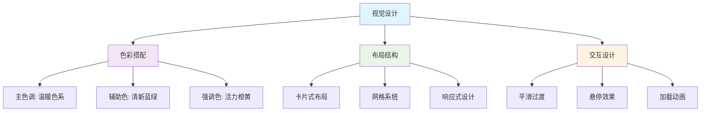
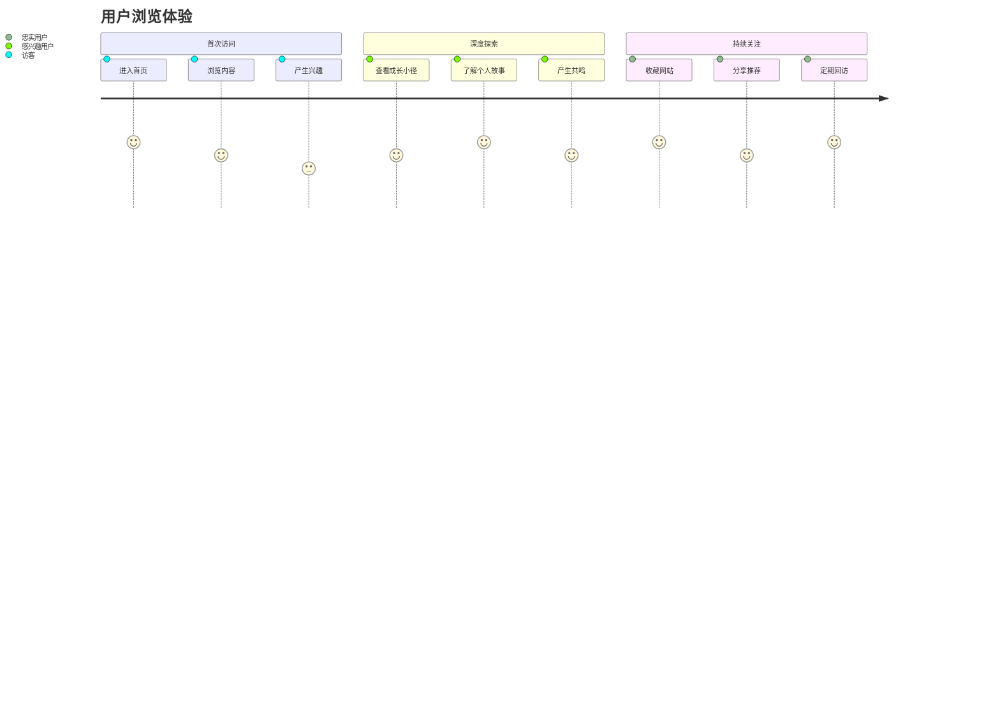
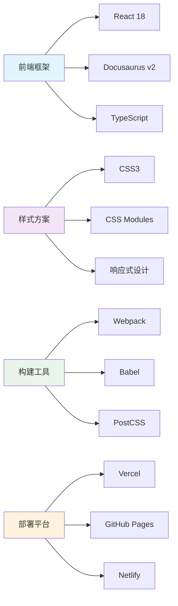
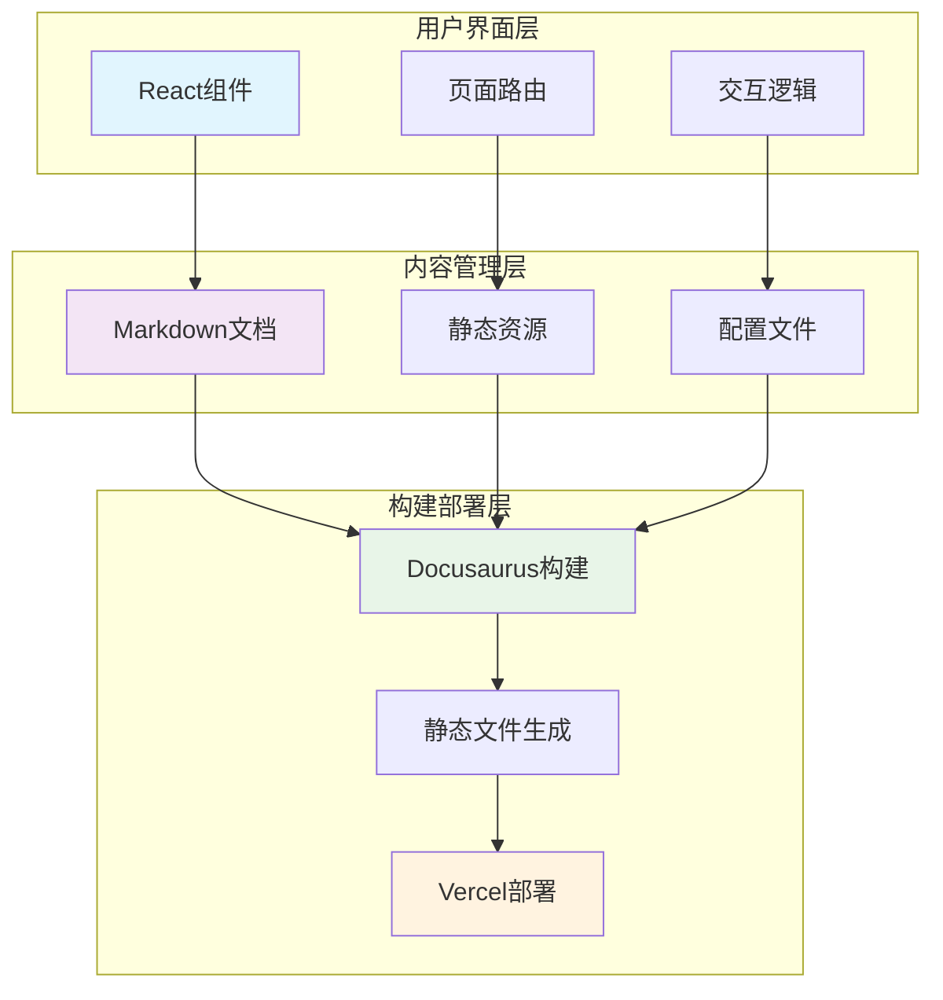
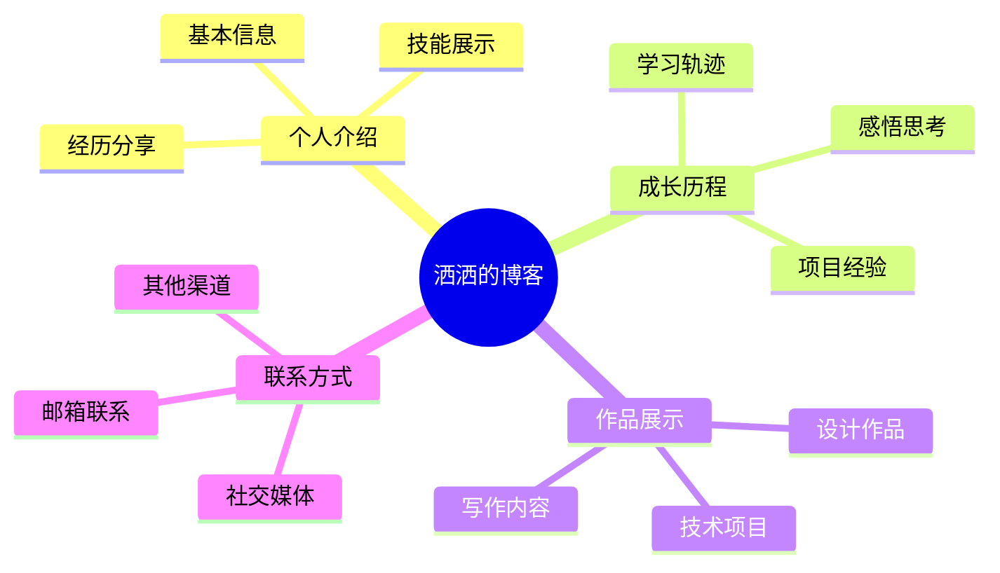
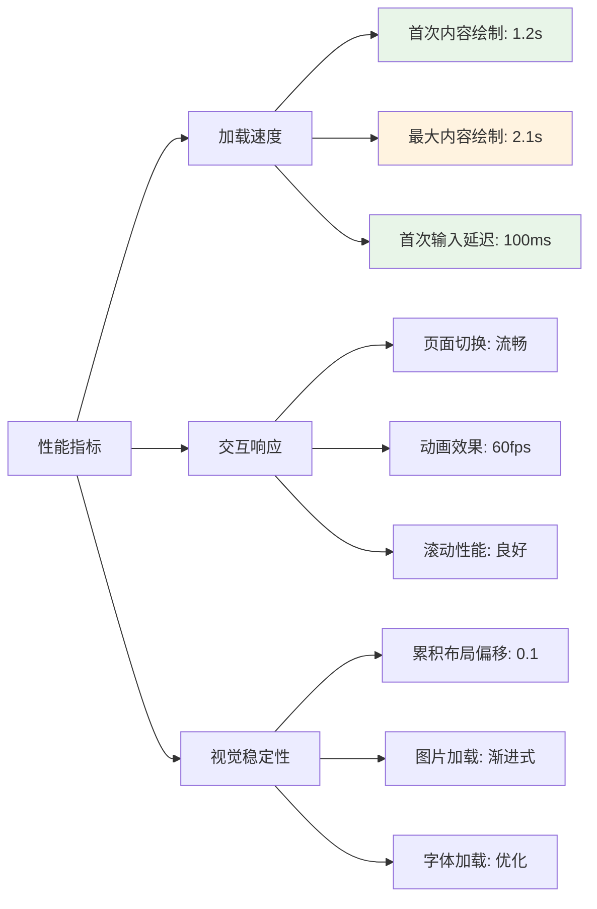

import useBaseUrl from '@docusaurus/useBaseUrl';

# 洒洒的个人博客

## 👩‍💻 作者介绍

**作者**: 洒洒

**作品网址**: [皮卡之家](https://pika-s-home.vercel.app/)

**项目类型**: 个人博客网站

**技术栈**: Docusaurus v2, React, CSS3

## 🎨 作品展示

### 首页展示

<div className="screenshot-container">
  
  <div className="screenshot-caption">
    <strong>首页设计</strong>：采用清新的配色方案，简洁的布局设计，突出个人品牌特色
  </div>
</div>

### 成长小径页面

<div className="screenshot-container">
  
  <div className="screenshot-caption">
    <strong>成长小径</strong>：展示个人成长历程和学习轨迹，内容组织清晰有序
  </div>
</div>

### 设计亮点分析

#### 视觉层次



#### 用户体验流程



## ✨ 特色功能

### 🎯 核心特性

- **清新设计**：采用简约优雅的视觉风格，注重用户体验
- **响应式布局**：完美适配手机、平板、桌面设备
- **个性化内容**：展示个人成长历程和经验分享
- **流畅动画**：精心设计的交互动效提升用户体验

### 🌟 创新亮点

1. **个性化导航设计**
   - 独特的导航栏样式
   - 流畅的页面切换效果
   - 移动端友好的交互体验

2. **内容呈现方式**
   - 卡片式信息展示
   - 渐进式内容加载
   - 清晰的信息层级

3. **视觉效果优化**
   - 精选的配色方案
   - 恰到好处的留白设计
   - 统一的设计语言

## 🛠️ 技术实现

### 核心技术栈



### 性能优化措施

#### 图片优化

```javascript title="docusaurus.config.js"
const config = {
  plugins: [
    [
      '@docusaurus/plugin-ideal-image',
      {
        quality: 70,
        max: 1030,
        min: 640,
        steps: 2,
        disableInDev: false,
      },
    ],
  ],
  
  themeConfig: {
    image: '/screenshot/screencapture-pika-s-home-vercel-app-2024-11-24-23_08_34.png',
  },
};
```

#### 代码分割

```javascript title="src/components/LazyImage.js"
import { lazy, Suspense } from 'react';
import useBaseUrl from '@docusaurus/useBaseUrl';

const LazyImage = lazy(() => import('./OptimizedImage'));

export default function ImageWithFallback({ src, alt, ...props }) {
  return (
    <Suspense fallback={<div className="image-loading">加载中...</div>}>
      <LazyImage 
        src={useBaseUrl(src)}
        alt={alt}
        loading="lazy"
        {...props}
      />
    </Suspense>
  );
}
```

#### 缓存策略

```javascript title="vercel.json"
{
  "headers": [
    {
      "source": "/screenshot/(.*)",
      "headers": [
        {
          "key": "Cache-Control",
          "value": "public, max-age=31536000, immutable"
        }
      ]
    }
  ]
}
```

### 架构设计



## 🎯 学习价值

### 设计思维

这个项目展示了如何：

1. **建立个人品牌形象**
   - 一致的视觉风格
   - 个性化的内容展示
   - 专业的技术实现

2. **优化用户体验**
   - 清晰的信息架构
   - 流畅的交互设计
   - 响应式布局适配

3. **技术实现细节**
   - 现代前端技术栈
   - 性能优化策略
   - 部署和维护方案

### 学习要点

:::tip[设计灵感]

洒洒的作品体现了"简约而不简单"的设计理念，值得初学者学习其：

- **布局规划技巧**：合理的网格系统和空间分配
- **色彩搭配方法**：温暖而专业的配色方案
- **交互设计理念**：用户友好的操作体验
- **内容组织策略**：清晰的信息层级和导航结构

:::

### 实践建议

1. **从模仿开始**
   - 分析优秀作品的设计要素
   - 理解设计背后的思考过程
   - 逐步形成自己的设计风格

2. **注重用户体验**
   - 始终站在用户角度思考
   - 简化操作流程
   - 提供清晰的视觉反馈

3. **持续改进优化**
   - 收集用户反馈
   - 定期更新内容
   - 优化性能表现

## 🚀 项目特点

### 内容架构



### 设计系统

#### 色彩规范

```css title="src/css/design-tokens.css"
:root {
  /* 主色调 */
  --primary-color: #ff6b6b;
  --primary-light: #ff8e8e;
  --primary-dark: #ff4757;
  
  /* 辅助色 */
  --secondary-color: #4ecdc4;
  --secondary-light: #6bccc4;
  --secondary-dark: #26a69a;
  
  /* 中性色 */
  --gray-100: #f8f9fa;
  --gray-200: #e9ecef;
  --gray-300: #dee2e6;
  --gray-400: #ced4da;
  --gray-500: #adb5bd;
  
  /* 语义化颜色 */
  --success-color: #2ed573;
  --warning-color: #ffa726;
  --error-color: #ff6b6b;
  --info-color: #54a0ff;
}
```

#### 字体系统

```css title="src/css/typography.css"
/* 字体家族 */
--font-primary: 'Inter', -apple-system, BlinkMacSystemFont, sans-serif;
--font-mono: 'Fira Code', 'SF Mono', Monaco, monospace;

/* 字体大小 */
--text-xs: 0.75rem;    /* 12px */
--text-sm: 0.875rem;   /* 14px */
--text-base: 1rem;     /* 16px */
--text-lg: 1.125rem;   /* 18px */
--text-xl: 1.25rem;    /* 20px */
--text-2xl: 1.5rem;    /* 24px */
--text-3xl: 1.875rem;  /* 30px */
--text-4xl: 2.25rem;   /* 36px */
```

### 响应式设计

```css title="src/css/responsive.css"
/* 断点定义 */
@media (min-width: 640px) {
  .container {
    max-width: 640px;
  }
}

@media (min-width: 768px) {
  .container {
    max-width: 768px;
  }
}

@media (min-width: 1024px) {
  .container {
    max-width: 1024px;
  }
}

@media (min-width: 1280px) {
  .container {
    max-width: 1280px;
  }
}
```

## 📊 性能表现

### 性能指标



### 优化建议

1. **图片压缩**
   - 使用现代图片格式（WebP、AVIF）
   - 实施懒加载策略
   - 提供不同分辨率版本

2. **代码优化**
   - 移除未使用的CSS
   - JavaScript代码分割
   - 开启Gzip压缩

3. **缓存策略**
   - 设置合适的缓存头
   - 利用CDN加速
   - 实现服务端缓存

这个项目是学习个人网站开发的优秀范例，展示了如何将技术实现与设计美学完美结合，为用户提供优秀的访问体验。

export const styles = `
.screenshot-container {
  margin: 2rem 0;
  border-radius: 12px;
  overflow: hidden;
  box-shadow: 0 8px 32px rgba(0, 0, 0, 0.1);
  transition: transform 0.3s ease;
  background: #f8f9fa;
  padding: 1rem;
}

.screenshot-container:hover {
  transform: translateY(-5px);
}

.screenshot {
  width: 100%;
  height: auto;
  display: block;
  border-radius: 8px;
}

.screenshot-caption {
  margin-top: 1rem;
  padding: 0.5rem 1rem;
  background: rgba(26, 115, 232, 0.1);
  border-radius: 6px;
  font-size: 0.875rem;
  color: #1a73e8;
  text-align: center;
}

.image-loading {
  display: flex;
  align-items: center;
  justify-content: center;
  height: 200px;
  background: #f8f9fa;
  border-radius: 8px;
  color: #6c757d;
  font-size: 0.875rem;
}

/* 响应式优化 */
@media (max-width: 768px) {
  .screenshot-container {
    margin: 1rem 0;
    padding: 0.5rem;
  }
  
  .screenshot-caption {
    font-size: 0.75rem;
    padding: 0.25rem 0.5rem;
  }
}
`; 