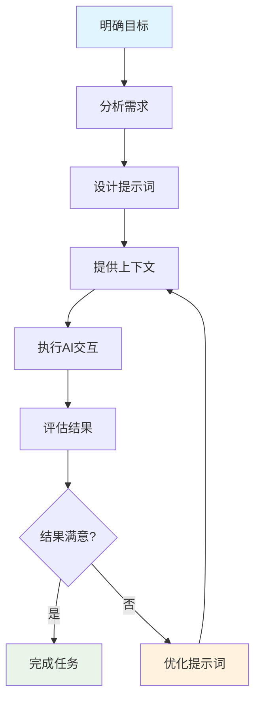
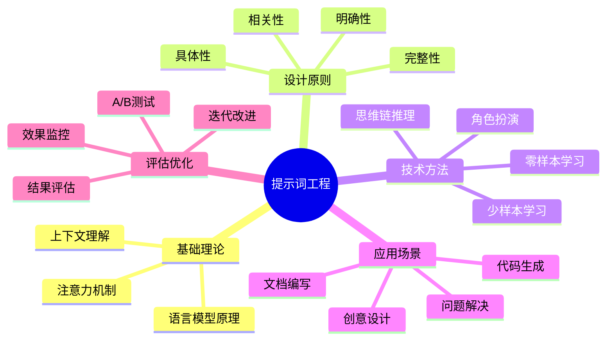
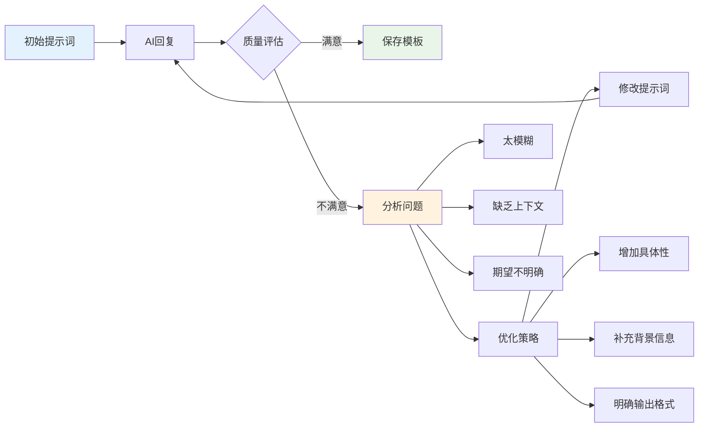
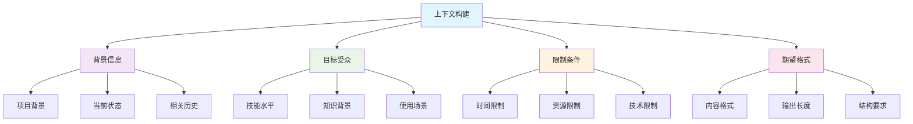
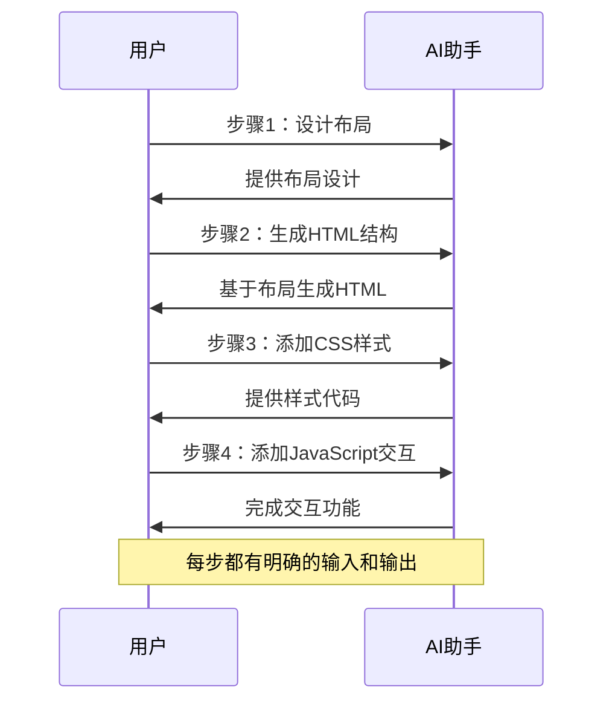
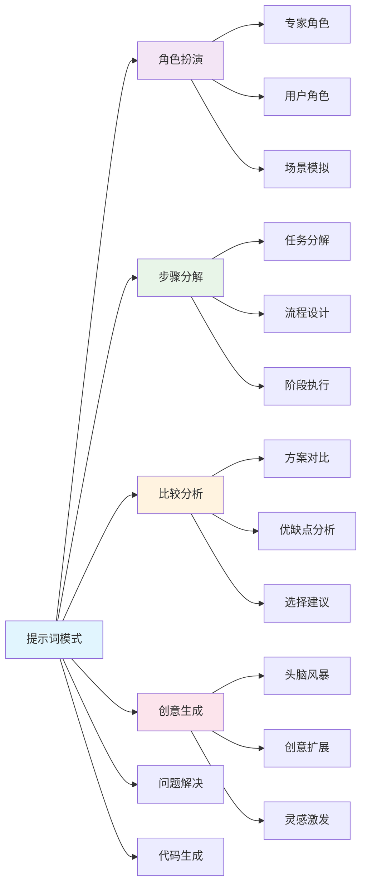
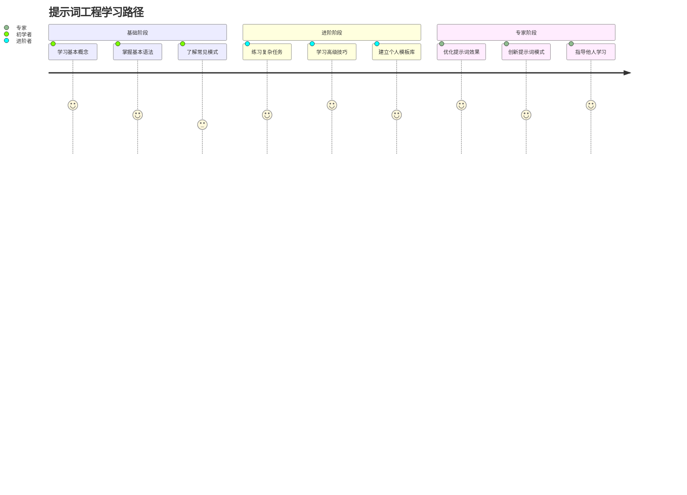

import Tabs from '@theme/Tabs';
import TabItem from '@theme/TabItem';
import { useState } from 'react';

export const PromptBuilder = () => {
  const [task, setTask] = useState('');
  const [context, setContext] = useState('');
  const [format, setFormat] = useState('');
  const [examples, setExamples] = useState('');
  const [generatedPrompt, setGeneratedPrompt] = useState('');

  const generatePrompt = () => {
    let prompt = '';
    
    if (context) {
      prompt += `背景: ${context}\n\n`;
    }
    
    if (task) {
      prompt += `任务: ${task}\n\n`;
    }
    
    if (format) {
      prompt += `输出格式: ${format}\n\n`;
    }
    
    if (examples) {
      prompt += `示例: ${examples}\n\n`;
    }
    
    prompt += '请根据以上要求提供详细的回答。';
    
    setGeneratedPrompt(prompt);
  };

  const clearAll = () => {
    setTask('');
    setContext('');
    setFormat('');
    setExamples('');
    setGeneratedPrompt('');
  };

  return (
    <div style={{
      border: '1px solid #e1e4e8',
      borderRadius: '8px',
      padding: '20px',
      margin: '20px 0',
      backgroundColor: '#f8f9fa'
    }}>
      <h4 style={{ marginBottom: '16px', color: '#1a73e8' }}>🛠️ 交互式提示词生成器</h4>
      
      <div style={{ marginBottom: '16px' }}>
        <label style={{ display: 'block', marginBottom: '8px', fontWeight: '600' }}>
          背景信息:
        </label>
        <textarea
          value={context}
          onChange={(e) => setContext(e.target.value)}
          placeholder="描述项目背景、目标受众等信息..."
          style={{
            width: '100%',
            padding: '8px',
            borderRadius: '4px',
            border: '1px solid #d1d5db',
            minHeight: '60px',
            fontSize: '14px'
          }}
        />
      </div>

      <div style={{ marginBottom: '16px' }}>
        <label style={{ display: 'block', marginBottom: '8px', fontWeight: '600' }}>
          具体任务:
        </label>
        <input
          type="text"
          value={task}
          onChange={(e) => setTask(e.target.value)}
          placeholder="明确描述你需要AI完成的具体任务..."
          style={{
            width: '100%',
            padding: '8px',
            borderRadius: '4px',
            border: '1px solid #d1d5db',
            fontSize: '14px'
          }}
        />
      </div>

      <div style={{ marginBottom: '16px' }}>
        <label style={{ display: 'block', marginBottom: '8px', fontWeight: '600' }}>
          输出格式:
        </label>
        <input
          type="text"
          value={format}
          onChange={(e) => setFormat(e.target.value)}
          placeholder="指定期望的输出格式，如：JSON、HTML、步骤列表等..."
          style={{
            width: '100%',
            padding: '8px',
            borderRadius: '4px',
            border: '1px solid #d1d5db',
            fontSize: '14px'
          }}
        />
      </div>

      <div style={{ marginBottom: '16px' }}>
        <label style={{ display: 'block', marginBottom: '8px', fontWeight: '600' }}>
          示例说明:
        </label>
        <textarea
          value={examples}
          onChange={(e) => setExamples(e.target.value)}
          placeholder="提供相关示例或参考..."
          style={{
            width: '100%',
            padding: '8px',
            borderRadius: '4px',
            border: '1px solid #d1d5db',
            minHeight: '60px',
            fontSize: '14px'
          }}
        />
      </div>

      <div style={{ marginBottom: '16px' }}>
        <button
          onClick={generatePrompt}
          style={{
            backgroundColor: '#1a73e8',
            color: 'white',
            padding: '8px 16px',
            border: 'none',
            borderRadius: '4px',
            cursor: 'pointer',
            marginRight: '8px',
            fontSize: '14px'
          }}
        >
          生成提示词
        </button>
        <button
          onClick={clearAll}
          style={{
            backgroundColor: '#6c757d',
            color: 'white',
            padding: '8px 16px',
            border: 'none',
            borderRadius: '4px',
            cursor: 'pointer',
            fontSize: '14px'
          }}
        >
          清空所有
        </button>
      </div>

      {generatedPrompt && (
        <div style={{
          backgroundColor: '#fff',
          border: '1px solid #e1e4e8',
          borderRadius: '4px',
          padding: '16px',
          marginTop: '16px'
        }}>
          <h5 style={{ marginBottom: '8px', color: '#28a745' }}>✅ 生成的提示词:</h5>
          <pre style={{
            backgroundColor: '#f6f8fa',
            padding: '12px',
            borderRadius: '4px',
            fontSize: '14px',
            lineHeight: '1.5',
            whiteSpace: 'pre-wrap',
            wordBreak: 'break-word'
          }}>
            {generatedPrompt}
          </pre>
          <button
            onClick={() => navigator.clipboard.writeText(generatedPrompt)}
            style={{
              backgroundColor: '#28a745',
              color: 'white',
              padding: '6px 12px',
              border: 'none',
              borderRadius: '4px',
              cursor: 'pointer',
              fontSize: '12px',
              marginTop: '8px'
            }}
          >
            📋 复制到剪贴板
          </button>
        </div>
      )}
    </div>
  );
};

export const PromptExamples = () => {
  const [selectedCategory, setSelectedCategory] = useState('code');
  const [selectedExample, setSelectedExample] = useState(0);

  const categories = {
    code: {
      name: '代码生成',
      examples: [
        {
          title: 'React组件开发',
          prompt: '请创建一个React函数组件，名为UserCard，包含以下功能：\n1. 接收用户信息props（姓名、头像、职位）\n2. 显示用户头像（圆形）\n3. 显示用户姓名和职位\n4. 添加hover效果\n5. 使用TypeScript类型定义\n\n请提供完整的组件代码和样式。',
          category: '前端开发'
        },
        {
          title: 'API接口设计',
          prompt: '设计一个用户管理系统的RESTful API，包含以下功能：\n1. 用户注册/登录\n2. 用户信息CRUD操作\n3. 用户权限管理\n\n请提供：\n- 完整的API端点列表\n- 请求/响应格式\n- 错误处理机制\n- 认证方式说明',
          category: '后端开发'
        },
        {
          title: '数据库设计',
          prompt: '为一个博客系统设计数据库表结构，需要支持：\n1. 用户管理（注册、登录、权限）\n2. 文章管理（发布、编辑、分类、标签）\n3. 评论系统（评论、回复）\n4. 统计功能（浏览量、点赞数）\n\n请提供SQL建表语句和表关系图。',
          category: '数据库'
        }
      ]
    },
    writing: {
      name: '文档写作',
      examples: [
        {
          title: '技术文档',
          prompt: '为一个新的开源项目编写README文档，项目是一个Vue.js组件库，包含以下内容：\n1. 项目简介和特性\n2. 安装和快速开始\n3. 组件使用示例\n4. API文档\n5. 贡献指南\n\n请使用Markdown格式，确保专业性和易读性。',
          category: '开源项目'
        },
        {
          title: '博客文章',
          prompt: '写一篇关于"前端性能优化"的技术博客文章，目标读者是中级前端开发者：\n1. 文章长度2000字左右\n2. 包含实际代码示例\n3. 结构清晰，有小标题\n4. 提供可操作的优化建议\n5. 加入个人观点和经验分享',
          category: '技术写作'
        }
      ]
    },
    design: {
      name: '设计思维',
      examples: [
        {
          title: 'UI设计方案',
          prompt: '为一个在线学习平台设计首页界面，需要考虑：\n1. 用户群体：学生和职场人士\n2. 核心功能：课程浏览、搜索、个人中心\n3. 设计风格：现代、简洁、专业\n4. 响应式设计要求\n\n请提供设计思路、布局方案和颜色搭配建议。',
          category: 'UI设计'
        },
        {
          title: '用户体验优化',
          prompt: '分析并优化一个电商网站的购物流程，从商品浏览到完成支付：\n1. 识别用户痛点\n2. 提出改进建议\n3. 设计新的交互流程\n4. 考虑移动端体验\n\n请提供详细的UX改进方案。',
          category: 'UX设计'
        }
      ]
    }
  };

  const currentExamples = categories[selectedCategory].examples;

  return (
    <div style={{
      border: '1px solid #e1e4e8',
      borderRadius: '8px',
      padding: '20px',
      margin: '20px 0',
      backgroundColor: '#f8f9fa'
    }}>
      <h4 style={{ marginBottom: '16px', color: '#1a73e8' }}>📚 提示词示例库</h4>
      
      <div style={{ marginBottom: '16px' }}>
        <div style={{ display: 'flex', gap: '8px', marginBottom: '12px' }}>
          {Object.entries(categories).map(([key, category]) => (
            <button
              key={key}
              onClick={() => {
                setSelectedCategory(key);
                setSelectedExample(0);
              }}
              style={{
                padding: '8px 12px',
                border: 'none',
                borderRadius: '4px',
                cursor: 'pointer',
                backgroundColor: selectedCategory === key ? '#1a73e8' : '#e9ecef',
                color: selectedCategory === key ? 'white' : '#495057',
                fontSize: '14px'
              }}
            >
              {category.name}
            </button>
          ))}
        </div>
        
        <div style={{ display: 'flex', gap: '8px', flexWrap: 'wrap' }}>
          {currentExamples.map((example, index) => (
            <button
              key={index}
              onClick={() => setSelectedExample(index)}
              style={{
                padding: '6px 10px',
                border: '1px solid #d1d5db',
                borderRadius: '4px',
                cursor: 'pointer',
                backgroundColor: selectedExample === index ? '#e3f2fd' : '#fff',
                color: selectedExample === index ? '#1a73e8' : '#495057',
                fontSize: '12px'
              }}
            >
              {example.title}
            </button>
          ))}
        </div>
      </div>

      <div style={{
        backgroundColor: '#fff',
        border: '1px solid #e1e4e8',
        borderRadius: '4px',
        padding: '16px'
      }}>
        <div style={{ marginBottom: '8px', fontSize: '14px', color: '#6c757d' }}>
          分类: {currentExamples[selectedExample].category}
        </div>
        <h5 style={{ marginBottom: '12px', color: '#1a73e8' }}>
          {currentExamples[selectedExample].title}
        </h5>
        <pre style={{
          backgroundColor: '#f6f8fa',
          padding: '12px',
          borderRadius: '4px',
          fontSize: '14px',
          lineHeight: '1.5',
          whiteSpace: 'pre-wrap',
          wordBreak: 'break-word'
        }}>
          {currentExamples[selectedExample].prompt}
        </pre>
        <button
          onClick={() => navigator.clipboard.writeText(currentExamples[selectedExample].prompt)}
          style={{
            backgroundColor: '#28a745',
            color: 'white',
            padding: '6px 12px',
            border: 'none',
            borderRadius: '4px',
            cursor: 'pointer',
            fontSize: '12px',
            marginTop: '8px'
          }}
        >
          📋 复制提示词
        </button>
      </div>
    </div>
  );
};

export const PromptTester = () => {
  const [userPrompt, setUserPrompt] = useState('');
  const [analysis, setAnalysis] = useState(null);

  const analyzePrompt = () => {
    const wordCount = userPrompt.trim().split(/\s+/).length;
    const hasContext = userPrompt.includes('背景') || userPrompt.includes('我正在') || userPrompt.includes('项目');
    const hasSpecificTask = userPrompt.includes('请') || userPrompt.includes('帮助') || userPrompt.includes('生成');
    const hasFormat = userPrompt.includes('格式') || userPrompt.includes('输出') || userPrompt.includes('结构');
    const hasExamples = userPrompt.includes('示例') || userPrompt.includes('例如') || userPrompt.includes('比如');
    
    const score = [hasContext, hasSpecificTask, hasFormat, hasExamples].filter(Boolean).length;
    
    const suggestions = [];
    if (!hasContext) suggestions.push('添加背景信息和上下文');
    if (!hasSpecificTask) suggestions.push('明确具体的任务描述');
    if (!hasFormat) suggestions.push('指定期望的输出格式');
    if (!hasExamples) suggestions.push('提供相关示例或参考');
    
    setAnalysis({
      wordCount,
      score,
      maxScore: 4,
      suggestions,
      quality: score >= 3 ? '优秀' : score >= 2 ? '良好' : score >= 1 ? '一般' : '需要改进'
    });
  };

  return (
    <div style={{
      border: '1px solid #e1e4e8',
      borderRadius: '8px',
      padding: '20px',
      margin: '20px 0',
      backgroundColor: '#f8f9fa'
    }}>
      <h4 style={{ marginBottom: '16px', color: '#1a73e8' }}>🔍 提示词质量分析器</h4>
      
      <div style={{ marginBottom: '16px' }}>
        <label style={{ display: 'block', marginBottom: '8px', fontWeight: '600' }}>
          输入你的提示词:
        </label>
        <textarea
          value={userPrompt}
          onChange={(e) => setUserPrompt(e.target.value)}
          placeholder="在这里输入你的提示词，我们将分析其质量并提供改进建议..."
          style={{
            width: '100%',
            padding: '12px',
            borderRadius: '4px',
            border: '1px solid #d1d5db',
            minHeight: '120px',
            fontSize: '14px',
            lineHeight: '1.5'
          }}
        />
      </div>

      <button
        onClick={analyzePrompt}
        disabled={!userPrompt.trim()}
        style={{
          backgroundColor: userPrompt.trim() ? '#1a73e8' : '#6c757d',
          color: 'white',
          padding: '8px 16px',
          border: 'none',
          borderRadius: '4px',
          cursor: userPrompt.trim() ? 'pointer' : 'not-allowed',
          fontSize: '14px',
          marginBottom: '16px'
        }}
      >
        分析提示词质量
      </button>

      {analysis && (
        <div style={{
          backgroundColor: '#fff',
          border: '1px solid #e1e4e8',
          borderRadius: '4px',
          padding: '16px'
        }}>
          <h5 style={{ marginBottom: '12px', color: '#1a73e8' }}>📊 分析结果</h5>
          
          <div style={{ marginBottom: '12px' }}>
            <div style={{ display: 'flex', alignItems: 'center', gap: '8px', marginBottom: '4px' }}>
              <span style={{ fontWeight: '600' }}>质量评分:</span>
              <span style={{ 
                color: analysis.score >= 3 ? '#28a745' : analysis.score >= 2 ? '#ffc107' : '#dc3545',
                fontWeight: 'bold'
              }}>
                {analysis.score}/{analysis.maxScore} ({analysis.quality})
              </span>
            </div>
            <div style={{ fontSize: '14px', color: '#6c757d' }}>
              字数统计: {analysis.wordCount} 字
            </div>
          </div>

          <div style={{
            width: '100%',
            height: '8px',
            backgroundColor: '#e9ecef',
            borderRadius: '4px',
            marginBottom: '16px'
          }}>
            <div style={{
              width: `${(analysis.score / analysis.maxScore) * 100}%`,
              height: '100%',
              backgroundColor: analysis.score >= 3 ? '#28a745' : analysis.score >= 2 ? '#ffc107' : '#dc3545',
              borderRadius: '4px',
              transition: 'width 0.3s ease'
            }} />
          </div>

          {analysis.suggestions.length > 0 && (
            <div>
              <h6 style={{ marginBottom: '8px', color: '#dc3545' }}>💡 改进建议:</h6>
              <ul style={{ marginLeft: '20px', fontSize: '14px', color: '#495057' }}>
                {analysis.suggestions.map((suggestion, index) => (
                  <li key={index} style={{ marginBottom: '4px' }}>{suggestion}</li>
                ))}
              </ul>
            </div>
          )}
        </div>
      )}
    </div>
  );
};

# 提示词工程基础

## 什么是提示词工程

提示词工程是一种优化与AI系统交互的技术,旨在通过精心设计的输入(即"提示词")来获得更准确、相关和有用的输出。在AI辅助开发中,掌握提示词工程技巧可以显著提高工作效率和输出质量。

### 提示词工程核心流程



:::tip[提示词工程的重要性]

掌握提示词工程可以带来以下好处：

- **提高准确性**：AI更准确理解您的需求
- **增强相关性**：获得更相关和有用的输出  
- **减少沟通成本**：减少来回沟通的次数
- **提升效率**：显著提高开发效率

:::

:::info[适用场景]

提示词工程特别适用于：
- 代码生成和调试
- 文档编写和翻译
- 创意设计和头脑风暴
- 问题解决和方案分析

:::

## 实践工具

### 交互式提示词生成器

<PromptBuilder />

### 提示词示例库

<PromptExamples />

### 提示词质量分析

<PromptTester />

## 提示词工程知识体系



## 编写有效提示词的技巧

### 明确性和具体性

:::note[核心原则]

有效的提示词应该遵循"具体、明确、完整"的原则。

:::

<Tabs>
  <TabItem value="good" label="✅ 好的示例" default>
    ```
    给我5个关于人工智能在日常生活中应用的博客文章主题,每个主题包含一个简短的描述
    ```
  </TabItem>
  <TabItem value="bad" label="❌ 不好的示例">
    ```
    给我一些博客想法
    ```
  </TabItem>
</Tabs>

### 提示词优化流程



:::warning[常见错误]

避免以下常见错误：

:::danger[模糊表述]
- 使用"一些"、"几个"等模糊量词
- 缺乏具体的上下文信息
- 没有明确的期望输出格式
:::

:::caution[歧义问题]
- 使用可能有多种理解的词汇
- 缺少必要的限制条件
- 没有提供示例或参考
:::

:::

**最佳实践：**
- 使用清晰、简洁的语言
- 明确说明你的需求和期望  
- 避免模糊或歧义的表述

### 提供上下文

:::info[上下文的重要性]

良好的上下文可以帮助AI更准确地理解您的需求和目标。

:::

```
我正在为一个面向初学者的编程博客写文章。请为我提供一个解释'变量'概念的文章大纲,内容应该简单易懂,适合完全没有编程经验的读者。
```

#### 上下文构建框架



:::note[上下文要素]

有效的上下文应包含：

1. **背景信息**：解释当前的情况或项目
2. **目标受众**：说明内容的目标读者
3. **限制条件**：描述相关的约束或要求
4. **期望格式**：明确输出的格式要求

:::

### 逐步引导

:::tip[分步策略]

将复杂任务分解为多个简单步骤，可以显著提高AI的理解和执行效果。

:::

#### 分步执行流程



<div className="step-list">

1. **第一步**："请为我的个人技术博客设计一个简单的首页布局"
2. **第二步**："基于你提供的布局,请给出HTML结构代码"
3. **第三步**："现在,请为这个HTML结构添加基本的CSS样式"

</div>

:::success[分步优势]

- 每个步骤都有明确的目标
- 可以根据AI的回应调整后续步骤
- 降低了单次任务的复杂度
- 提高了最终结果的质量

:::

### 使用示例和模板

:::info[模板化思维]

使用模板可以帮助AI更好地理解您期望的输出格式。

:::

:::note[示例模板]

请按照以下格式为我的博客文章生成3个标题:

1. **[吸引人的形容词]** + **[主题]** + **[有价值的承诺]**
2. **[数字]** + **[方法/技巧]** + **[实现目标]**
3. **[如何/怎样]** + **[实现目标]** + **[不做某事/使用某方法]**

**示例：**
1. 惊人的时间管理技巧: 提高生产力的秘密武器
2. 7个简单方法让你的博客访问量翻倍
3. 如何学会编程而不失去理智

:::

## 常见提示词模式

### 提示词模式分类



### 角色扮演提示

:::tip[角色扮演的威力]

让AI扮演特定角色可以获得更专业和针对性的回答。

:::

```
请你扮演一位经验丰富的前端开发工程师。我是一名刚开始学习HTML和CSS的新手。请用通俗易懂的语言解释什么是响应式设计,为什么它很重要,以及如何开始实现响应式网页。
```

### 步骤分解提示

:::info[结构化方法]

将复杂任务分解为清晰的步骤，可以获得更系统的解决方案。

:::

```
我想创建一个个人博客网站。请列出实现这个目标的主要步骤,包括:
1. 规划内容和功能
2. 选择技术栈
3. 设计用户界面
4. 开发前端
5. 实现后端功能
6. 测试和调试
7. 部署网站

对于每个步骤,请提供简要说明和可能需要的工具或资源。
```

### 比较分析提示

:::note[对比分析]

要求AI进行比较分析时，提供明确的比较维度和标准。

:::

```
请比较WordPress、Ghost和Hugo这三个博客平台,分析它们在以下方面的优缺点:
1. 易用性
2. 定制灵活性
3. 性能
4. SEO友好度
5. 社区支持

为每个平台提供一个总结段落,并给出适合不同类型博主的建议。
```

### 创意生成提示

:::tip[创意激发]

在要求AI生成创意时，提供具体的约束条件可以获得更实用的建议。

:::

```
我想为我的技术博客创建一个独特的互动元素,以增加读者参与度。请提供5个创新的想法,每个想法都应该:
1. 与技术主题相关
2. 易于实现（不需要复杂的后端）
3. 能够吸引读者互动
4. 有助于增加页面停留时间

对于每个想法,简要解释其工作原理和潜在好处。
```

## 提示词工程实践路径



:::success[学习成果]

完成本节学习后，您将能够：

- 编写清晰、具体的提示词
- 使用多种提示词模式
- 通过上下文提供提高AI理解
- 将复杂任务分解为简单步骤

:::

export const styles = {
  stepList: {
    marginLeft: '20px',
    borderLeft: '2px solid #1a73e8',
    paddingLeft: '20px'
  }
}; 