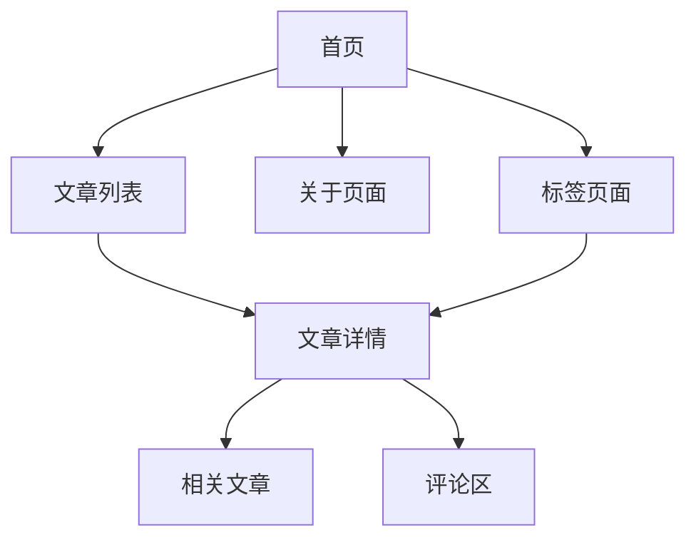

import Tabs from '@theme/Tabs';
import TabItem from '@theme/TabItem';

# 博客项目规划

## 确定项目需求

### 核心功能规划

<div className="feature-grid">

#### 📝 内容管理
- 文章列表展示
- 文章详情页面
- 分类和标签系统
- 搜索功能

#### 💬 互动功能
- 评论系统
- 点赞功能
- 分享按钮
- 订阅功能

#### 👤 用户体验
- 响应式设计
- 深色模式
- 阅读进度条
- 返回顶部按钮

#### ⚙️ 管理功能
- 文章管理
- 评论管理
- 数据统计
- SEO优化

</div>

### 技术栈选择

<div className="tech-stack">

<Tabs>
  <TabItem value="frontend" label="前端技术" default>
    - **框架**: Next.js
    - **样式**: Tailwind CSS
    - **状态管理**: React Context/Redux
    - **UI组件**: Headless UI
  </TabItem>
  <TabItem value="backend" label="后端技术">
    - **API**: Next.js API Routes
    - **数据库**: MongoDB
    - **认证**: NextAuth.js
    - **存储**: Vercel Blob Storage
  </TabItem>
  <TabItem value="tools" label="开发工具">
    - **编辑器**: Cursor
    - **协作**: v0
    - **部署**: Vercel
    - **监控**: Vercel Analytics
  </TabItem>
</Tabs>

</div>

## 设计规划

### 页面结构



### 数据模型

<div className="data-models">

#### 文章模型
```typescript
interface Post {
  id: string;
  title: string;
  slug: string;
  content: string;
  excerpt: string;
  coverImage: string;
  author: Author;
  tags: string[];
  publishedAt: Date;
  updatedAt: Date;
}
```

#### 评论模型
```typescript
interface Comment {
  id: string;
  postId: string;
  author: string;
  content: string;
  createdAt: Date;
  replies?: Comment[];
}
```

#### 用户模型
```typescript
interface User {
  id: string;
  name: string;
  email: string;
  avatar: string;
  role: 'admin' | 'user';
  createdAt: Date;
}
```

</div>

## 开发计划

### 项目里程碑

<div className="timeline">

#### 第一阶段：基础搭建
1. 项目初始化
2. 基本页面结构
3. 样式系统设置
4. 部署流程配置

#### 第二阶段：核心功能
1. 文章展示系统
2. Markdown渲染
3. 标签系统
4. 搜索功能

#### 第三阶段：互动功能
1. 评论系统
2. 用户认证
3. 点赞功能
4. 分享功能

#### 第四阶段：优化完善
1. SEO优化
2. 性能优化
3. 错误处理
4. 单元测试

</div>

### 开发规范

<div className="guidelines">

#### 代码规范
```json
{
  "extends": [
    "next/core-web-vitals",
    "prettier"
  ],
  "rules": {
    "react/no-unescaped-entities": "off",
    "import/no-anonymous-default-export": "off"
  }
}
```

#### Git提交规范
```bash
# 提交信息格式
<type>(<scope>): <subject>

# 示例
feat(blog): add comment system
fix(auth): resolve login issues
docs(readme): update installation guide
```

#### 文件命名规范
```
pages/
  index.tsx
  posts/
    [slug].tsx
  tags/
    [tag].tsx
components/
  layout/
    Header.tsx
    Footer.tsx
  posts/
    PostCard.tsx
    PostList.tsx
```

</div>

## 性能和SEO考虑

### 性能优化计划

<div className="performance-plan">

#### 图片优化
```typescript
import Image from 'next/image';

export function OptimizedImage({ src, alt }) {
  return (
    <Image
      src={src}
      alt={alt}
      width={800}
      height={400}
      placeholder="blur"
      blurDataURL={`data:image/svg+xml;base64,...`}
    />
  );
}
```

#### 代码分割
```typescript
// 动态导入组件
const CommentSection = dynamic(() => import('@/components/CommentSection'), {
  loading: () => <CommentSkeleton />,
  ssr: false
});
```

</div>

### SEO策略

<div className="seo-strategy">

#### Meta标签配置
```typescript
// pages/_app.tsx
import { DefaultSeo } from 'next-seo';

const DEFAULT_SEO = {
  title: '我的技术博客',
  description: '分享Web开发、AI和技术见解',
  openGraph: {
    type: 'website',
    locale: 'zh_CN',
    url: 'https://myblog.com',
    site_name: '我的技术博客'
  }
};

function MyApp({ Component, pageProps }) {
  return (
    <>
      <DefaultSeo {...DEFAULT_SEO} />
      <Component {...pageProps} />
    </>
  );
}
```

#### 站点地图生成
```javascript
// scripts/generate-sitemap.js
const { generateSitemap } = require('next-sitemap');

generateSitemap({
  baseUrl: 'https://myblog.com',
  sitemapSize: 7000,
  exclude: ['/api/*', '/admin/*'],
  generateRobotsTxt: true
});
```

</div>

export const styles = {
  featureGrid: {
    display: 'grid',
    gridTemplateColumns: 'repeat(auto-fit, minmax(250px, 1fr))',
    gap: '1rem',
    marginBottom: '2rem'
  },
  timeline: {
    borderLeft: '3px solid #1a73e8',
    paddingLeft: '1rem'
  },
  guidelines: {
    backgroundColor: '#f6f8fa',
    padding: '1rem',
    borderRadius: '8px'
  }
};
