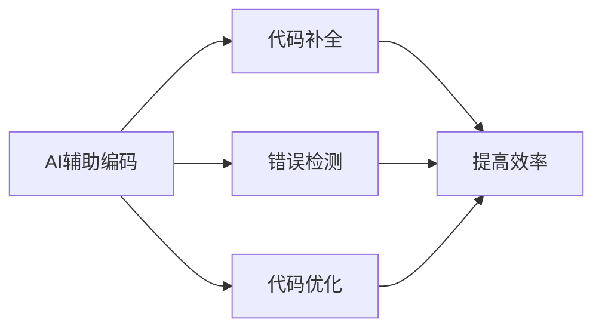

import Tabs from '@theme/Tabs';
import TabItem from '@theme/TabItem';

# 总结和进阶建议

## 知识回顾

### 基础知识

<div className="knowledge-review">

#### 1. 提示词工程
- 理解提示词工程的重要性
- 掌握编写有效提示词的技巧
- 熟悉常见提示词模式
- 实践AI交互优化

#### 2. Markdown格式
- 基本语法掌握
- 高级功能应用
- 文档结构组织
- 格式化最佳实践

#### 3. AI沟通技巧
- 清晰表达需求
- 迭代式对话
- 利用AI优势
- 优化交互效率

</div>

### 工具使用

<div className="tools-review">

#### 1. Cursor


#### 2. v0平台
- 项目管理
- 团队协作
- 版本控制
- AI辅助开发

#### 3. Vercel
- 自动部署
- 性能优化
- 监控告警
- 域名管理

</div>

## 项目实践总结

### 开发流程

<div className="process-summary">

#### 1. 规划阶段
```typescript
interface ProjectPlan {
  requirements: {
    features: string[];
    priorities: ('high' | 'medium' | 'low')[];
    timeline: Date[];
  };
  techStack: {
    frontend: string[];
    backend: string[];
    deployment: string[];
  };
  milestones: {
    phase: string;
    tasks: string[];
    deadline: Date;
  }[];
}
```

#### 2. 开发阶段
:::tip 关键点回顾
- 使用Cursor进行本地开发
- 在v0平台上进行团队协作
- 通过Vercel实现持续部署
- 保持代码质量和性能优化
:::

#### 3. 维护阶段
- 持续集成/部署
- 性能监控和优化
- 安全更新
- 功能迭代

</div>

## 进阶学习方向

### 技术深化

<div className="advanced-learning">

#### 1. 前端技术
```javascript
const frontendPath = {
  framework: ['React深入', 'Next.js高级特性'],
  performance: ['性能优化', '首屏加载优化'],
  testing: ['单元测试', 'E2E测试'],
  architecture: ['状态管理', '组件设计模式']
};
```

#### 2. AI工具应用
- 探索更多AI编码助手
- 学习大语言模型应用
- 自定义AI工作流
- 优化提示词策略

#### 3. DevOps实践
- CI/CD深入学习
- 容器化技术
- 云服务应用
- 监控和日志系统

</div>

### 项目扩展

<div className="project-extension">

#### 功能扩展建议

<Tabs>
  <TabItem value="content" label="内容管理" default>
    - 多语言支持
    - 富媒体内容
    - 内容版本控制
    - 自动化发布
  </TabItem>
  <TabItem value="interaction" label="互动功能">
    - 实时评论系统
    - 用户社区
    - 内容推荐
    - 订阅系统
  </TabItem>
  <TabItem value="analytics" label="数据分析">
    - 访问统计
    - 用户行为分析
    - 内容热度追踪
    - 性能监控
  </TabItem>
</Tabs>

</div>

## 持续学习资源

### 推荐资源

<div className="learning-resources">

#### 1. 官方文档
- [Next.js文档](https://nextjs.org/docs)
- [Vercel文档](https://vercel.com/docs)
- [React文档](https://reactjs.org/docs)
- [Tailwind CSS文档](https://tailwindcss.com/docs)

#### 2. 社区资源
- GitHub开源项目
- 技术博客
- 开发者论坛
- 视频教程

#### 3. 实践项目
```typescript
interface ProjectIdea {
  name: string;
  description: string;
  technologies: string[];
  learningGoals: string[];
  difficulty: 'beginner' | 'intermediate' | 'advanced';
}

const projectIdeas: ProjectIdea[] = [
  {
    name: '技术博客平台',
    description: '构建个人技术博客系统',
    technologies: ['Next.js', 'MDX', 'Tailwind'],
    learningGoals: ['SSG', '性能优化', 'SEO'],
    difficulty: 'intermediate'
  },
  // 更多项目想法...
];
```

</div>

### 学习建议

<div className="learning-tips">

#### 循序渐进
1. 巩固基础知识
2. 实践小型项目
3. 参与开源贡献
4. 分享学习经验

#### 保持更新
- 关注技术趋势
- 参与技术社区
- 实践新技术
- 总结和分享

#### 建立作品集
- 完整项目展示
- 技术博客写作
- 开源项目贡献
- 技术分享演讲

</div>

export const styles = {
  knowledgeReview: {
    backgroundColor: '#f6f8fa',
    padding: '1rem',
    borderRadius: '8px',
    marginBottom: '1rem'
  },
  processSum: {
    borderLeft: '3px solid #1a73e8',
    paddingLeft: '1rem'
  },
  learningTips: {
    backgroundColor: '#f0f7ff',
    padding: '1rem',
    borderRadius: '8px'
  }
};
