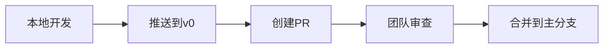

import Tabs from '@theme/Tabs';
import TabItem from '@theme/TabItem';

# 工作流集成指南

## 工作流程概述

<div className="workflow-overview">

### 🔄 完整开发周期

1. **本地开发** (Cursor)
   - AI辅助编码
   - 实时错误检查
   - 代码优化

2. **团队协作** (v0)
   - 代码审查
   - 实时协作
   - 版本控制

3. **部署发布** (Vercel)
   - 自动部署
   - 性能监控
   - 域名管理

</div>

## 环境配置

### 工具链设置

<div className="setup-steps">

#### 1. Cursor配置

```json
// .cursor/settings.json
{
  "editor.formatOnSave": true,
  "editor.defaultFormatter": "cursor",
  "ai.completions.enabled": true,
  "git.enableSmartCommit": true
}
```

#### 2. v0集成

```yaml
# v0.config.yaml
project:
  name: my-blog
  type: next-app
  
integrations:
  - name: github
    repo: username/repo
  - name: vercel
    projectId: your-project-id
```

#### 3. Vercel配置

```json
// vercel.json
{
  "version": 2,
  "builds": [
    {
      "src": "package.json",
      "use": "@vercel/next"
    }
  ],
  "routes": [
    { "src": "/(.*)", "dest": "/" }
  ]
}
```

</div>

## 开发工作流

### 从Cursor到v0

<div className="workflow-steps">

#### 1. 本地开发流程

<Tabs>
  <TabItem value="create" label="创建功能" default>
    ```bash
    # 1. 创建新分支
    git checkout -b feature/new-blog-post

    # 2. 使用Cursor开发
    # 利用AI补全和建议
    
    # 3. 提交更改
    git add .
    git commit -m "Add new blog post feature"
    ```
  </TabItem>
  <TabItem value="push" label="推送到v0">
    ```bash
    # 1. 推送到远程仓库
    git push origin feature/new-blog-post

    # 2. 在v0平台创建PR
    # 3. 等待团队审查
    ```
  </TabItem>
</Tabs>

#### 2. 代码审查流程



</div>

### 从v0到Vercel

<div className="deployment-flow">

#### 1. 自动部署配置

```yaml
# .github/workflows/deploy.yml
name: Deploy to Vercel
on:
  push:
    branches: [main]
jobs:
  deploy:
    runs-on: ubuntu-latest
    steps:
      - uses: actions/checkout@v2
      - name: Deploy to Vercel
        uses: amondnet/vercel-action@v20
        with:
          vercel-token: ${{ secrets.VERCEL_TOKEN }}
          vercel-org-id: ${{ secrets.ORG_ID }}
          vercel-project-id: ${{ secrets.PROJECT_ID }}
```

#### 2. 部署预览

:::tip 预览环境
每个PR都会生成一个独立的预览环境，方便团队成员查看更改效果。
:::

</div>

## 协作最佳实践

### 分支管理策略

<div className="branch-strategy">

#### 分支结构
```
main
├── develop
│   ├── feature/blog-post
│   ├── feature/comment-system
│   └── feature/user-profile
└── hotfix/security-patch
```

#### 工作流程规范

1. 从`develop`分支创建特性分支
2. 完成开发后创建PR到`develop`
3. 代码审查通过后合并
4. 定期将`develop`合并到`main`

</div>

### 提交信息规范

<div className="commit-convention">

#### 提交格式
```
<type>(<scope>): <subject>

<body>

<footer>
```

#### 类型说明
- `feat`: 新功能
- `fix`: 修复bug
- `docs`: 文档更新
- `style`: 代码格式调整
- `refactor`: 代码重构
- `test`: 测试相关
- `chore`: 构建过程或辅助工具的变动

</div>

### 自动化测试集成

<div className="testing-integration">

#### 测试配置

```javascript
// jest.config.js
module.exports = {
  testEnvironment: 'jsdom',
  setupFilesAfterEnv: ['<rootDir>/jest.setup.js'],
  testPathIgnorePatterns: ['/node_modules/', '/.next/'],
  transform: {
    '^.+\\.(js|jsx|ts|tsx)$': ['babel-jest', { presets: ['next/babel'] }],
  },
}
```

#### CI流程
```yaml
# .github/workflows/test.yml
name: Run Tests
on: [push, pull_request]
jobs:
  test:
    runs-on: ubuntu-latest
    steps:
      - uses: actions/checkout@v2
      - name: Install dependencies
        run: npm ci
      - name: Run tests
        run: npm test
```

</div>

## 监控和维护

### 性能监控

<div className="monitoring-setup">

#### 性能指标追踪
```javascript
// pages/_app.js
export function reportWebVitals(metric) {
  if (metric.label === 'web-vital') {
    // 发送到分析服务
    analytics.send({
      metric: metric.name,
      value: metric.value,
      path: window.location.pathname
    });
  }
}
```

#### 告警设置
```javascript
// monitoring-config.js
export const alerts = {
  performance: {
    FCP: 2000, // 首次内容绘制阈值
    LCP: 2500, // 最大内容绘制阈值
    TTI: 3500  // 可交互���间阈值
  }
};
```

</div>

### 错误追踪

<div className="error-tracking">

#### Sentry集成
```javascript
// sentry.config.js
import * as Sentry from '@sentry/nextjs';

Sentry.init({
  dsn: process.env.SENTRY_DSN,
  tracesSampleRate: 1.0,
  environment: process.env.NODE_ENV
});
```

#### 错误边界组件
```jsx
class ErrorBoundary extends React.Component {
  state = { hasError: false }

  static getDerivedStateFromError(error) {
    return { hasError: true };
  }

  componentDidCatch(error, errorInfo) {
    Sentry.captureException(error, { extra: errorInfo });
  }

  render() {
    if (this.state.hasError) {
      return <h1>Something went wrong.</h1>;
    }
    return this.props.children;
  }
}
```

</div>

export const styles = {
  workflowOverview: {
    backgroundColor: '#f6f8fa',
    padding: '1rem',
    borderRadius: '8px',
    marginBottom: '2rem'
  },
  setupSteps: {
    borderLeft: '3px solid #1a73e8',
    paddingLeft: '1rem'
  },
  branchStrategy: {
    backgroundColor: '#f0f7ff',
    padding: '1rem',
    borderRadius: '8px'
  },
  errorTracking: {
    marginTop: '1rem',
    padding: '1rem',
    border: '1px solid #e1e4e8',
    borderRadius: '8px'
  }
};
