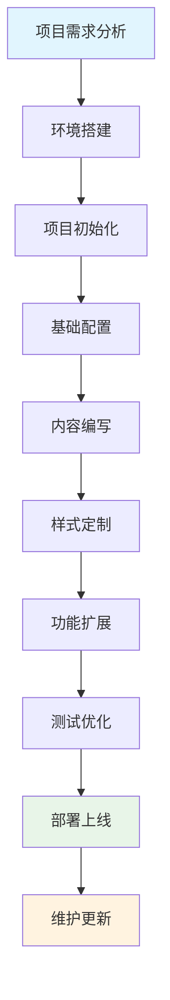
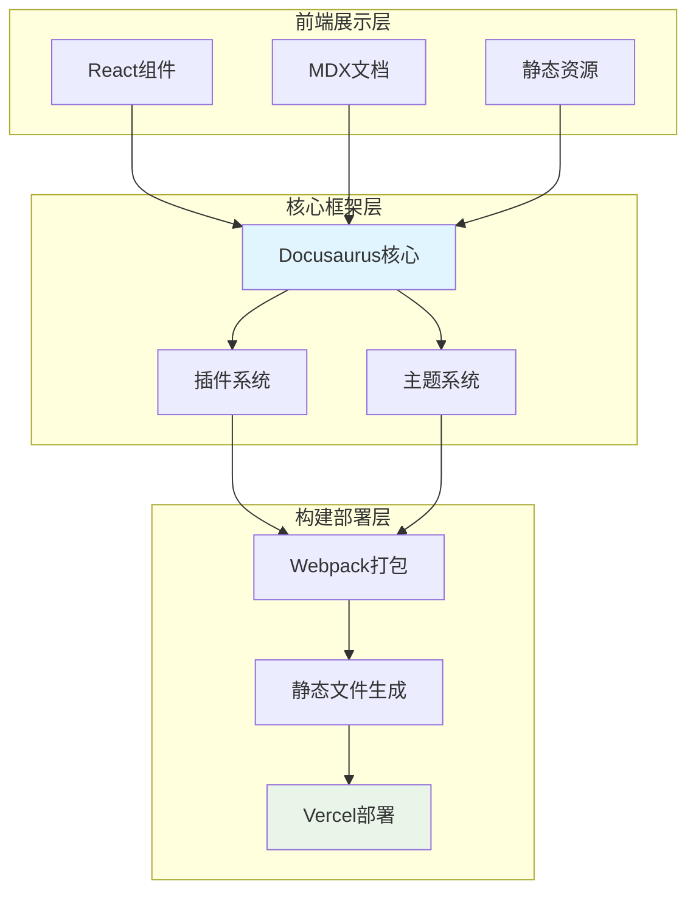
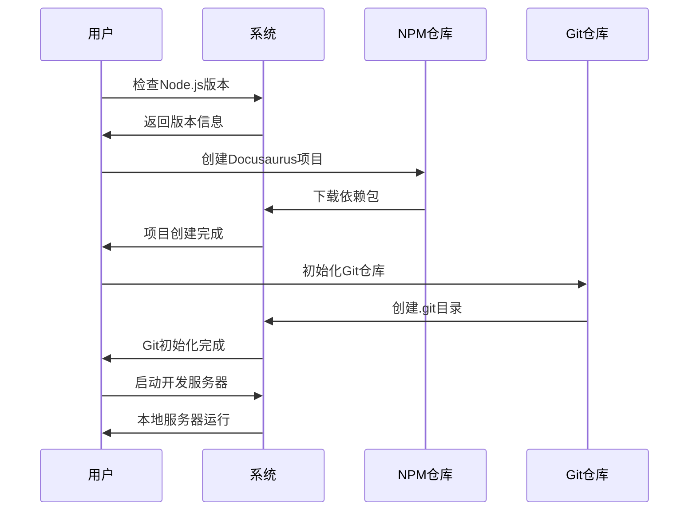
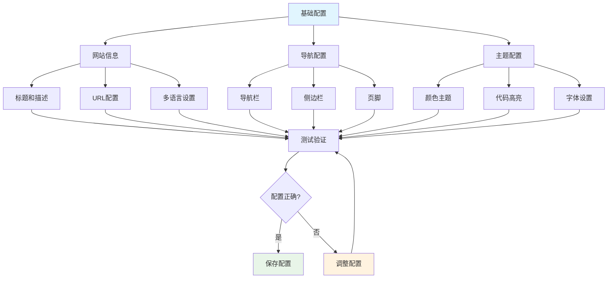
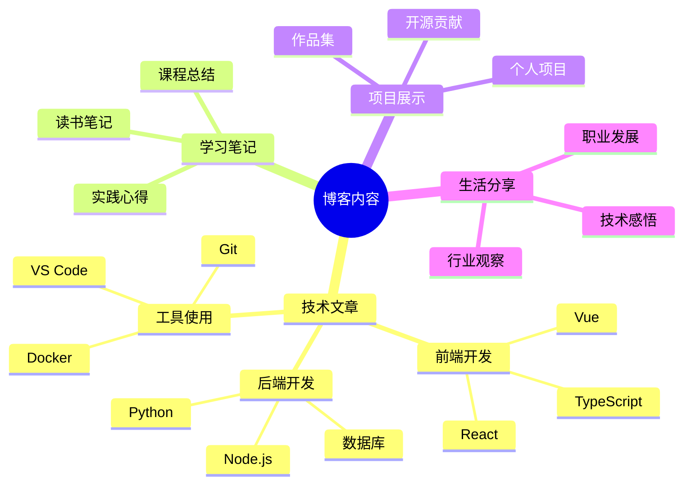
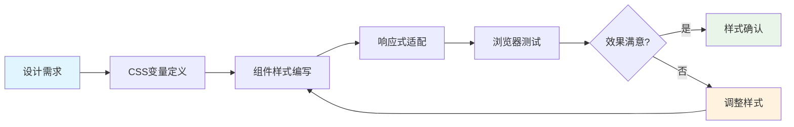
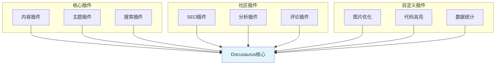
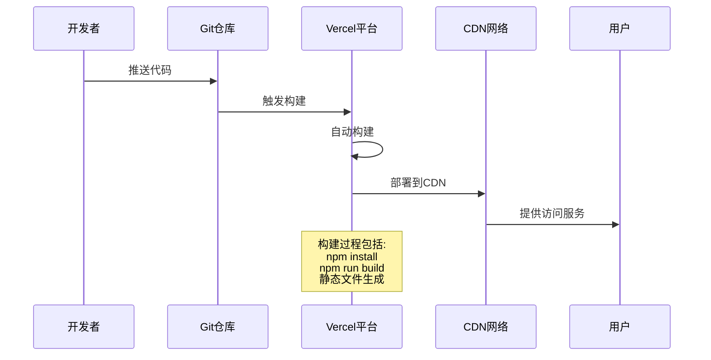
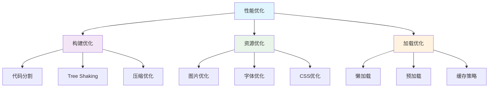
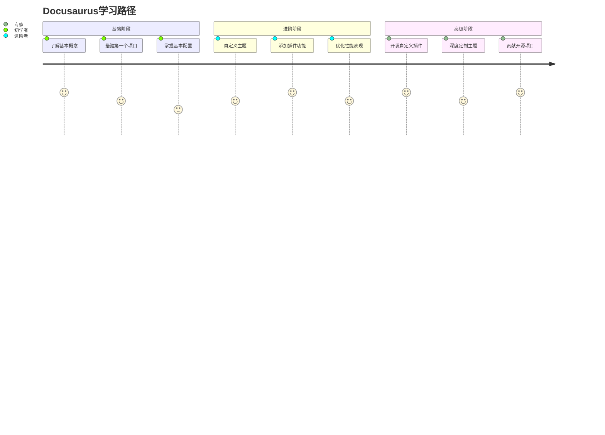

import Tabs from '@theme/Tabs';
import TabItem from '@theme/TabItem';
import TOCInline from '@theme/TOCInline';

# Docusaurus博客搭建完整教程

## 教程概述

:::tip[🎯 教程目标]

通过本教程，您将学会：
- 搭建一个现代化的技术博客
- 配置多语言和版本控制
- 实现自动部署和持续集成
- 优化SEO和性能表现

:::

### 本教程目录

<TOCInline toc={toc} minHeadingLevel={2} maxHeadingLevel={3} />

### 项目开发流程



### 技术架构图



## 环境准备

### 系统要求

- Node.js 18.0 或更高版本
- npm 或 yarn 包管理器
- Git 版本控制
- 现代浏览器（Chrome、Firefox、Safari、Edge）

### 安装流程



## 项目搭建

### 创建项目

```bash title="创建Docusaurus项目"
npx create-docusaurus@latest my-blog classic --typescript
cd my-blog
```

### 项目结构

```
my-blog/
├── blog/                  # 博客文章
├── docs/                  # 文档内容
├── src/
│   ├── components/        # 自定义组件
│   ├── css/              # 样式文件
│   └── pages/            # 自定义页面
├── static/               # 静态资源
├── docusaurus.config.js  # 配置文件
├── sidebars.js           # 侧边栏配置
└── package.json          # 项目依赖
```

### 启动项目

```bash title="启动开发服务器"
npm start
```

## 基础配置

### 网站信息配置

```javascript title="docusaurus.config.js" showLineNumbers {6-10,15-20}
import {themes as prismThemes} from 'prism-react-renderer';

/** @type {import('@docusaurus/types').Config} */
const config = {
  title: '我的技术博客',
  tagline: '分享前端开发经验和技术思考',
  favicon: 'img/favicon.ico',
  url: 'https://my-blog.vercel.app',
  baseUrl: '/',
  organizationName: 'username',
  projectName: 'my-blog',

  onBrokenLinks: 'throw',
  onBrokenMarkdownLinks: 'warn',

  i18n: {
    defaultLocale: 'zh-Hans',
    locales: ['zh-Hans', 'en'],
  },

  presets: [
    [
      'classic',
      /** @type {import('@docusaurus/preset-classic').Options} */
      ({
        docs: {
          sidebarPath: './sidebars.js',
          editUrl: 'https://github.com/username/my-blog/tree/main/',
        },
        blog: {
          showReadingTime: true,
          editUrl: 'https://github.com/username/my-blog/tree/main/',
        },
        theme: {
          customCss: './src/css/custom.css',
        },
      }),
    ],
  ],

  themeConfig:
    /** @type {import('@docusaurus/preset-classic').ThemeConfig} */
    ({
      // 全局目录配置
      tableOfContents: {
        minHeadingLevel: 2,
        maxHeadingLevel: 4,
      },
      image: 'img/docusaurus-social-card.jpg',
      navbar: {
        title: '我的博客',
        logo: {
          alt: '我的博客Logo',
          src: 'img/logo.svg',
        },
        items: [
          {
            type: 'docSidebar',
            sidebarId: 'tutorialSidebar',
            position: 'left',
            label: '教程',
          },
          {to: '/blog', label: '博客', position: 'left'},
          {
            href: 'https://github.com/username/my-blog',
            label: 'GitHub',
            position: 'right',
          },
        ],
      },
      footer: {
        style: 'dark',
        links: [
          {
            title: '文档',
            items: [
              {
                label: '教程',
                to: '/docs/intro',
              },
            ],
          },
          {
            title: '社区',
            items: [
              {
                label: 'Stack Overflow',
                href: 'https://stackoverflow.com/questions/tagged/docusaurus',
              },
              {
                label: 'Discord',
                href: 'https://discordapp.com/invite/docusaurus',
              },
              {
                label: 'Twitter',
                href: 'https://twitter.com/docusaurus',
              },
            ],
          },
        ],
      },
      prism: {
        theme: prismThemes.github,
        darkTheme: prismThemes.dracula,
      },
    }),
};

export default config;
```

### 配置优化流程



## 内容创建

### 文档结构规划



### 创建博客文章

```markdown title="blog/2024-01-01-welcome.md" showLineNumbers
---
slug: welcome
title: 欢迎来到我的技术博客
authors: [your-name]
tags: [welcome, blog, introduction]
---

# 欢迎来到我的技术博客

这是我的第一篇博客文章，在这里我将分享：

- 前端开发经验
- 技术学习心得
- 项目实践总结
- 行业观察思考

希望这些内容能对大家有所帮助！

{/* truncate */}

## 博客内容规划

### 技术文章系列

我计划写以下系列文章：

1. **React深度学习系列**
   - React Hooks详解
   - 状态管理最佳实践
   - 性能优化技巧

2. **前端工程化系列**
   - 构建工具配置
   - 代码质量保证
   - 自动化部署

3. **项目实战系列**
   - 从零搭建博客系统
   - 电商网站开发
   - 移动端应用开发

### 学习方法分享

我也会分享一些学习方法和心得：

- 如何高效学习新技术
- 技术文档的阅读技巧
- 开源项目的参与方式
- 技术面试的准备方法

欢迎大家关注我的博客，一起学习成长！
```

### 创建文档页面

```markdown title="docs/intro.md" showLineNumbers
---
sidebar_position: 1
toc_min_heading_level: 2
toc_max_heading_level: 3
---

# 教程介绍

让我们在**不到5分钟**的时间内发现**Docusaurus**。

## 开始使用

通过**创建新站点**开始使用。

或者**立即尝试Docusaurus**：

```bash
npx create-docusaurus@latest my-website classic
```

### 你需要什么

- [Node.js](https://nodejs.org/en/download/) 版本 18.0 或以上：
  - 安装 Node.js 时，建议勾选所有与依赖项相关的复选框。

## 生成新站点

使用**经典模板**生成新的 Docusaurus 站点。

经典模板将自动添加到您的项目中，在你运行命令之后：

```bash
npx create-docusaurus@latest my-website classic
```

您可以在命令行中输入此命令，无论是在 Command Prompt、Powershell、Terminal 还是您代码编辑器的任何其他集成终端中。

该命令还会安装运行 Docusaurus 所需的所有依赖项。

## 启动站点

运行开发服务器：

```bash
cd my-website
npm run start
```

`cd` 命令更改您正在使用的目录。为了使用您新创建的 Docusaurus 站点，您需要在终端中导航到该目录。

`npm run start` 命令在本地构建您的网站并通过开发服务器为其提供服务，供您在 http://localhost:3000 上查看。

打开 `docs/intro.md`（此页面）并编辑一些行：站点会**自动重新加载**并显示您的更改。
```

## 样式定制

### 自定义CSS

```css title="src/css/custom.css" showLineNumbers {5-10,15-20,25-30}
/**
 * 自定义CSS变量
 */

/* 亮色主题 */
:root {
  --ifm-color-primary: #2e8555;
  --ifm-color-primary-dark: #29784c;
  --ifm-color-primary-darker: #277148;
  --ifm-color-primary-darkest: #205d3b;
  --ifm-color-primary-light: #33925d;
  --ifm-color-primary-lighter: #359962;
  --ifm-color-primary-lightest: #3cad6e;
  --ifm-code-font-size: 95%;
  --docusaurus-highlighted-code-line-bg: rgba(0, 0, 0, 0.1);
}

/* 暗色主题 */
[data-theme='dark'] {
  --ifm-color-primary: #25c2a0;
  --ifm-color-primary-dark: #21af90;
  --ifm-color-primary-darker: #1fa588;
  --ifm-color-primary-darkest: #1a8870;
  --ifm-color-primary-light: #29d5b0;
  --ifm-color-primary-lighter: #32d8b4;
  --ifm-color-primary-lightest: #4fddbf;
  --docusaurus-highlighted-code-line-bg: rgba(0, 0, 0, 0.3);
}

/* 自定义样式 */
.hero {
  background: linear-gradient(135deg, #667eea 0%, #764ba2 100%);
  color: white;
}

.hero__title {
  font-size: 3rem;
  font-weight: 700;
}

.hero__subtitle {
  font-size: 1.5rem;
  margin-top: 1rem;
}

/* 卡片样式 */
.card {
  border-radius: 12px;
  box-shadow: 0 4px 6px rgba(0, 0, 0, 0.1);
  transition: transform 0.3s ease, box-shadow 0.3s ease;
}

.card:hover {
  transform: translateY(-4px);
  box-shadow: 0 8px 25px rgba(0, 0, 0, 0.15);
}

/* 响应式设计 */
@media (max-width: 768px) {
  .hero__title {
    font-size: 2rem;
  }
  
  .hero__subtitle {
    font-size: 1.2rem;
  }
}
```

### 样式定制流程



## 功能扩展

### 插件系统



### 添加搜索功能

```javascript title="docusaurus.config.js" showLineNumbers {5-10}
const config = {
  // ... 其他配置
  
  themes: [
    [
      require.resolve("@easyops-cn/docusaurus-search-local"),
      {
        hashed: true,
        language: ["en", "zh"],
        highlightSearchTermsOnTargetPage: true,
      },
    ],
  ],
  
  // ... 其他配置
};
```

## 部署配置

### 部署流程



### Vercel部署配置

```json title="vercel.json" showLineNumbers
{
  "version": 2,
  "builds": [
    {
      "src": "package.json",
      "use": "@vercel/static-build",
      "config": {
        "distDir": "build"
      }
    }
  ],
  "routes": [
    {
      "src": "/(.*)",
      "dest": "/$1"
    }
  ]
}
```

### GitHub Actions自动部署

```yaml title=".github/workflows/deploy.yml" showLineNumbers
name: Deploy to Vercel

on:
  push:
    branches: [ main ]
  pull_request:
    branches: [ main ]

jobs:
  deploy:
    runs-on: ubuntu-latest
    
    steps:
    - uses: actions/checkout@v3
    
    - name: Setup Node.js
      uses: actions/setup-node@v3
      with:
        node-version: '18'
        cache: 'npm'
    
    - name: Install dependencies
      run: npm ci
    
    - name: Build
      run: npm run build
    
    - name: Deploy to Vercel
      uses: amondnet/vercel-action@v20
      with:
        vercel-token: ${{ secrets.VERCEL_TOKEN }}
        vercel-org-id: ${{ secrets.ORG_ID }}
        vercel-project-id: ${{ secrets.PROJECT_ID }}
        working-directory: ./
```

:::info[💡 小贴士]

在部署前请确保：
- 所有依赖都已正确安装
- 构建过程没有错误
- 静态资源路径正确

:::

## 性能优化

### 优化策略



### 图片优化配置

```javascript title="docusaurus.config.js" showLineNumbers {10-15}
const config = {
  // ... 其他配置
  
  plugins: [
    [
      '@docusaurus/plugin-ideal-image',
      {
        quality: 70,
        max: 1030,
        min: 640,
        steps: 2,
        disableInDev: false,
      },
    ],
  ],
  
  // ... 其他配置
};
```

:::success[🎉 部署成功]

恭喜！您已经成功搭建了一个功能完整的Docusaurus博客。

接下来可以：
- 添加更多内容
- 定制个性化样式
- 集成第三方服务
- 优化SEO设置

:::

## 进阶功能

### 国际化配置

```javascript title="docusaurus.config.js" showLineNumbers {5-10}
const config = {
  // ... 其他配置
  
  i18n: {
    defaultLocale: 'zh-Hans',
    locales: ['zh-Hans', 'en'],
    localeConfigs: {
      'zh-Hans': {
        label: '中文',
        direction: 'ltr',
      },
      en: {
        label: 'English',
        direction: 'ltr',
      },
    },
  },
  
  // ... 其他配置
};
```

### 版本控制

```javascript title="docusaurus.config.js" showLineNumbers {8-12}
const config = {
  // ... 其他配置
  
  presets: [
    [
      'classic',
      {
        docs: {
          sidebarPath: './sidebars.js',
          versions: {
            current: {
              label: '当前版本',
              path: 'current',
            },
          },
        },
      },
    ],
  ],
  
  // ... 其他配置
};
```

### 学习路径规划



:::warning[⚠️ 注意事项]

在开发过程中请注意：
- 定期备份重要数据
- 测试多种浏览器兼容性
- 优化移动端显示效果
- 关注安全性最佳实践

:::

## 总结

通过本教程，您已经掌握了Docusaurus博客搭建的完整流程。从项目初始化到部署上线，每个步骤都配有详细说明和代码示例。

继续探索Docusaurus的更多可能性，打造属于您的独特博客平台！

export const styles = {
  card: {
    borderRadius: '12px',
    boxShadow: '0 4px 6px rgba(0, 0, 0, 0.1)',
    transition: 'transform 0.3s ease, box-shadow 0.3s ease',
    padding: '20px',
    margin: '16px 0'
  }
}; 