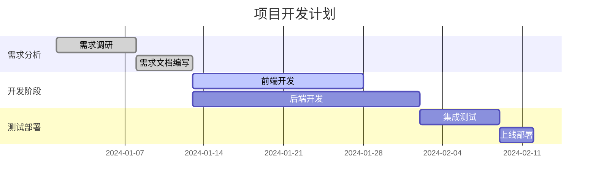
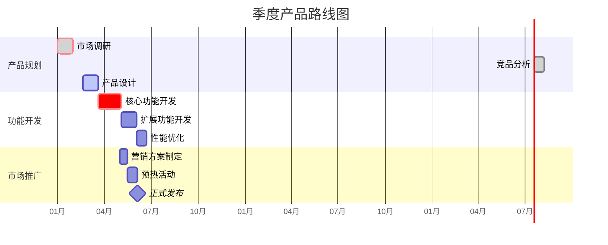
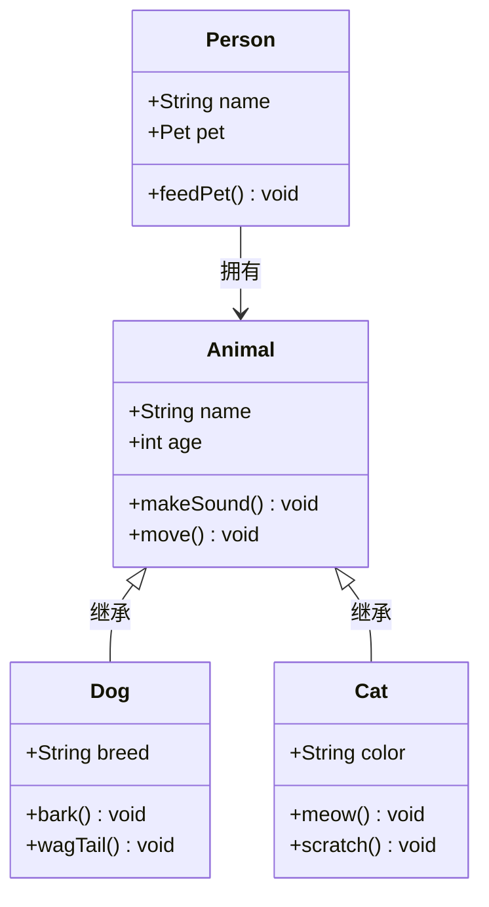
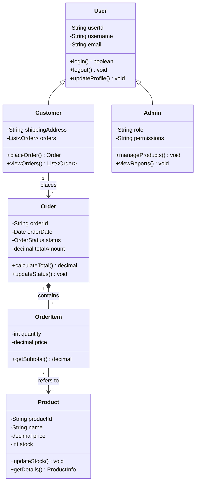
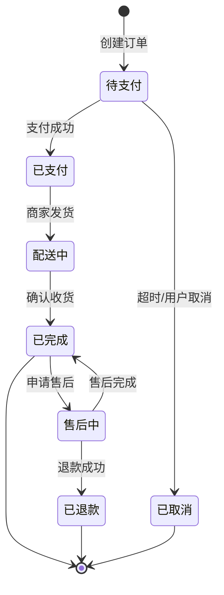
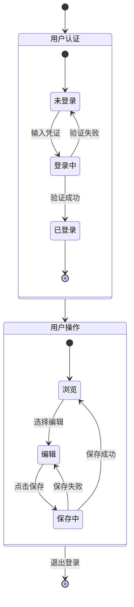
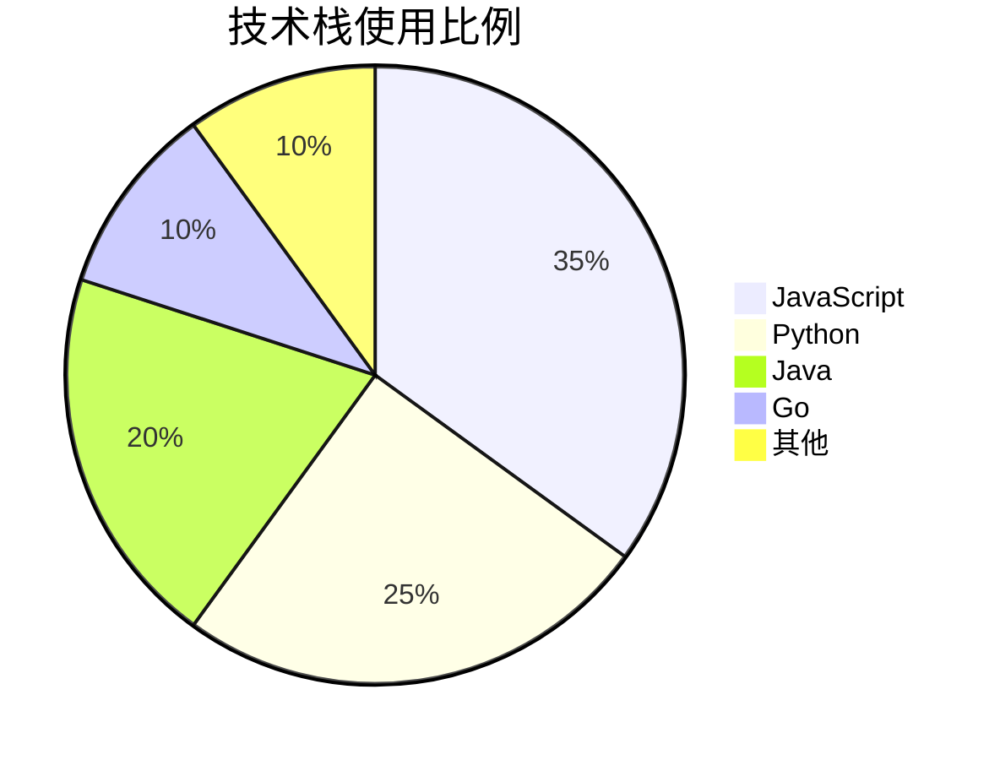
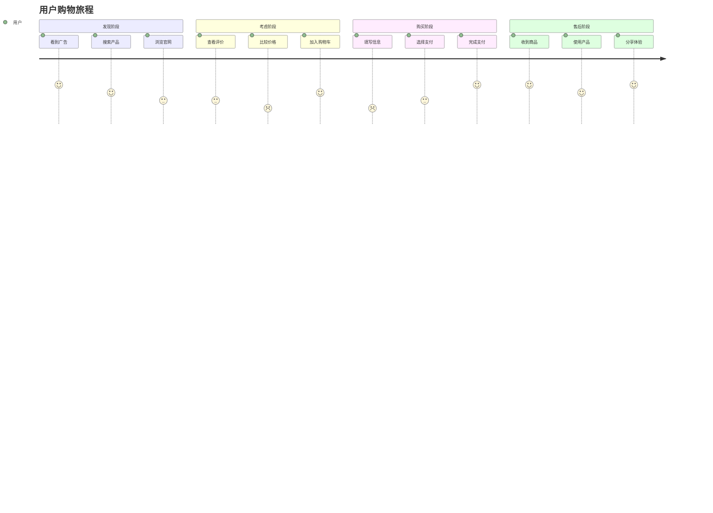
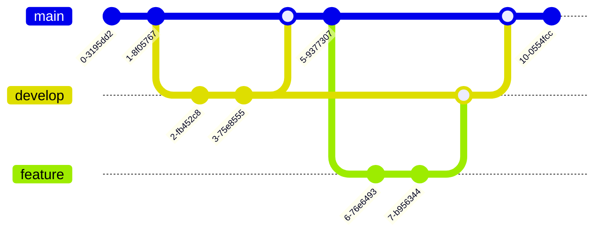

import CodeBlock from '@theme/CodeBlock';
import Admonition from '@theme/Admonition';

# Mermaid 高级应用

## 📅 甘特图（Gantt Chart）

甘特图是项目管理的重要工具，用于展示项目进度和时间安排。

### 基础语法

<CodeBlock language="mermaid">
{`gantt
    title 项目开发计划
    dateFormat YYYY-MM-DD
    
    section 需求分析
    需求调研           :done,    des1, 2024-01-01, 7d
    需求文档编写       :done,    des2, after des1, 5d
    
    section 开发阶段
    前端开发           :active,  dev1, 2024-01-13, 15d
    后端开发           :         dev2, after des2, 20d
    
    section 测试部署
    集成测试           :         test1, after dev2, 7d
    上线部署           :         deploy, after test1, 3d`}
</CodeBlock>

### 高级配置

<CodeBlock language="mermaid">
{`gantt
    title 季度产品路线图
    dateFormat YYYY-MM-DD
    axisFormat %m月
    
    section 产品规划
    市场调研            :crit, done, 2024-01-01, 30d
    竞品分析            :done, after a1, 20d
    产品设计            :active, 2024-02-20, 30d
    
    section 功能开发
    核心功能开发        :crit, 2024-03-20, 45d
    扩展功能开发        :2024-05-04, 30d
    性能优化            :2024-06-03, 20d
    
    section 市场推广
    营销方案制定        :2024-05-01, 15d
    预热活动            :2024-05-16, 20d
    正式发布            :milestone, 2024-06-05, 0d`}
</CodeBlock>

## 🏗️ 类图（Class Diagram）

类图用于展示系统的静态结构，包括类、属性、方法和类之间的关系。

### 基础语法

<CodeBlock language="mermaid">
{`classDiagram
    class Animal {
        +String name
        +int age
        +makeSound() void
        +move() void
    }
    
    class Dog {
        +String breed
        +bark() void
        +wagTail() void
    }
    
    class Cat {
        +String color
        +meow() void
        +scratch() void
    }
    
    Animal <|-- Dog : 继承
    Animal <|-- Cat : 继承
    
    class Person {
        +String name
        +Pet pet
        +feedPet() void
    }
    
    Person --> Animal : 拥有`}
</CodeBlock>

### 关系类型

<CodeBlock language="mermaid">
{`classDiagram
    classA <|-- classB : 继承
    classC *-- classD : 组合
    classE o-- classF : 聚合
    classG <-- classH : 关联
    classI -- classJ : 链接
    classK <.. classL : 依赖
    classM <|.. classN : 实现
    classO .. classP : 虚线链接`}
</CodeBlock>

### 实战示例：电商系统类图

<CodeBlock language="mermaid">
{`classDiagram
    class User {
        -String userId
        -String username
        -String email
        +login() boolean
        +logout() void
        +updateProfile() void
    }
    
    class Customer {
        -String shippingAddress
        -List~Order~ orders
        +placeOrder() Order
        +viewOrders() List~Order~
    }
    
    class Admin {
        -String role
        -String permissions
        +manageProducts() void
        +viewReports() void
    }
    
    class Product {
        -String productId
        -String name
        -decimal price
        -int stock
        +updateStock() void
        +getDetails() ProductInfo
    }
    
    class Order {
        -String orderId
        -Date orderDate
        -OrderStatus status
        -decimal totalAmount
        +calculateTotal() decimal
        +updateStatus() void
    }
    
    class OrderItem {
        -int quantity
        -decimal price
        +getSubtotal() decimal
    }
    
    User <|-- Customer
    User <|-- Admin
    Customer "1" --> "*" Order : places
    Order "1" *-- "*" OrderItem : contains
    OrderItem "*" --> "1" Product : refers to`}
</CodeBlock>

## 🔄 状态图（State Diagram）

状态图展示对象在其生命周期中的各种状态以及状态之间的转换。

### 基础语法

<CodeBlock language="mermaid">
{`stateDiagram-v2
    [*] --> 待支付 : 创建订单
    待支付 --> 已支付 : 支付成功
    待支付 --> 已取消 : 超时/用户取消
    已支付 --> 配送中 : 商家发货
    配送中 --> 已完成 : 确认收货
    已完成 --> [*]
    已取消 --> [*]
    
    已完成 --> 售后中 : 申请售后
    售后中 --> 已完成 : 售后完成
    售后中 --> 已退款 : 退款成功
    已退款 --> [*]`}
</CodeBlock>

### 复合状态

<CodeBlock language="mermaid">
{`stateDiagram-v2
    [*] --> 用户认证
    
    state 用户认证 {
        [*] --> 未登录
        未登录 --> 登录中 : 输入凭证
        登录中 --> 已登录 : 验证成功
        登录中 --> 未登录 : 验证失败
        已登录 --> [*]
    }
    
    用户认证 --> 用户操作
    
    state 用户操作 {
        [*] --> 浏览
        浏览 --> 编辑 : 选择编辑
        编辑 --> 保存中 : 点击保存
        保存中 --> 浏览 : 保存成功
        保存中 --> 编辑 : 保存失败
    }
    
    用户操作 --> [*] : 退出登录`}
</CodeBlock>

## 📊 饼图（Pie Chart）

饼图用于展示数据的组成比例。

<CodeBlock language="mermaid">
{`pie title 技术栈使用比例
    "JavaScript" : 35
    "Python" : 25
    "Java" : 20
    "Go" : 10
    "其他" : 10`}
</CodeBlock>

## 🚶 用户旅程图（User Journey）

用户旅程图展示用户在使用产品或服务过程中的体验。

<CodeBlock language="mermaid">
{`journey
    title 用户购物旅程
    section 发现阶段
      看到广告: 5: 用户
      搜索产品: 4: 用户
      浏览官网: 3: 用户
    section 考虑阶段
      查看评价: 3: 用户
      比较价格: 2: 用户
      加入购物车: 4: 用户
    section 购买阶段
      填写信息: 2: 用户
      选择支付: 3: 用户
      完成支付: 5: 用户
    section 售后阶段
      收到商品: 5: 用户
      使用产品: 4: 用户
      分享体验: 5: 用户`}
</CodeBlock>

## 🌳 Git 图（Git Graph）

Git 图用于展示版本控制的分支和合并历史。

<CodeBlock language="mermaid">
{`gitGraph
    commit
    commit
    branch develop
    checkout develop
    commit
    commit
    checkout main
    merge develop
    commit
    branch feature
    checkout feature
    commit
    commit
    checkout develop
    merge feature
    checkout main
    merge develop
    commit`}
</CodeBlock>

## 🎨 高级样式定制

### 自定义主题

<CodeBlock language="mermaid">
{`%%{init: {
  'theme': 'base',
  'themeVariables': {
    'primaryColor': '#ff6b6b',
    'primaryTextColor': '#fff',
    'primaryBorderColor': '#ff4757',
    'lineColor': '#5f27cd',
    'secondaryColor': '#4834d4',
    'tertiaryColor': '#dfe6e9'
  }
}}%%
graph TD
    A[自定义主题] --> B[个性化配色]
    B --> C[品牌一致性]
    C --> D[视觉优化]`}
</CodeBlock>

<Admonition type="tip" title="AI 辅助生成复杂图表">
对于复杂的图表，可以使用 Gemini CLI 来辅助生成：

<CodeBlock language="text">
{`您：帮我创建一个微服务架构的类图，包括网关、认证服务、业务服务

Gemini：我来为您创建微服务架构类图：

\`\`\`mermaid
classDiagram
    class APIGateway {
        -String gatewayId
        -Map~String,Route~ routes
        -RateLimiter rateLimiter
        +routeRequest(Request) Response
        +authenticate(Token) boolean
        +applyRateLimit() void
    }
    
    class AuthService {
        -TokenManager tokenManager
        -UserRepository userRepo
        +login(credentials) Token
        +validateToken(token) boolean
        +refreshToken(token) Token
        +logout(token) void
    }
    
    class UserService {
        -UserRepository repository
        +createUser(userData) User
        +getUser(userId) User
        +updateUser(userId, data) User
        +deleteUser(userId) boolean
    }
    
    class OrderService {
        -OrderRepository repository
        -PaymentClient paymentClient
        +createOrder(orderData) Order
        +getOrder(orderId) Order
        +processPayment(orderId) PaymentResult
        +updateOrderStatus(orderId, status) void
    }
    
    class NotificationService {
        -EmailSender emailSender
        -SMSSender smsSender
        +sendEmail(recipient, content) void
        +sendSMS(phone, message) void
        +sendBatchNotifications() void
    }
    
    APIGateway --> AuthService : validates with
    APIGateway --> UserService : routes to
    APIGateway --> OrderService : routes to
    APIGateway --> NotificationService : routes to
    OrderService --> NotificationService : triggers
    UserService --> NotificationService : uses
\`\`\``}
</CodeBlock>
</Admonition>

## 🚀 下一步

掌握了 Mermaid 的高级特性后，您可以：

  <a href="./drawio" className="next-button">
    学习 Draw.io 设计 →
  </a>
  <a href="./use-cases" className="next-button secondary">
    查看场景应用 →
  </a>

