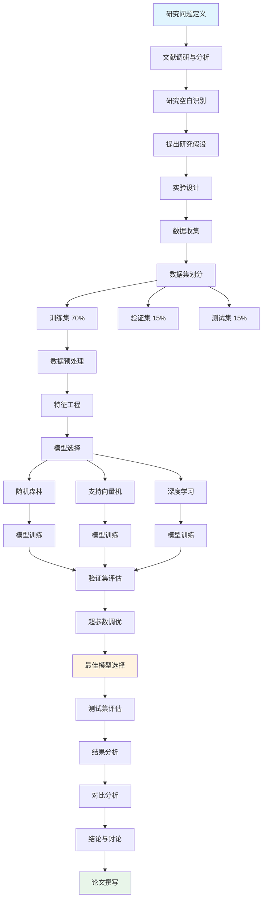

import CodeBlock from '@theme/CodeBlock';
import Admonition from '@theme/Admonition';

# 实战项目

## 📝 项目 1：学术论文图表套件

### 项目目标
为一篇关于机器学习的学术论文创建完整的图表套件，包括研究方法流程图、实验设计图、数据分析流程和结果对比图表。

### 1.1 研究方法流程图

<CodeBlock language="mermaid">
{`graph TB
    Start[研究问题定义] --> Literature[文献调研与分析]
    Literature --> Gap[研究空白识别]
    Gap --> Hypothesis[提出研究假设]
    
    Hypothesis --> Design[实验设计]
    Design --> Data[数据收集]
    
    Data --> Split[数据集划分]
    Split --> Train[训练集 70%]
    Split --> Valid[验证集 15%]
    Split --> Test[测试集 15%]
    
    Train --> Preprocess[数据预处理]
    Preprocess --> Feature[特征工程]
    
    Feature --> Models[模型选择]
    Models --> RF[随机森林]
    Models --> SVM[支持向量机]
    Models --> DL[深度学习]
    
    RF --> Training1[模型训练]
    SVM --> Training2[模型训练]
    DL --> Training3[模型训练]
    
    Training1 --> Validation[验证集评估]
    Training2 --> Validation
    Training3 --> Validation
    
    Validation --> Tuning[超参数调优]
    Tuning --> Best[最佳模型选择]
    Best --> Testing[测试集评估]
    
    Testing --> Analysis[结果分析]
    Analysis --> Comparison[对比分析]
    Comparison --> Conclusion[结论与讨论]
    Conclusion --> Paper[论文撰写]
    
    style Start fill:#e1f5fe
    style Paper fill:#e8f5e9
    style Best fill:#fff3e0`}
</CodeBlock>

### 1.2 实验设计图

### 1.3 数据处理管道

<CodeBlock language="mermaid">
{`sequenceDiagram
    participant Raw as 原始数据
    participant Clean as 数据清洗
    participant Transform as 数据转换
    participant Feature as 特征提取
    participant Scale as 特征缩放
    participant Select as 特征选择
    participant Model as 模型输入
    
    Raw->>Clean: 缺失值处理
    Clean->>Clean: 异常值检测
    Clean->>Transform: 数据类型转换
    Transform->>Feature: 特征工程
    Feature->>Scale: 标准化/归一化
    Scale->>Select: 特征重要性分析
    Select->>Model: 最终特征集
    
    Note over Clean: 删除重复数据 填充缺失值 异常值处理
    Note over Feature: 多项式特征 交互特征 领域特征
    Note over Select: PCA 互信息 递归特征消除`}
</CodeBlock>

### 1.4 结果可视化

<CodeBlock language="mermaid">
{`pie title 模型性能对比（准确率）
    "随机森林" : 92.5
    "支持向量机" : 89.3
    "深度学习" : 94.7
    "集成模型" : 96.2`}
</CodeBlock>

<Admonition type="info" title="项目交付物">
1. **流程图集**：PDF 格式，300 DPI
2. **LaTeX 源码**：可直接嵌入论文
3. **SVG 矢量图**：支持无损缩放
4. **说明文档**：图表使用指南
</Admonition>

## 🏗️ 项目 2：系统架构文档

### 项目目标
为一个微服务电商系统创建完整的架构文档图表，包括系统架构图、数据流图、API 时序图和部署架构图。

### 2.1 系统整体架构

<CodeBlock language="text">
{`您：为电商系统生成整体架构图

Gemini：我来创建完整的电商系统架构图：

\`\`\`mermaid
graph TB
    subgraph "前端应用"
        Web[Web商城]
        Mobile[移动APP]
        Admin[管理后台]
        Merchant[商家平台]
    end
    
    subgraph "接入层"
        CDN[CDN加速]
        WAF[Web防火墙]
        LB[负载均衡]
        Gateway[API网关]
    end
    
    subgraph "微服务层"
        subgraph "核心服务"
            User[用户服务]
            Product[商品服务]
            Order[订单服务]
            Payment[支付服务]
        end
        
        subgraph "业务服务"
            Cart[购物车]
            Search[搜索服务]
            Recommend[推荐服务]
            Inventory[库存服务]
        end
        
        subgraph "支撑服务"
            Notification[通知服务]
            File[文件服务]
            Report[报表服务]
            Workflow[工作流服务]
        end
    end
    
    subgraph "中间件"
        MQ[消息队列]
        Cache[分布式缓存]
        Config[配置中心]
        Registry[服务注册]
    end
    
    subgraph "数据存储"
        MySQL[(MySQL集群)]
        MongoDB[(MongoDB)]
        Redis[(Redis集群)]
        ES[(ElasticSearch)]
    end
    
    Web --> CDN
    Mobile --> CDN
    Admin --> WAF
    Merchant --> WAF
    CDN --> LB
    WAF --> LB
    LB --> Gateway
    
    Gateway --> User
    Gateway --> Product
    Gateway --> Order
    Gateway --> Payment
    
    Order --> MQ
    Payment --> MQ
    MQ --> Inventory
    MQ --> Notification
    
    User --> MySQL
    Product --> MongoDB
    Search --> ES
    Cart --> Redis
\`\`\``}
</CodeBlock>

### 2.2 数据流图

<CodeBlock language="mermaid">
{`graph LR
    subgraph "数据采集"
        App[应用日志]
        User[用户行为]
        Trans[交易数据]
    end
    
    subgraph "数据处理"
        Kafka[Kafka队列]
        Flink[实时处理]
        Spark[批处理]
    end
    
    subgraph "数据存储"
        HDFS[HDFS存储]
        Hive[数据仓库]
        HBase[NoSQL存储]
    end
    
    subgraph "数据服务"
        OLAP[OLAP分析]
        API[数据API]
        Report[报表系统]
    end
    
    App --> Kafka
    User --> Kafka
    Trans --> Kafka
    
    Kafka --> Flink
    Kafka --> Spark
    
    Flink --> HBase
    Spark --> HDFS
    HDFS --> Hive
    
    HBase --> API
    Hive --> OLAP
    OLAP --> Report`}
</CodeBlock>

### 2.3 核心 API 时序图

<CodeBlock language="mermaid">
{`sequenceDiagram
    participant U as 用户
    participant G as API网关
    participant A as 认证服务
    participant O as 订单服务
    participant I as 库存服务
    participant P as 支付服务
    participant N as 通知服务
    
    U->>G: 提交订单请求
    G->>A: 验证Token
    A-->>G: Token有效
    
    G->>O: 创建订单
    O->>I: 检查库存
    I-->>O: 库存充足
    O->>I: 锁定库存
    I-->>O: 锁定成功
    
    O->>P: 创建支付单
    P-->>O: 支付单创建成功
    O-->>G: 订单创建成功
    G-->>U: 返回订单信息
    
    U->>G: 支付请求
    G->>P: 执行支付
    P->>P: 调用第三方支付
    P-->>G: 支付成功
    G-->>U: 支付完成
    
    P->>O: 更新订单状态
    O->>I: 扣减库存
    O->>N: 发送通知
    N-->>U: 订单确认邮件`}
</CodeBlock>

## 💼 项目 3：商业计划书图表

### 项目目标
为创业项目商业计划书创建专业图表，包括商业模式画布、市场分析图表、产品路线图和组织架构图。

### 3.1 商业模式画布

<CodeBlock language="mermaid">
{`graph TB
    subgraph "商业模式画布"
        subgraph "基础设施"
            KP[关键合作伙伴 ・技术供应商 ・物流合作 ・支付平台]
            KA[关键活动 ・平台运营 ・技术开发 ・市场推广]
            KR[关键资源 ・技术团队 ・平台系统 ・用户数据]
        end
        
        subgraph "产品价值"
            VP[价值主张 ・一站式解决方案 ・优质用户体验 ・性价比高]
        end
        
        subgraph "客户界面"
            CR[客户关系 ・自助服务 ・社区支持 ・专属客服]
            CH[渠道通路 ・线上平台 ・移动应用 ・合作渠道]
            CS[客户细分 ・个人用户 ・中小企业 ・大型企业]
        end
        
        subgraph "财务状况"
            C$[成本结构 ・技术开发 ・运营成本 ・营销费用]
            R$[收入来源 ・订阅费用 ・交易佣金 ・增值服务]
        end
    end
    
    KP --> KA
    KA --> VP
    KR --> VP
    VP --> CR
    VP --> CH
    CR --> CS
    CH --> CS
    KA --> C$
    KR --> C$
    CS --> R$`}
</CodeBlock>

### 3.2 市场增长预测

<CodeBlock language="mermaid">
{`gantt
    title 产品发展路线图
    dateFormat YYYY-MM-DD
    axisFormat %Y-Q%q
    
    section 产品开发
    MVP版本           :done, mvp, 2024-01-01, 90d
    功能完善           :done, feature, after mvp, 120d
    2.0版本开发        :active, v2, 2024-07-01, 150d
    3.0版本规划        :v3, 2025-01-01, 180d
    
    section 市场拓展
    种子用户获取       :done, seed, 2024-02-01, 60d
    市场推广           :done, market, 2024-04-01, 90d
    规模化增长         :active, scale, 2024-07-01, 180d
    国际化             :intl, 2025-01-01, 365d
    
    section 融资计划
    天使轮             :done, angel, 2024-01-15, 30d
    Pre-A轮            :done, prea, 2024-06-01, 45d
    A轮                :active, arounda, 2024-11-01, 60d
    B轮                :roundb, 2025-06-01, 60d`}
</CodeBlock>

### 3.3 组织架构

<CodeBlock language="mermaid">
{`graph TB
    CEO[CEO 首席执行官]
    
    CEO --> CTO[CTO 首席技术官]
    CEO --> COO[COO 首席运营官]
    CEO --> CFO[CFO 首席财务官]
    CEO --> CMO[CMO 首席营销官]
    
    CTO --> Dev[开发团队 15人]
    CTO --> QA[测试团队 5人]
    CTO --> DevOps[运维团队 3人]
    
    COO --> Product[产品团队 8人]
    COO --> Support[客服团队 10人]
    COO --> Operations[运营团队 6人]
    
    CFO --> Finance[财务部 4人]
    CFO --> Legal[法务部 2人]
    
    CMO --> Marketing[市场部 7人]
    CMO --> Sales[销售部 12人]
    CMO --> BD[商务拓展 5人]
    
    style CEO fill:#e1f5fe
    style CTO fill:#fff3e0
    style COO fill:#f3e5f5
    style CFO fill:#e8f5e9
    style CMO fill:#fce4ec`}
</CodeBlock>

## 🎯 综合练习

### 练习任务

  

    <h4>📚 练习 1：技术文档</h4>
    
为您的开源项目创建：

    <ul>
      <li>系统架构图</li>
      <li>API 流程图</li>
      <li>部署架构图</li>
      <li>数据模型图</li>
    </ul>
  

  
  

    <h4>🎓 练习 2：学术图表</h4>
    
为研究论文准备：

    <ul>
      <li>实验流程图</li>
      <li>算法流程图</li>
      <li>数据分析图</li>
      <li>结果对比图</li>
    </ul>
  

  
  

    <h4>💼 练习 3：商务演示</h4>
    
为项目汇报制作：

    <ul>
      <li>项目时间线</li>
      <li>团队架构图</li>
      <li>业务流程图</li>
      <li>财务分析图</li>
    </ul>
  

### 评估标准

<Admonition type="success" title="优秀作品标准">
- **准确性**：信息准确，逻辑清晰
- **美观性**：配色协调，布局合理
- **规范性**：符合行业标准
- **创新性**：有独特的表现形式
- **实用性**：能够有效传达信息
</Admonition>

## 📦 项目模板下载

  <h3>可下载资源</h3>
  <ul>
    <li>📄 Mermaid 图表模板集</li>
    <li>🎨 Draw.io 样式库</li>
    <li>📊 学术论文图表示例</li>
    <li>🏗️ 系统架构图模板</li>
    <li>💼 商业图表模板</li>
  </ul>
  
  
访问 <a href="https://github.com/your-repo/diagram-templates" target="_blank">GitHub 仓库</a> 获取所有模板

## 🎉 课程完成

恭喜您完成了图表制作课程的学习！您现在已经掌握了：

  

    ✅
    Mermaid 代码化图表制作
  

  

    ✅
    Draw.io 专业图表设计
  

  

    ✅
    AI 辅助图表创作技巧
  

  

    ✅
    不同场景的图表应用
  

  

    ✅
    实战项目经验
  

### 继续学习

  
推荐后续学习路径：

  <ul>
    <li>深入学习数据可视化（D3.js、ECharts）</li>
    <li>探索 UML 建模工具（PlantUML、StarUML）</li>
    <li>学习信息图表设计（Infographic）</li>
    <li>掌握交互式图表（Plotly、Bokeh）</li>
  </ul>

