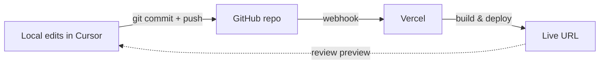

<AxisBadge axes={["JOB", "FUN"]} />

# Deploy Your Personal Website

<PdfDownload
  href="/pdfs/technest/week-02-portfolio-deploy.pdf"
  title="Week 2 Handout — Printable PDF"
  description="The full Week 2 lecture handout: forking the Magic Portfolio template, AI-customised content, and the Vercel CLI deploy."
  size="628 KB"
/>

## Learning Objectives

By the end of this session, students should be able to:

- **Audit the tech stack of their own Week 1 site** by asking the AI which framework and UI libraries it picked, and explain in their own words what each one is for.
- **Fork a production-ready Vercel template through natural-language requests**, without ever cloning a repo with their own hands or running `git clone`.
- **Describe website content in plain English** — bio, projects, links, theme — and watch Cursor translate that description into clean, committed source changes.
- **Trigger a Vercel deploy by prompt**, read the deployment's build log when something goes wrong, and recover by describing the failure to the AI.
- **Wire a first lightweight AI clone** into their portfolio using Gemini 2.5 Flash and a `.env.local`-managed API key — minimal UI, no streaming, no persistence yet (those land in Week 3).

## Core Topics

- The "what stack did the AI pick?" check-in — why most of you are already on Next.js + Tailwind even if you didn't ask for it.
- Modern UI libraries: when to reach for Shadcn UI, when for Magic UI, when for Aceternity, when for Radix — and when to skip libraries entirely.
- How a Vercel template becomes your own site in one conversation.
- The "describe content in English, let AI write the MDX/TSX" pattern that powers Weeks 2–6 of this course.
- The professional **Local → GitHub → Vercel** CI/CD workflow, and why "drag-drop to Vercel" is a footgun.
- A first taste of LLM integration — Gemini 2.5 Flash + `.env.local` + a tiny chat box. Streaming + persona + persistence are next week's job.

## Tools / Stack

| Tool | Role this week |
|---|---|
| **Cursor** | The one chat window where everything happens. |
| **Vercel MCP** | AI creates the project, deploys, reads logs, sets env vars. |
| **GitHub** | Every commit pushes; Vercel rebuilds automatically. |
| **Next.js 14** | The framework the Magic Portfolio template ships on. |
| **Tailwind CSS** | Styling; AI edits classes when you describe visual changes. |
| **Magic Portfolio** | [Vercel template](https://vercel.com/templates/next.js/magic-portfolio-for-next-js) we fork as the starting point. |
| **UI library survey** | Once UI · Magic UI · Shadcn · React Bits · Aceternity · Radix · 21st (see [section below](#ui-libraries-worth-knowing)). |
| **Gemini 2.5 Flash** | Fast, cheap LLM behind the Phase 6 lite-clone chat. |
| **Google AI Studio** | Where you fetch the free API key (one manual moment). |

<SiteEvolution thisWeek={2} />

## UI Libraries Worth Knowing

Frameworks (like Next.js) supply structure — routing, server-side rendering, performance defaults. **UI libraries** supply the building blocks: buttons, dialogs, animated headings, motion-rich landing-page sections. Together they buy you speed, visual consistency, and scalability. Skim this table once; you'll keep coming back to it through Weeks 3–6.

| Library | One-line vibe | Link |
|---|---|---|
| **Once UI** | Clean, foundational design systems | [once-ui.com](https://once-ui.com/products/once-ui-core) |
| **Magic UI** | Modern animations & eye-catching interactives | [magicui.design](https://magicui.design/docs/components) |
| **Shadcn UI** | Industry-favourite copy-paste components, fully customisable | [ui.shadcn.com](https://ui.shadcn.com/docs/components) |
| **React Bits** | Lightweight React snippets | [reactbits.dev](https://www.reactbits.dev/get-started/index) |
| **Aceternity UI** | Trendy, futuristic, animation-heavy landing pages | [ui.aceternity.com](https://ui.aceternity.com/components) |
| **Radix UI** | Accessibility-first primitives (screen readers, keyboard nav) | [radix-ui.com](https://www.radix-ui.com/themes/docs/components/alert-dialog) |
| **21st** | Discovery registry for modern components | [21st.dev](https://21st.dev/home) |

<Tip title="You don't 'install' Shadcn — you copy it">
Shadcn UI is unusual: instead of adding it as a heavy npm dependency, you literally copy & paste each component's source into your project. That's why it's the current favourite — *you own the code*, so you can tweak any pixel without fighting a library API.
</Tip>

## The Professional CI/CD Workflow

The non-negotiable rule: **always go through GitHub**. Edit locally, commit, push — Vercel rebuilds automatically. Every push gets a unique preview URL you can review before promoting.

<Note title="Anti-pattern — never do this">
Editing local files and **uploading them to Vercel by hand** (drag-drop in the dashboard, or `vercel deploy` from a folder that isn't a git repo) is a footgun. No git history means **no rollback, no audit trail, no review** — and the next time something breaks you won't even know which change caused it. Every deploy this term goes through GitHub. Period.
</Note>

## Session Plan

| Time | Activity |
|---|---|
| 0 – 15 min | **Recap & Check-in.** Who got their first Vercel URL working in Week 1? Show of hands. Anyone still stuck — 2 minutes pairing with a classmate. Then everyone runs the **Phase 0 tech-stack prompt** below on their Week 1 repo. |
| 15 – 40 min | **Concept Teaching.** Tech-stack discovery (frameworks vs UI libraries — see the table above). The "template-first" pattern. Why forking a good template beats starting from scratch. The CI/CD diagram and why GitHub is the source of truth. |
| 40 – 75 min | **Live Demo.** Instructor asks Cursor one prompt: "Fork Magic Portfolio, make it about me, deploy it." Class watches the whole flow — fork, clone, edit, commit, deploy — happen as a single conversation. Then the lite AI-clone hookup. |
| 75 – 105 min | **Hands-On Lab.** Each student ships their own personal portfolio URL **with a working chat box** wired to Gemini 2.5 Flash. Everyone picks a different accent colour so the classroom has variety to critique. |
| 105 – 120 min | **Q&A + Wrap.** Show-and-tell: three students paste their live URLs and chat-with-themselves so the class can react. |

## Hands-On Lab

**Task.** By the end of class you should have a `yourname-portfolio-*.vercel.app` URL that features your photo, short bio, two real projects (or study projects), your email, **and** a tiny working chat box that answers as a lite AI version of you — all on a responsive, dark-mode-capable site.

### Phase 0 — Recap & Tech-Stack Discovery

Last week you let the AI pick a starter. Many of you ended up on Next.js + Tailwind without explicitly asking for it. Today we name what's already there.

<PromptStep n={1} audience="Cursor">
Open my Week 1 project (`hello-technest`). What tech stack is used in this current project? Categorise into **development frameworks** vs **UI libraries** vs **other tooling** (linters, formatters, build tools). For each, explain in one sentence what its specific role is and why it's a sensible choice for a personal website. Be honest if any of it is unnecessary for what I built.
</PromptStep>

<Note title="Class discussion">
After the AI replies, we'll go around: what stack did the AI choose for *you*, and was its rationale convincing? Two sentences each. Listen for the patterns — most of you will hear "Next.js" and "Tailwind" repeatedly.
</Note>

### Phase 1 — Fork & scaffold

<PromptStep n={2} audience="Cursor">
Please fork the Vercel template called **Magic Portfolio** (the Next.js one) into a new public GitHub repo on my account called `my-portfolio`. Clone it into this workspace, install dependencies with pnpm, and start the dev server. When the server is ready, open `http://localhost:3000` in my browser. Do not change any code yet — I just want to see the template running first.
</PromptStep>

<VerifyStep n={3}>

- Browser opens `http://localhost:3000` and shows the Magic Portfolio demo site.
- A `my-portfolio` repo appears on your GitHub account.
- Your file-tree pane now has a `my-portfolio` folder with Next.js structure.

</VerifyStep>

### Phase 2 — Content customisation

<PromptStep n={4} audience="Cursor">
Now I want to make this site about me. Here's who I am — read this carefully and replace all the demo content (name, bio, "about" page, social links, photo credit) with my real details:

- Name: **\[your full name\]**
- One-line bio: **\[one sentence — e.g., "CS student at \[university\] learning to ship AI products."\]**
- Longer bio: **\[3–4 sentences — who you are, what you're interested in, what you're building this term\]**
- Email: **\[your email\]**
- GitHub: **\[your GitHub URL\]**
- LinkedIn (optional): **\[your LinkedIn URL\]**
- Accent colour: **\[pick one — e.g., "deep teal #0e7490" or "soft coral #fb7185"\]**

Update the theme config to use my accent colour. Use any of the template's existing image placeholders — I'll swap real photos in a later step. Commit the change with a clear message.
</PromptStep>

<VerifyStep n={5}>

- Your name, bio, and email now show up on the homepage and About page.
- The accent colour (buttons, links, hover states) matches what you asked for.
- `git log` shows a commit Cursor wrote with a sensible message.

</VerifyStep>

### Phase 3 — Add project cards

<PromptStep n={6} audience="Cursor">
The Projects section is still showing demo projects. Replace them with these two real projects of mine:

1. **\[Project 1 name\]** — **\[one-sentence description\]**. Link: **\[URL or GitHub repo\]**. If you have a thumbnail image, place one from the existing placeholders.
2. **\[Project 2 name\]** — **\[one-sentence description\]**. Link: **\[URL or GitHub repo\]**.

If I only have one real project, make the second a study project from this course — for example, "Hello TECHNEST — my first AI-driven deploy" with the live URL from Week 1. Commit and push.
</PromptStep>

<VerifyStep n={7}>

- Projects section on your homepage shows your two projects with links that actually work.
- The commit is pushed to GitHub — check your repo in the browser.

</VerifyStep>

### Phase 4 — Production deploy

<PromptStep n={8} audience="Cursor">
Now deploy this to Vercel as a production site. Use the Vercel MCP. Link the project to my `my-portfolio` GitHub repo so every future push auto-deploys. When the deployment finishes, open the production URL in my browser and give me the URL to copy.
</PromptStep>

<ManualStep n={9} why="GitHub's App-install consent screen requires a human click — no CLI can accept repo permissions for you.">
If Vercel asks you to authorise its GitHub App on the repo (only happens the first time for a new repo), approve it in the browser window that pops up.
</ManualStep>

<VerifyStep n={10}>

- A production URL like `my-portfolio-*.vercel.app` opens in your browser.
- Your name, bio, accent colour, and projects all render correctly on the live site.
- Visit the URL on your phone — it should look fine on mobile too.

</VerifyStep>

<RecoverStep n={11}>
The production build failed with an error I don't understand. Can you read the Vercel build log through the MCP, find the root cause, fix whatever needs fixing in the source, commit and push again, and confirm the next deploy succeeds?
</RecoverStep>

### Phase 5 — Polish via conversation

<PromptStep n={12} audience="Cursor">
The site looks fine but a bit generic. Please do three small polish passes:

1. Increase the hero title weight and give it a tiny bit more letter-spacing so my name feels more confident.
2. Add a subtle fade-in animation on the project cards when the page loads — nothing fancy, just enough that the site feels alive.
3. Add an OG image / favicon using the same accent colour so when I share the URL in a chat, the preview looks intentional.

Commit each pass as a separate commit so I can read what changed.
</PromptStep>

<VerifyStep n={13}>

- Refresh the live site and confirm each of the three polish passes shipped.
- Your repo now has three new commits with descriptive messages.
- Paste the URL into a Slack / WhatsApp / WeChat chat — the preview card should show your name and the accent colour.

</VerifyStep>

<Tip title="Use real photos if you have them">
If you have a headshot and two project screenshots on your laptop, drag them into Cursor's chat and say: **"Use these three images — headshot for the About page, screenshots for the two project cards. Compress them to reasonable web sizes before committing."** Cursor will place the files in `public/` and wire them into the right components.
</Tip>

### Phase 6 — Add a lightweight AI clone of yourself

This is your first taste of LLM integration. We're keeping it intentionally minimal: a basic input + reply box that hits Gemini 2.5 Flash with a system prompt grounded in your CV. **Streaming, persona file, and persistence are next week's job** — today we just want the model to talk back in something resembling your voice.

<ManualStep n={14} why="Google's API-key creation requires a human to accept their usage terms. No CLI can press 'Agree' for you.">
Open [aistudio.google.com/apikey](https://aistudio.google.com/apikey), sign in with your Google account, click **Create API key**, name it `TechNest week2 - test`, and copy it. Keep the tab open — but **do not paste the key into Cursor's chat**.
</ManualStep>

<Tip title="Never paste API keys into a chat scrollback">
Keys belong in `.env.local`, never in chat history (your chat scrollback often syncs to the cloud) and never in committed source. The right move is to copy the key to your clipboard, then tell the AI: *"I've copied my key to the clipboard — please configure the env vars without me pasting it in chat."* Cursor will tell you exactly which file to paste it into.
</Tip>

<PromptStep n={15} audience="Cursor">
I've copied my Google Gemini API key to my system clipboard. **Don't ask me to paste it in this chat.** Please:

1. Configure the environment variable: add `GOOGLE_GENERATIVE_AI_API_KEY` to a `.env.local` file (create the file if needed). Confirm `.env.local` is in `.gitignore` so it never reaches GitHub.
2. Add the same key to my Vercel production environment using the Vercel MCP / CLI.
3. Install `ai` and `@ai-sdk/google` from npm.
4. Add a **simple** chat component to my portfolio site — a single text input, a send button, and a reply area. **No streaming, no persistence, no fancy launcher button** — that's next week. Just a working chat that uses the `gemini-2.5-flash` model.
5. Use the content from my CV / About page as the **system prompt** so the AI answers in my voice with my background.
6. Commit and push so Vercel auto-deploys.

When done, walk me through how to test it locally and on the production URL.
</PromptStep>

<VerifyStep n={16}>

- The site has a chat box (anywhere on the page is fine — we'll polish placement next week).
- Asking *"tell me about yourself"* returns a reply that recognisably matches your CV / about copy.
- `.env.local` exists at the project root; `.gitignore` covers it; `git status` shows zero key-related files staged.
- The same chat works on the live `*.vercel.app` URL after the auto-deploy completes.

</VerifyStep>

<Note title="What's coming in Week 3">
Next week we make this **production-grade**: streaming responses (token-by-token), a `content/persona.md` file you can edit instead of re-prompting, `localStorage` persistence so refreshes don't wipe the conversation, and a polished floating launcher in your accent colour. Today's goal is just to *feel the LLM respond*. The instructor's closing note from class: in the enterprise world we'd reach for **RAG** (retrieval-augmented generation) and vector databases for big knowledge bases — but that's Week 4 territory. Today is the lightweight prompt-based starter.
</Note>

## Weekly Assignment

**Build / Implement.**

- Your live portfolio URL, featuring your real name, bio, two projects, and contact info.
- The URL must render correctly on both desktop and mobile.
- A working lite AI-clone chat box on the same site (Phase 6) — single-shot replies are fine; no streaming required this week.

**Requirements.**

- The repo must be on your GitHub.
- At least four commits, all authored by AI at your direction.
- The production URL must be served from Vercel (i.e., a `*.vercel.app` domain, or a custom domain pointing at Vercel).
- The Gemini API key must be in Vercel's production env vars — **not** in any committed file.
- A screenshot of the Cursor conversation where you described your bio (Phase 2) — this proves you didn't hand-edit the source.

**Submission.** Post the URL + screenshot in the course Slack channel before the start of Week 3.

## Resources

| Docs | Videos | Repos |
|---|---|---|
| Vercel template: Magic Portfolio | Instructor demo: "From template to live URL in 20 minutes" | `vercel/templates/magic-portfolio` |
| Vercel CLI — project management | | `ai-programming-teaching-project/docs/website/` |
| Next.js 14 App Router — basics | | |
| [UI library survey (in-page)](#ui-libraries-worth-knowing) — 7 libraries | | |
| [Google AI Studio — API keys](https://aistudio.google.com/apikey) | | |
| [Vercel AI SDK — Google provider](https://sdk.vercel.ai/providers/ai-sdk-providers/google-generative-ai) | | |

## Real-World Application

Every engineer, designer, and founder you'll interview with in 2026 expects a personal site within the first five seconds of Googling your name. Your portfolio is not a *nice-to-have* — it's table stakes. The good news: it's also the single highest-ROI artefact you can build in two hours, and you're going to upgrade it every week for the rest of the term. Add the chat-with-yourself widget on top of that and you've already got a portfolio that **does something** — most CS students at this stage have a static résumé page; you have a conversational one.

<Note title="Career">
After class: copy your live URL and add it to your LinkedIn headline and your GitHub profile README. Tag **@TECHNEST** on LinkedIn when you post — your instructor will reshare the first five students to do this.
</Note>

## Challenges & Tips

- *"The template looks good but I want a totally different vibe."* Ask Cursor **"Replace the current design with something inspired by \[reference site\]."** Let the AI propose, then iterate. Resist hand-editing CSS.
- *"Vercel says 'Build error: module not found'."* Paste the full error into Cursor (use the `[RECOVER]` pattern from Week 1). 90% of first-deploy errors are a missing package Vercel can't find — Cursor fixes them in one prompt.
- *"My photo looks stretched."* Ask Cursor **"Crop my hero photo to a square and re-export at 600 × 600. Don't lose quality."** Describe the outcome, not the CSS.
- *"Vercel shows 'Unauthorized' when I try to deploy."* Your token from Week 1 may have expired. In Cursor, say **"My Vercel MCP token is expired. Walk me through generating a new one and updating your config."**
- *"The preview URL looks different from the production URL."* Preview deploys and production deploys can use different env vars. Ask Cursor to diff them: **"Compare the env vars on my preview vs production deployment and list any differences."**
- *"My lite AI-clone returns `API_KEY_INVALID` on the live site but works locally."* The key is in `.env.local` but not in Vercel's production env. Ask Cursor: **"Confirm `GOOGLE_GENERATIVE_AI_API_KEY` is set in my Vercel project's Production environment, and add it via the Vercel MCP if missing."**
- *"My AI clone replies sound generic / not like me."* That's expected this week — we're using your CV as a one-shot system prompt. **Don't fix it today.** Next week we move the persona into a dedicated `content/persona.md` file you can iterate on without touching code.

<Info title="If nothing updates after a new commit">
Ask: **"Is Vercel's GitHub integration still connected? Check the last deploy time and the webhook delivery log."** If the webhook is broken, Cursor will walk you through re-linking.
</Info>
